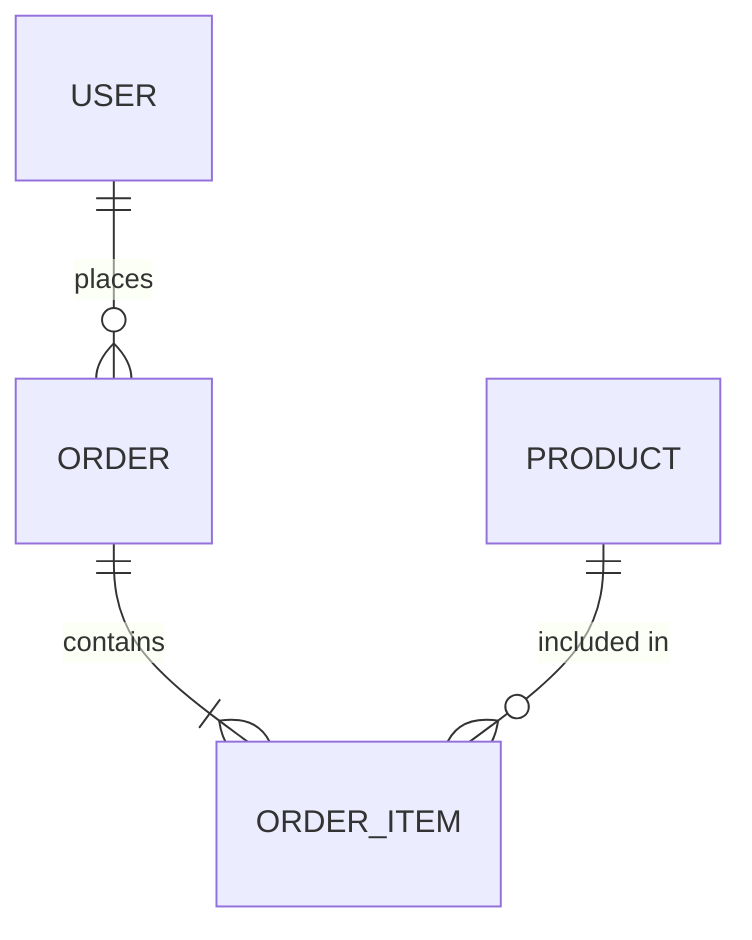

# Skill: database-design — 数据库表设计

## 职责

基于业务需求和数据实体，设计完整的数据库 Schema，包括表结构、字段类型、索引策略、关联关系和迁移脚本。

---

## 输入

- `docs/{project-name}_{YYYY-MM-DD}/requirements-analysis/context.md`（数据实体列表）
- `specs/{project-name}_{YYYY-MM-DD}/technical-design/architecture-decisions.md`（数据库选型）

---

## 执行步骤

### 步骤 1：实体关系分析

从需求中提取所有数据实体，分析关联关系：
- 一对一（1:1）
- 一对多（1:N）
- 多对多（M:N，需中间表）

### 步骤 2：表结构设计

每张表必须包含：
- 主键（id，推荐 UUID 或自增整数）
- 创建时间（created_at）
- 更新时间（updated_at）
- 软删除字段（deleted_at，如需要）

字段设计原则：
- 字段名使用 snake_case
- 枚举值使用 VARCHAR + CHECK 约束或独立枚举类型
- 金额字段使用 DECIMAL(10,2)，不用 FLOAT
- 密码字段只存 hash，不存明文

### 步骤 3：索引策略

必须为以下情况添加索引：
- 外键字段
- 频繁查询的过滤字段（WHERE 子句）
- 唯一约束字段
- 复合查询字段（复合索引）

### 步骤 4：生成 ER 图

用 Mermaid erDiagram 语法生成实体关系图。

### 步骤 5：生成迁移脚本

根据选型生成对应的迁移文件：
- Prisma → `schema.prisma`
- TypeORM → migration SQL
- Drizzle → schema 定义
- 原生 SQL → `migrations/001_init.sql`

---

## 输出格式

写入 `specs/{project-name}_{YYYY-MM-DD}/technical-design/database-schema.md`：

```markdown
# Database Schema

## 数据库选型
{数据库类型 + 版本}

## 实体关系图



## 表结构

### {table_name}
**用途**：{一句话描述}
**关联 US**：US-{NNN}

| 字段名 | 类型 | 约束 | 默认值 | 说明 |
|--------|------|------|--------|------|
| id | UUID / SERIAL | PRIMARY KEY | gen_random_uuid() | 主键 |
| created_at | TIMESTAMP | NOT NULL | NOW() | 创建时间 |
| updated_at | TIMESTAMP | NOT NULL | NOW() | 更新时间 |
| {field} | {type} | {constraints} | {default} | {description} |

**索引**：
- `idx_{table}_{field}` ON ({field}) — {用途}

**外键**：
- `{field}` → `{referenced_table}.id` ON DELETE {CASCADE/SET NULL/RESTRICT}

## 迁移脚本

### Prisma Schema（如使用 Prisma）
```prisma
model {ModelName} {
  id        String   @id @default(uuid())
  createdAt DateTime @default(now())
  updatedAt DateTime @updatedAt
  // fields
}
```

### SQL Migration（如使用原生 SQL）
```sql
-- migrations/001_init.sql
CREATE TABLE {table_name} (
  id UUID PRIMARY KEY DEFAULT gen_random_uuid(),
  created_at TIMESTAMP NOT NULL DEFAULT NOW(),
  updated_at TIMESTAMP NOT NULL DEFAULT NOW()
);
```

## 种子数据（Seed Data）
{如需要初始数据，列出种子数据脚本}

## 数据量预估
| 表名 | 初期数据量 | 1年后预估 | 索引策略说明 |
|------|---------|---------|------------|
```

---

## 澄清检查点（DBAMB）

以下情况标记为 DBAMB，需用户确认：
- 是否需要软删除（deleted_at）还是硬删除
- 多租户数据隔离方式（行级 / Schema 级 / 数据库级）
- 历史记录/审计日志需求
- 数据归档策略
- 是否需要全文搜索（影响是否引入 Elasticsearch）
