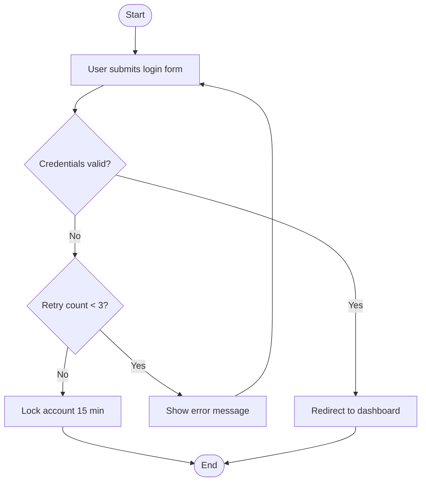

# Flowchart Generator

Convert a plain-text process description into a standard Mermaid flowchart ready to embed in any Markdown document.

## When to Use

- BA: Generating business process diagrams (`businessFlow` field in BA Spec)
- UX: Generating user operation flow diagrams (`userFlows` field in UX Spec)

## Input

```
flowDescription: "User submits login form → system validates credentials → if valid, redirect to dashboard; if invalid, show error and allow retry up to 3 times → after 3 failures, lock account for 15 minutes"
```

## Output Format

````markdown

````

## Mermaid Syntax Rules

| Node Type | Syntax | Use For |
|-----------|--------|---------|
| Process step | `[Text]` | Regular action or step |
| Decision | `{Text}` | Condition or branch point |
| Start/End | `([Text])` | Terminal nodes |
| Data store | `[(Text)]` | Database or storage |

- Default direction: `flowchart TD` (top-down)
- Labeled edges: `-->|label|`
- Group related steps with `subgraph`
- Keep node labels concise (≤10 words)

## Execution Rules

1. Identify all steps, decision points, and branches from the description
2. Every flowchart must have explicit start and end nodes
3. All decision nodes must have labeled outgoing edges for each branch
4. If the description is too vague to generate a valid diagram, output a numbered step list marked "flowchart pending" — do not block the main workflow

## Failure Handling

If input is ambiguous: output a plain numbered list of steps with a note `<!-- flowchart pending: clarify [specific ambiguity] -->` and continue.
