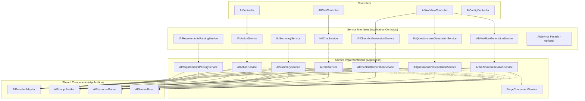

# 设计文档：AI 服务层重构

## 概述

本设计将当前的巨型 `AIService` partial class（约 8000+ 行，16 个构造函数依赖）拆分为多个职责单一的独立服务，并提取统一的 AI Provider 抽象层、Prompt 管理器和响应解析器。重构遵循 SOLID 原则，特别是单一职责原则（SRP）和接口隔离原则（ISP）。

重构采用渐进式策略：先提取底层共享组件（Provider 抽象层、Prompt 构建器、响应解析器、横切关注点），再拆分上层业务服务，最后更新 Controller 注入并提供向后兼容的 Facade。

## 架构

### 重构前后对比

```
重构前:
┌─────────────────────────────────────────────┐
│              IAIService (单一大接口)           │
│  ┌─────────────────────────────────────────┐ │
│  │         AIService (partial class)       │ │
│  │  Main.cs | Chat.cs | Generation.cs     │ │
│  │  ActionAndHttp.cs | Summary.cs         │ │
│  │  (16 个构造函数依赖, 8000+ 行)           │ │
│  └─────────────────────────────────────────┘ │
└─────────────────────────────────────────────┘

重构后:
┌──────────────────────────────────────────────────────────┐
│                    Controller Layer                       │
│  AIWorkflowController | AIChatController | AIController  │
│  AIConfigController                                      │
└──────────┬───────────────────────────────────────────────┘
           │ 注入细粒度接口
┌──────────▼───────────────────────────────────────────────┐
│              Fine-Grained Service Interfaces              │
│  IAIWorkflowGenerationService                            │
│  IAIQuestionnaireGenerationService                       │
│  IAIChecklistGenerationService                           │
│  IAIChatService                                          │
│  IAIActionService                                        │
│  IAISummaryService                                       │
│  IAIRequirementsParsingService                           │
│  (可选) IAIService Facade → 委托到上述接口                 │
└──────────┬───────────────────────────────────────────────┘
           │ 依赖
┌──────────▼───────────────────────────────────────────────┐
│              Shared Components                            │
│  IAIProviderAdapter    (Provider 统一调用)                 │
│  IAIPromptBuilder      (Prompt 构建)                      │
│  IAIResponseParser     (响应解析 + JSON 修复)              │
│  AIServiceBase         (横切关注点: 历史记录, IP/UA)       │
│  IStageComponentService (Stage 组件创建)                  │
└──────────────────────────────────────────────────────────┘
```

### 分层架构 Mermaid 图



## 组件与接口

### 1. IAIProviderAdapter — AI Provider 统一调用接口

位置：`Application.Contracts/IServices/AI/IAIProviderAdapter.cs`

```csharp
public interface IAIProviderAdapter : IScopedService
{
    /// <summary>
    /// Call AI provider with a single prompt (for generation/parsing scenarios)
    /// </summary>
    Task<AIProviderResponse> CallAsync(AIProviderRequest request);

    /// <summary>
    /// Call AI provider with multi-message chat input
    /// </summary>
    Task<AIProviderResponse> CallChatAsync(AIChatProviderRequest request);

    /// <summary>
    /// Stream AI provider response with multi-message chat input
    /// </summary>
    IAsyncEnumerable<string> StreamChatAsync(AIChatProviderRequest request);

    /// <summary>
    /// Call AI provider with automatic fallback on failure
    /// </summary>
    Task<AIProviderResponse> CallWithFallbackAsync(AIProviderRequest request);
}

public class AIProviderRequest
{
    public string Prompt { get; set; } = string.Empty;
    public string? ModelId { get; set; }
    public string? Provider { get; set; }
    public string? ModelName { get; set; }
    public int? MaxTokensOverride { get; set; }
}

public class AIChatProviderRequest
{
    public List<object> Messages { get; set; } = new();
    public AIModelConfig? Config { get; set; }
    public string? Provider { get; set; }
}
```

实现类 `AIProviderAdapter` 位于 `Application/Services/AI/Providers/AIProviderAdapter.cs`，内部包含：
- Provider 路由逻辑（switch on provider name）
- 各 Provider 的具体调用方法（从 Main.cs 和 Chat.cs 提取）
- 默认配置解析逻辑（从 `IAIModelConfigService` 获取租户默认配置）
- Fallback 逻辑

每个 Provider 的具体实现可进一步提取为独立的内部类或私有方法，但初始重构阶段保持在 `AIProviderAdapter` 内部即可，避免过度设计。

### 2. IAIPromptBuilder — Prompt 构建接口

位置：`Application.Contracts/IServices/AI/IAIPromptBuilder.cs`

```csharp
public interface IAIPromptBuilder : IScopedService
{
    // Workflow prompts
    string BuildWorkflowGenerationPrompt(AIWorkflowGenerationInput input);
    Task<string> BuildWorkflowModificationPromptAsync(AIWorkflowModificationInput input, object existingWorkflowInfo);

    // Questionnaire prompts
    string BuildQuestionnaireGenerationPrompt(AIQuestionnaireGenerationInput input);
    string BuildBatchQuestionnaireGenerationPrompt(List<AIStageGenerationResult> stages, string originalDescription);

    // Checklist prompts
    string BuildChecklistGenerationPrompt(AIChecklistGenerationInput input);
    string BuildBatchChecklistGenerationPrompt(List<AIStageGenerationResult> stages, string originalDescription);

    // Stage-level prompts
    string BuildChecklistGenerationPrompt(AIStageGenerationResult stage, string originalDescription);
    string BuildQuestionnaireGenerationPrompt(AIStageGenerationResult stage, string originalDescription);

    // Chat prompts
    string BuildChatPrompt(AIChatInput input);
    string GetChatSystemPrompt(string mode, string input);
    string GetGenerateCodePrompt(string instruction, string codeLanguage = "python");
    string ProcessTemplateVariables(string template, string instruction, string codeLanguage);

    // Action prompts
    string BuildActionAnalysisPrompt(AIActionAnalysisInput input);
    string BuildActionCreationPrompt(AIActionCreationInput input);

    // Summary prompts
    string BuildStageSummaryPrompt(AIStageSummaryInput input);
}
```

实现类 `AIPromptBuilder` 位于 `Application/Services/AI/Prompts/AIPromptBuilder.cs`，将所有 `Build*Prompt` 方法从各 partial class 文件中提取到此处。

### 3. IAIResponseParser — 响应解析接口

位置：`Application.Contracts/IServices/AI/IAIResponseParser.cs`

```csharp
public interface IAIResponseParser : IScopedService
{
    // Workflow parsing
    AIWorkflowGenerationResult ParseWorkflowResponse(string aiResponse);
    AIWorkflowGenerationResult TryRepairAndParseWorkflow(string aiResponse);
    AIWorkflowGenerationResult GenerateFallbackWorkflow(string aiResponse);

    // Questionnaire parsing
    AIQuestionnaireGenerationResult ParseQuestionnaireResponse(string aiResponse);
    AIQuestionnaireGenerationResult ParseAIQuestionnaireResponse(string aiResponse, AIStageGenerationResult stage);
    List<AIQuestionnaireGenerationResult> ParseBatchQuestionnaireResponse(string aiResponse, List<AIStageGenerationResult> stages);

    // Checklist parsing
    AIChecklistGenerationResult ParseChecklistResponse(string aiResponse);
    AIChecklistGenerationResult ParseAIChecklistResponse(string aiResponse, AIStageGenerationResult stage);
    List<AIChecklistGenerationResult> ParseBatchChecklistResponse(string aiResponse, List<AIStageGenerationResult> stages);

    // Chat parsing
    AIChatResponse ParseChatResponse(string content, AIChatInput input);
    AIChatResponse GenerateFallbackChatResponse(AIChatInput input);
    AIChatResponse GenerateErrorChatResponse(AIChatInput input, string errorMessage);

    // Summary parsing
    AIStageSummaryResult ParseStageSummaryResponse(string aiResponse, AIStageSummaryInput input);

    // Utility
    string FixJsonContent(string jsonContent);

    // Confidence scoring
    double CalculateConfidenceScore(WorkflowInputDto workflow);
    double CalculateQuestionnaireConfidenceScore(QuestionnaireInputDto questionnaire);
    double CalculateChecklistConfidenceScore(ChecklistInputDto checklist);
    double CalculateWorkflowQualityScore(WorkflowInputDto workflow, List<AIValidationIssue> issues);
}
```

实现类 `AIResponseParser` 位于 `Application/Services/AI/Parsing/AIResponseParser.cs`。

### 4. AIServiceBase — 横切关注点基类

位置：`Application/Services/AI/AIServiceBase.cs`

```csharp
public abstract class AIServiceBase
{
    protected readonly ILogger Logger;
    protected readonly IAIPromptHistoryRepository PromptHistoryRepository;
    protected readonly IOperatorContextService OperatorContextService;
    protected readonly IHttpContextAccessor HttpContextAccessor;
    protected readonly IBackgroundTaskQueue BackgroundTaskQueue;

    protected AIServiceBase(
        ILogger logger,
        IAIPromptHistoryRepository promptHistoryRepository,
        IOperatorContextService operatorContextService,
        IHttpContextAccessor httpContextAccessor,
        IBackgroundTaskQueue backgroundTaskQueue)
    { ... }

    protected void QueuePromptHistorySave(
        string promptType, string entityType, long? entityId, long? onboardingId,
        string promptContent, AIProviderResponse response, DateTime startTime,
        string? metadata = null)
    { ... }

    protected void QueueFailedPromptHistorySave(
        string promptType, string entityType, long? entityId, long? onboardingId,
        string promptContent, string errorMessage, DateTime startTime)
    { ... }

    protected string GetClientIpAddress() => HttpContextAccessor.GetClientIpAddress();
    protected string GetUserAgent() => HttpContextAccessor.GetUserAgent();
}
```

### 5. 细粒度服务接口

位置：`Application.Contracts/IServices/AI/`

#### IAIWorkflowGenerationService

```csharp
public interface IAIWorkflowGenerationService : IScopedService
{
    Task<AIWorkflowGenerationResult> GenerateWorkflowAsync(AIWorkflowGenerationInput input);
    IAsyncEnumerable<AIWorkflowStreamResult> StreamGenerateWorkflowAsync(AIWorkflowGenerationInput input);
    Task<AIWorkflowEnhancementResult> EnhanceWorkflowAsync(long workflowId, string enhancement);
    Task<AIWorkflowGenerationResult> EnhanceWorkflowAsync(AIWorkflowModificationInput input);
    Task<AIValidationResult> ValidateWorkflowAsync(WorkflowInputDto workflow);
    Task<bool> CreateStageComponentsAsync(long workflowId, List<AIStageGenerationResult> stages,
        List<AIChecklistGenerationResult> checklists, List<AIQuestionnaireGenerationResult> questionnaires);
}
```

#### IAIQuestionnaireGenerationService

```csharp
public interface IAIQuestionnaireGenerationService : IScopedService
{
    Task<AIQuestionnaireGenerationResult> GenerateQuestionnaireAsync(AIQuestionnaireGenerationInput input);
    IAsyncEnumerable<AIQuestionnaireStreamResult> StreamGenerateQuestionnaireAsync(AIQuestionnaireGenerationInput input);
}
```

#### IAIChecklistGenerationService

```csharp
public interface IAIChecklistGenerationService : IScopedService
{
    Task<AIChecklistGenerationResult> GenerateChecklistAsync(AIChecklistGenerationInput input);
    IAsyncEnumerable<AIChecklistStreamResult> StreamGenerateChecklistAsync(AIChecklistGenerationInput input);
}
```

#### IAIChatService

```csharp
public interface IAIChatService : IScopedService
{
    Task<AIChatResponse> SendChatMessageAsync(AIChatInput input);
    IAsyncEnumerable<AIChatStreamResult> StreamChatAsync(AIChatInput input);
}
```

#### IAIActionService

```csharp
public interface IAIActionService : IScopedService
{
    Task<AIActionAnalysisResult> AnalyzeActionAsync(AIActionAnalysisInput input);
    Task<AIActionCreationResult> CreateActionAsync(AIActionCreationInput input);
    IAsyncEnumerable<AIActionStreamResult> StreamAnalyzeActionAsync(AIActionAnalysisInput input);
    IAsyncEnumerable<AIActionStreamResult> StreamCreateActionAsync(AIActionCreationInput input);
    IAsyncEnumerable<AIActionStreamResult> StreamGenerateHttpConfigAsync(AIHttpConfigGenerationInput input);
}
```

#### IAISummaryService

```csharp
public interface IAISummaryService : IScopedService
{
    Task<AIStageSummaryResult> GenerateStageSummaryAsync(AIStageSummaryInput input);
}
```

#### IAIRequirementsParsingService

```csharp
public interface IAIRequirementsParsingService : IScopedService
{
    Task<AIRequirementsParsingResult> ParseRequirementsAsync(string naturalLanguage);
    Task<AIRequirementsParsingResult> ParseRequirementsAsync(string naturalLanguage,
        string? modelProvider, string? modelName, string? modelId);
}
```

### 6. IStageComponentService — Stage 组件创建接口

位置：`Application.Contracts/IServices/AI/IStageComponentService.cs`

```csharp
public interface IStageComponentService : IScopedService
{
    Task<bool> CreateStageComponentsAsync(long workflowId,
        List<AIStageGenerationResult> stages,
        List<AIChecklistGenerationResult> checklists,
        List<AIQuestionnaireGenerationResult> questionnaires);
}
```

实现类 `StageComponentService` 位于 `Application/Services/AI/StageComponentService.cs`，包含：
- Checklist/Questionnaire 分配逻辑（`DetermineChecklistCount`, `DetermineQuestionnaireCount` 等）
- 名称/描述生成逻辑
- 唯一名称确保逻辑
- 实际的数据库创建操作

### 7. IAIService Facade（可选向后兼容）

位置：`Application/Services/AI/AIServiceFacade.cs`

```csharp
public class AIServiceFacade : IAIService, IScopedService
{
    private readonly IAIWorkflowGenerationService _workflowService;
    private readonly IAIQuestionnaireGenerationService _questionnaireService;
    private readonly IAIChecklistGenerationService _checklistService;
    private readonly IAIChatService _chatService;
    private readonly IAIActionService _actionService;
    private readonly IAISummaryService _summaryService;
    private readonly IAIRequirementsParsingService _requirementsService;

    // All methods delegate to the corresponding service
    public Task<AIWorkflowGenerationResult> GenerateWorkflowAsync(AIWorkflowGenerationInput input)
        => _workflowService.GenerateWorkflowAsync(input);
    // ... etc
}
```

此 Facade 确保任何仍然注入 `IAIService` 的代码继续工作，同时新代码可以直接注入细粒度接口。

## 数据模型

### 现有数据模型保持不变

所有现有 DTO 类（`AIWorkflowGenerationInput`, `AIWorkflowGenerationResult`, `AIChatInput`, `AIChatResponse` 等）保持在 `Application.Contracts/IServices/IAIService.cs` 中不变，确保 API 契约兼容。

### 新增数据模型

#### AIProviderRequest / AIChatProviderRequest

```csharp
// Location: Application.Contracts/IServices/AI/IAIProviderAdapter.cs (alongside interface)

public class AIProviderRequest
{
    public string Prompt { get; set; } = string.Empty;
    public string? ModelId { get; set; }
    public string? Provider { get; set; }
    public string? ModelName { get; set; }
    public int? MaxTokensOverride { get; set; }
}

public class AIChatProviderRequest
{
    public List<object> Messages { get; set; } = new();
    public AIModelConfig? Config { get; set; }
    public string? Provider { get; set; }
}
```

### 文件组织结构

```
Application.Contracts/
  IServices/
    AI/
      IAIProviderAdapter.cs          (NEW - Provider 抽象接口 + Request DTOs)
      IAIPromptBuilder.cs            (NEW - Prompt 构建接口)
      IAIResponseParser.cs           (NEW - 响应解析接口)
      IAIWorkflowGenerationService.cs (NEW)
      IAIQuestionnaireGenerationService.cs (NEW)
      IAIChecklistGenerationService.cs (NEW)
      IAIChatService.cs              (NEW)
      IAIActionService.cs            (NEW)
      IAISummaryService.cs           (NEW)
      IAIRequirementsParsingService.cs (NEW)
      IStageComponentService.cs      (NEW)
    IAIService.cs                    (KEEP - 保留接口定义和所有 DTO 类)
    IUserAIModelConfigService.cs     (KEEP - 不变)

Application/
  Services/
    AI/
      AIServiceBase.cs               (NEW - 横切关注点基类)
      AIServiceFacade.cs             (NEW - 向后兼容 Facade)
      Providers/
        AIProviderAdapter.cs         (NEW - Provider 统一实现)
      Prompts/
        AIPromptBuilder.cs           (NEW - Prompt 构建实现)
      Parsing/
        AIResponseParser.cs          (NEW - 响应解析实现)
      Workflow/
        AIWorkflowGenerationService.cs (NEW)
      Questionnaire/
        AIQuestionnaireGenerationService.cs (NEW)
      Checklist/
        AIChecklistGenerationService.cs (NEW)
      Chat/
        AIChatService.cs             (NEW)
      Action/
        AIActionService.cs           (NEW)
      Summary/
        AISummaryService.cs          (NEW)
      Requirements/
        AIRequirementsParsingService.cs (NEW)
      StageComponent/
        StageComponentService.cs     (NEW)
      UserAIModelConfigService.cs    (KEEP - 不变)
      AIService.Main.cs              (DELETE after migration)
      AIService.Chat.cs              (DELETE after migration)
      AIService.Generation.cs        (DELETE after migration)
      AIService.ActionAndHttp.cs     (DELETE after migration)
      AIService.Summary.cs           (DELETE after migration)
```

### 各服务依赖对比

| 服务 | 依赖数量 | 主要依赖 |
|------|---------|---------|
| AIProviderAdapter | 4 | AIOptions, Logger, HttpClientFactory, IAIModelConfigService |
| AIPromptBuilder | 1 | Logger |
| AIResponseParser | 1 | Logger |
| AIWorkflowGenerationService | 6 | AIProviderAdapter, PromptBuilder, ResponseParser, IWorkflowService, StageComponentService, base(5) |
| AIQuestionnaireGenerationService | 4 | AIProviderAdapter, PromptBuilder, ResponseParser, base(5) |
| AIChecklistGenerationService | 4 | AIProviderAdapter, PromptBuilder, ResponseParser, base(5) |
| AIChatService | 5 | AIProviderAdapter, PromptBuilder, ResponseParser, IAIModelConfigService, base(5) |
| AIActionService | 4 | AIProviderAdapter, PromptBuilder, base(5) |
| AISummaryService | 4 | AIProviderAdapter, PromptBuilder, ResponseParser, base(5) |
| AIRequirementsParsingService | 4 | AIProviderAdapter, PromptBuilder, ResponseParser, base(5) |
| StageComponentService | 7 | IChecklistService, IQuestionnaireService, IChecklistRepository, IQuestionnaireRepository, IChecklistTaskService, IComponentMappingService, IStageRepository |

注：`base(5)` 指 AIServiceBase 的 5 个依赖通过继承获得，不计入构造函数参数。最大构造函数参数数量为 7（StageComponentService），远低于原来的 16。

</text>
</invoke>

## 正确性属性

*正确性属性是一种在系统所有有效执行中都应成立的特征或行为——本质上是关于系统应该做什么的形式化陈述。属性作为人类可读规范和机器可验证正确性保证之间的桥梁。*

### Property 1: Provider 路由正确性

*For any* valid provider name (zhipuai, openai, gemini, claude, anthropic, deepseek) in an AIProviderRequest, the AIProviderAdapter SHALL route the call to the corresponding provider implementation. *For any* string that is not a recognized provider name, the AIProviderAdapter SHALL either attempt a generic OpenAI-compatible call or throw a CRMException.

**Validates: Requirements 1.4, 1.5**

### Property 2: Provider Fallback 机制

*For any* AIProviderRequest where the primary provider call fails (returns Success=false), if a fallback configuration exists, the AIProviderAdapter SHALL attempt the fallback provider and return its response.

**Validates: Requirements 1.7**

### Property 3: 服务接口 DI 注册

*For any* newly created AI service interface (IAIWorkflowGenerationService, IAIQuestionnaireGenerationService, IAIChecklistGenerationService, IAIChatService, IAIActionService, IAISummaryService, IAIRequirementsParsingService), the interface SHALL extend IScopedService.

**Validates: Requirements 2.8**

### Property 4: 构造函数依赖数量约束

*For any* newly created AI service implementation class, the constructor SHALL have no more than 8 parameters (excluding base class parameters inherited via AIServiceBase).

**Validates: Requirements 3.10**

### Property 5: 响应解析鲁棒性

*For any* valid JSON string conforming to the expected AI response schema, the Response_Parser SHALL return a result with Success=true. *For any* string that cannot be parsed even after JSON repair, the Response_Parser SHALL return a fallback result with a reduced confidence score rather than throwing an exception.

**Validates: Requirements 5.1, 5.2, 5.3, 5.4, 5.5, 5.7**

### Property 6: JSON 修复幂等性

*For any* valid JSON string, applying FixJsonContent SHALL produce a string that is still valid JSON (the operation preserves valid JSON). *For any* string with common AI formatting issues (trailing commas, single quotes, missing commas between objects), FixJsonContent SHALL produce a string that is closer to valid JSON.

**Validates: Requirements 5.6**

### Property 7: 置信度分数范围不变量

*For any* WorkflowInputDto, QuestionnaireInputDto, or ChecklistInputDto, the calculated confidence score SHALL be a value between 0.0 and 1.0 inclusive.

**Validates: Requirements 5.8**

### Property 8: Stage 组件分配不变量

*For any* list of AIStageGenerationResult stages and a total count of checklists/questionnaires to distribute, the sum of checklists/questionnaires assigned to each stage SHALL equal the total input count. The same invariant applies to task distribution across checklists and question distribution across questionnaires.

**Validates: Requirements 6.2, 6.3**

### Property 9: Stage 组件命名唯一性

*For any* set of stages processed by StageComponentService, all generated checklist names within the same scope SHALL be unique, and all generated questionnaire names SHALL be unique.

**Validates: Requirements 6.5**

### Property 10: Facade 委托等价性

*For any* method call on the IAIService facade, the result SHALL be identical to calling the corresponding method directly on the fine-grained service interface. The facade SHALL not modify, filter, or transform the input or output in any way.

**Validates: Requirements 7.5**

## 错误处理

### Provider 层错误处理

| 场景 | 处理方式 |
|------|---------|
| Provider 调用超时 | 返回 `AIProviderResponse { Success = false, ErrorMessage = "..." }`，不抛异常 |
| Provider 返回非 200 状态码 | 记录日志，返回失败的 AIProviderResponse |
| 不支持的 Provider 名称 | 尝试 Generic OpenAI-Compatible 调用；如果也失败，抛出 `CRMException(ErrorCodeEnum.BadRequest)` |
| Fallback Provider 也失败 | 返回最后一个失败的 AIProviderResponse |

### 响应解析错误处理

| 场景 | 处理方式 |
|------|---------|
| JSON 解析失败 | 尝试 `FixJsonContent` 修复后重新解析 |
| 修复后仍然失败 | 尝试 `TryRepairAndParseWorkflow` 等深度修复 |
| 所有解析尝试失败 | 生成 Fallback 结果（ConfidenceScore = 0.0） |

### Prompt 历史记录错误处理

| 场景 | 处理方式 |
|------|---------|
| 历史记录保存失败 | 记录 Warning 日志，不影响主流程 |
| BackgroundTaskQueue 满 | 记录 Warning 日志，丢弃历史记录 |

### Stage 组件创建错误处理

| 场景 | 处理方式 |
|------|---------|
| 单个 Stage 组件创建失败 | 记录错误日志，继续处理剩余 Stage |
| 唯一名称生成超过最大重试次数 | 使用带时间戳的名称作为最终 Fallback |

## 测试策略

### 测试框架选择

- 单元测试框架：xUnit
- 属性测试框架：FsCheck（通过 FsCheck.Xunit 集成）
- Mock 框架：Moq
- 每个属性测试最少运行 100 次迭代

### 属性测试（Property-Based Tests）

属性测试用于验证上述正确性属性，每个属性对应一个独立的属性测试：

1. **Provider 路由测试**：生成随机的有效/无效 provider 名称，验证路由行为
2. **Fallback 测试**：Mock 失败的 primary provider，验证 fallback 触发
3. **DI 注册测试**：通过反射扫描所有 AI 服务接口，验证 IScopedService 继承
4. **构造函数参数测试**：通过反射扫描所有 AI 服务实现类，验证参数数量
5. **响应解析测试**：生成随机的有效/无效 JSON 字符串，验证解析行为
6. **JSON 修复幂等性测试**：生成随机有效 JSON，验证 FixJsonContent 保持有效性
7. **置信度分数测试**：生成随机的 DTO 输入，验证分数范围
8. **分配不变量测试**：生成随机的 stage 列表和总数，验证分配总和
9. **命名唯一性测试**：生成随机的 stage 列表，验证生成名称唯一
10. **Facade 委托测试**：对每个 facade 方法，验证调用被正确委托

每个属性测试必须包含注释标签，格式为：
`// Feature: ai-service-refactoring, Property {N}: {property_text}`

### 单元测试（Unit Tests）

单元测试用于验证具体示例和边界情况：

- **AIProviderAdapter**：各 Provider 的请求构造和响应反序列化
- **AIPromptBuilder**：各类 Prompt 的输出格式和内容正确性
- **AIResponseParser**：具体的 JSON 修复场景（trailing comma, single quotes, missing comma between objects）
- **StageComponentService**：边界情况（0 个 stage, 1 个 stage, stage 无 checklist/questionnaire）
- **AIServiceFacade**：验证所有方法都正确委托

### 测试目录结构

```
Tests/
  AI/
    Providers/
      AIProviderAdapterTests.cs
    Prompts/
      AIPromptBuilderTests.cs
    Parsing/
      AIResponseParserTests.cs
      AIResponseParserPropertyTests.cs
    StageComponent/
      StageComponentServiceTests.cs
      StageComponentServicePropertyTests.cs
    Facade/
      AIServiceFacadeTests.cs
    Properties/
      AIServiceArchitecturePropertyTests.cs  (DI, constructor constraints)
```
