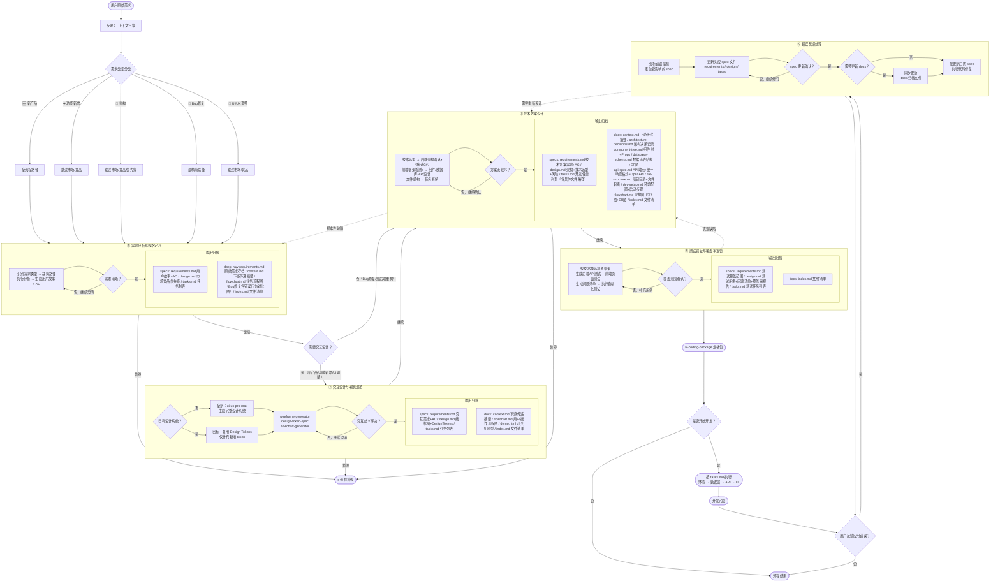
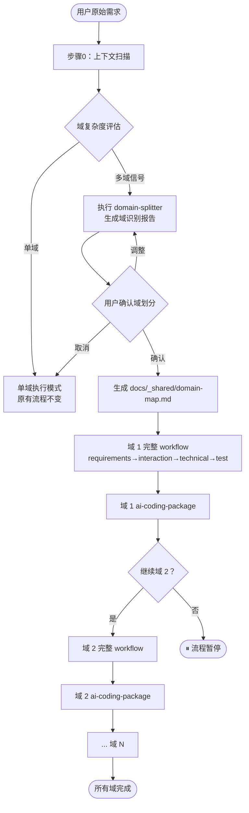

# Workflow Orchestrator：端到端规范交付流程

## 概述

本文件是端到端规范交付流程的完整入口。激活本文件后，将依次引导四个阶段完成从原始需求到测试覆盖率报告的全流程交付。

**流程起点**：用户的自然语言原始需求
**流程终点**：所有阶段 specs 经用户确认，docs 生成完毕，输出 AI Web Coding 可用规格包

> **重要**：当用户提交需求或功能描述时，**直接进入 requirements-analysis 执行流程**，不询问是否启动 spec session，不切换到其他模式。

---

## ⚠️ 全局路径强制规则（CRITICAL — 所有阶段必须遵守）

**产出文件分为两类，分别写入不同目录，命名规则不同：**

| 文件类型 | 写入路径 | 说明 |
|---------|---------|------|
| 可执行规格（requirements / design / tasks） | `specs/{module-name}_{YYYYMMDDHHmmss}/{phase}/` | 每次执行 workflow 都创建新文件夹，时间戳确保唯一性 |
| 知识库文档（context / flowchart / demo / index） | `docs/{module-name}/{phase}/` | 以模块为单位，默认修改已有文件，不重复创建 |
| 原始需求存档 | `docs/{module-name}/raw-requirements.md` | 追加写入，保留历史记录 |

**命名规则说明：**

| 类型 | 格式 | 示例 | 规则 |
|------|------|------|------|
| specs 文件夹 | `{module-name}_{YYYYMMDDHHmmss}` | `user-auth_20260312143022` | 每次执行都新建，即使需求相同 |
| docs 文件夹 | `{module-name}` | `user-auth` | 以模块为单位，同模块共用一个文件夹 |

**`{phase}` 使用功能名称：**

| 阶段　　　　　　　　 | phase 名称　　　　　　　|
| ----------------------| -------------------------|
| 需求分析与规格定义　 | `requirements-analysis` |
| 交互设计与视觉规范　 | `interaction-design`　　|
| 技术方案设计　　　　 | `technical-design`　　　|
| 测试验证与覆盖率报告 | `test-verification`　　 |

| 规则 | 说明 |
|------|------|
| ✅ specs 正确路径 | `specs/{module-name}_{YYYYMMDDHHmmss}/requirements-analysis/` 等 |
| ✅ docs 正确路径 | `docs/{module-name}/requirements-analysis/` 等 |
| ❌ 严禁写入 | `.kiro/specs/` 下的任何路径 |
| ❌ 严禁写入 | `.kiro/steering/` 下的任何路径 |
| ❌ 严禁写入 | 项目根目录 |

---

## ⚠️ 严禁触发 Kiro 内置 Spec 模式（CRITICAL）

- 当用户提交任何产品需求、功能描述或开发任务时，**直接进入 requirements-analysis 执行流程**
- **绝对禁止**在 `.kiro/specs/` 下创建任何文件夹或文件
- **绝对禁止**询问"是否启动 spec session"或触发 Kiro spec 工作流
- **绝对禁止**创建 `.config.kiro` 文件

---

## ⚠️ 需求开始前：强制执行上下文扫描（CRITICAL）

**在接收到任何需求后，进入 requirements-analysis 之前，必须先执行以下扫描步骤：**

```
步骤 0：上下文扫描与变更性质分析
  ├── 0-1：扫描项目文件结构（查看 docs/ 和 specs/ 目录）
  ├── 0-2：查找与当前需求相关的已有 docs 文件（docs/{module-name}/）
  ├── 0-3：查找历史 spec 记录（specs/{module-name}_*/）
  ├── 0-4：分析变更性质，输出分析结论
  └── 0-5：执行域复杂度评估（见下方"域拆分判断"）
```

### 域拆分判断（步骤 0-5）

**在完成变更性质分析后，必须执行域复杂度评估：**

读取 `.kiro/steering/skills/domain-splitter/SKILL.md`，按其触发条件判断是否需要拆分域：

```
满足以下任意条件 → 触发 domain-splitter Skill，暂停等待用户确认域划分
  ├── 需求描述中出现 3 个以上明显不同的业务实体
  ├── 需求涉及多个独立的用户角色且职责不重叠
  ├── 需求明确提到"系统"、"平台"、"多模块"等词汇
  ├── 需求中存在明显的数据所有权边界
  └── 预估任务量超过 20 个独立功能点

以上条件均不满足 → 跳过域拆分，作为单域继续执行（module-name 由用户确认）
```

**域拆分执行结果分支：**

```
domain-splitter 输出域划分报告
  ├── 用户确认域划分 → 进入【多域执行模式】（见下方说明）
  ├── 用户调整后确认 → 按调整后的域划分进入【多域执行模式】
  └── 用户取消 / 单域 → 进入【单域执行模式】（原有流程，不变）
```

### 变更性质判断规则

| 变更性质 | 判断依据 | docs 处理方式 |
|---------|---------|-------------|
| 🆕 全新模块 | docs/ 下不存在对应模块文件夹 | 创建新的 `docs/{module-name}/` |
| ➕ 功能扩展 | 已有模块，新增功能点，不影响现有架构 | 修改已有 docs 文件，追加内容 |
| 🔧 局部修改 | 已有模块，修改部分功能，影响范围有限 | 修改已有 docs 文件对应章节 |
| 🔄 重大重构 | 已有模块，架构级别变更，影响多个文件 | 评估后决定：通常仍修改已有文件，仅在架构完全推翻时才创建新模块文件夹 |

**核心原则：只要不是大的改动（架构完全推翻），都应修改已有 docs 文件，不生成新文件。**

### 扫描结论输出格式

> **上下文扫描结论**
>
> - 相关模块：`{module-name}`（已存在 / 不存在）
> - 历史 spec 记录：`specs/{module-name}_{timestamp}/`（找到 N 条 / 无记录）
> - 已有 docs 文件：`docs/{module-name}/`（列出相关文件 / 无）
> - 变更性质：{🆕 全新模块 / ➕ 功能扩展 / 🔧 局部修改 / 🔄 重大重构}
> - docs 处理方式：{创建新文件夹 / 修改已有文件}
> - 域复杂度评估：{🔲 单域（继续原有流程）/ 🗂️ 多域（触发 domain-splitter）}
> - 本次 spec 路径：`specs/{module-name}_{YYYYMMDDHHmmss}/`（单域）或 待域确认后确定（多域）

---

## 整体流程概述



---

## ⚠️ 阶段执行强制规则：Specs 先行，确认后生成 Docs（CRITICAL）

**每个阶段必须严格遵守以下执行顺序，不得跳过任何步骤：**

```
步骤 1：生成 specs 文件（requirements.md + design.md + tasks.md）
步骤 2：向用户展示 specs 摘要，主动澄清模糊或不清晰的需求点
         ├── 用户提出疑问、修改意见，或存在理解歧义 → 更新 specs，重复步骤 2
         └── 双方对需求理解一致，用户明确确认 → 进入步骤 3
步骤 3：生成 docs 文件（context.md + 附加文件 + index.md）
步骤 4：询问用户是否继续下一阶段
         ├── 用户确认继续 → 进入下一阶段
         └── 用户选择暂停 → 流程暂停，等待用户指令
```

**澄清原则**：
- 每次展示 specs 后，必须主动列出当前存在的模糊点或假设，请用户确认
- 不得在需求存在歧义时单方面推进
- 澄清轮次不限，直到用户明确表示"确认无误"或"可以继续"

**阶段间过渡询问格式（docs 生成后必须使用）**：

> docs 文件已生成完毕。是否继续进入下一阶段：**[下一阶段名称]**？
>
> - 回复"继续"或"是" → 进入下一阶段
> - 回复"暂停"或"否" → 流程暂停，随时可以继续

**严禁行为**：
- ❌ 禁止在用户确认需求清晰前生成任何 docs 文件
- ❌ 禁止跳过阶段间过渡询问直接进入下一阶段
- ❌ 禁止将 specs 澄清、docs 生成、阶段过渡合并在同一步骤完成

---

## 多域执行模式

> 仅在 domain-splitter 输出域划分且用户确认后进入此模式。单域需求继续走原有流程，本节不适用。

### 执行原则

1. **域间顺序**：按 domain-splitter 输出的优先级顺序依次执行，高依赖度的域（如 auth/user）最先处理
2. **域内完整性**：每个域独立走完完整的四阶段 workflow（requirements → interaction → technical → test），产出规范与单域完全一致
3. **跨域文件**：所有域确认后、第一个域开始前，先生成 `docs/_shared/domain-map.md`
4. **域间过渡**：每个域的 ai-coding-package 生成后，询问用户是否继续下一个域

### 多域流程图



### 域内 workflow 执行规范

每个域执行时，以该域的 `module-name` 代入所有现有规范：

| 规范项 | 单域 | 多域（每个域） |
|--------|------|--------------|
| specs 路径 | `specs/{module-name}_{ts}/` | `specs/{domain-module-name}_{ts}/` |
| docs 路径 | `docs/{module-name}/` | `docs/{domain-module-name}/` |
| 需求类型识别 | 整体需求 | 该域范围内的需求 |
| 阶段执行规则 | 原有规则 | 原有规则（完全一致） |
| ai-coding-package | 全流程完成后生成 | 每个域四阶段完成后各生成一次 |

**额外约定**（多域专属）：
- technical-design 的 `api-spec.md` 中，跨域调用的 API 端点需标注 `[cross-domain]`
- technical-design 的 `context.md` 中，需声明该域依赖的其他域接口
- `docs/_shared/domain-map.md` 在每个域完成后更新对应状态

---

## 各阶段详细说明

### requirements-analysis：需求分析与规格定义

| 项目　　　　　 | 内容　　　　　　　　　　　　　　　　　　　　　　　　　　　　　　　　　　　　　　　　　　　　　　　　　　 |
| ----------------| ----------------------------------------------------------------------------------------------------------|
| **触发条件**　 | 用户提交原始需求文本，且已完成步骤 0 上下文扫描　　　　　　　　　　　　　　　　　　　　　　　　　　　　　|
| **首要动作**　 | 执行步骤 0 扫描，识别需求类型，告知执行路径，等待用户确认　　　　　　　　　　　　　　　　　　　　　　　　|
| **输入来源**　 | 用户直接输入 + 步骤 0 扫描结果　　　　　　　　　　　　　　　　　　　　　　　　　　　　　　　　　　　　　 |
| **激活文件**　 | `.kiro/steering/phases/requirements-analysis/index.md`　　　　　　　　　　　　　　　　　　　　　　　　　 |
| **步骤 1 输出**| `specs/{module-name}_{YYYYMMDDHHmmss}/requirements-analysis/requirements.md` + `design.md` + `tasks.md` |
| **需求澄清**　 | 反复与用户确认，直到需求无歧义　　　　　　　　　　　　　　　　　　　　　　　　　　　　　　　　　　　　　|
| **步骤 3 输出**| `docs/{module-name}/requirements-analysis/context.md` + `flowchart.md`（附加）+ `index.md`（修改或新建）|
| **完成标准**　 | 用户确认需求清晰，docs 生成完毕，用户确认继续下一阶段，状态标记为 `completed`　　　　　　　　　　　　　 |

**Skills 执行规则（按需求类型裁剪）**：

| 需求类型 | 执行的 Skills |
|---------|-------------|
| 🆕 新产品 | market-research → competitor-analysis → priority-matrix → feature-spec → requirements-clarify → user-story-writer → flowchart-generator |
| ➕ 功能新增 | priority-matrix → feature-spec → requirements-clarify → user-story-writer → flowchart-generator |
| 🔧 重构 | feature-spec → requirements-clarify → user-story-writer → flowchart-generator |
| 🐛 Bug 修复 | requirements-clarify → user-story-writer |
| 🎨 UI/UX 调整 | feature-spec → requirements-clarify → user-story-writer → flowchart-generator |

---

### interaction-design：交互设计与视觉规范

| 项目 | 内容 |
|------|------|
| **触发条件** | requirements-analysis 状态为 `completed` |
| **输入来源** | `docs/{module-name}/requirements-analysis/context.md` |
| **激活文件** | `.kiro/steering/phases/interaction-design/index.md` |
| **步骤 1 输出** | `specs/{module-name}_{YYYYMMDDHHmmss}/interaction-design/requirements.md` + `design.md` + `tasks.md` |
| **需求澄清** | 反复与用户确认交互细节，直到所有交互歧义解决 |
| **步骤 3 输出** | `docs/{module-name}/interaction-design/context.md` + `flowchart.md`（附加）+ `demo.html`（附加）+ `index.md`（修改或新建）|
| **完成标准** | 用户确认需求清晰，所有交互歧义已解决，docs 生成完毕，用户确认继续下一阶段，状态标记为 `completed` |

**强制执行 Skills（按序）**：ui-ux-pro-max → wireframe-generator → design-token-spec → flowchart-generator

---

### technical-design：技术方案设计

| 项目 | 内容 |
|------|------|
| **触发条件** | requirements-analysis 和 interaction-design 均为 `completed` |
| **输入来源** | `docs/{module-name}/requirements-analysis/context.md` + `docs/{module-name}/interaction-design/context.md` |
| **激活文件** | `.kiro/steering/phases/technical-design/index.md` |
| **步骤 1-2 输出** | `specs/{module-name}_{YYYYMMDDHHmmss}/technical-design/design.md`（技术选型 + 风险登记表） |
| **步骤 3 输出** | `docs/{module-name}/technical-design/architecture-decisions.md`（用户确认后锁定，修改或新建）|
| **步骤 4-6 输出** | `docs/{module-name}/` 下：`component-tree.md` + `database-schema.md` + `api-spec.md`（修改或新建）|
| **步骤 7-8 输出** | `docs/{module-name}/` 下：`file-structure.md` + `dev-setup.md`（修改或新建）|
| **步骤 9 输出** | `specs/{module-name}_{YYYYMMDDHHmmss}/technical-design/tasks.md`（含具体操作步骤的开发任务列表）|
| **需求澄清** | 步骤 3 架构确认、步骤 4-6 完成后各有一次用户确认节点 |
| **docs 输出** | `docs/{module-name}/technical-design/` 下：`context.md` + `flowchart.md`（架构图+时序图+ER图）+ `index.md` |
| **完成标准** | 用户确认架构决策，所有 specs 文件生成完毕，docs 生成完毕，用户确认继续下一阶段 |
| **特殊情况** | 发现根本性业务逻辑缺陷时，回退到 requirements-analysis |

**强制执行 Skills（按序，含并行）**：
- 并行：tech-stack-advisor + risk-analysis
- 确认节点：architecture-confirm（后端默认 C# + ASP.NET Core，用户逐项确认；C# 项目激活 csharp skill）
- 前端框架检测：已有项目自动识别 React/Vue，新项目询问用户 → 激活对应框架 skills（item-api-layer / item-components / item-type-patterns）
- 并行：component-breakdown + database-design + api-design（前端遵循框架 skills 约束，后端遵循 csharp skill 约束）
- 确认节点：用户确认组件/数据库/API 完整性
- 并行：file-structure-generator + dev-environment-setup
- 最后：task-breakdown

---

### test-verification：测试验证与覆盖率报告

| 项目 | 内容 |
|------|------|
| **触发条件** | requirements-analysis 和 technical-design 均为 `completed` |
| **输入来源** | `docs/{module-name}/requirements-analysis/context.md` + `docs/{module-name}/technical-design/context.md` |
| **激活文件** | `.kiro/steering/phases/test-verification/index.md` |
| **步骤 1 输出** | `specs/{module-name}_{YYYYMMDDHHmmss}/test-verification/requirements.md` + `design.md`（含测试用例 + 问题清单）+ `tasks.md` |
| **需求澄清** | 步骤 1 完成后展示测试用例总览，等待用户确认覆盖范围 |
| **步骤 3 输出** | `docs/{module-name}/test-verification/index.md`（修改或新建，无 context，无下游）|
| **完成标准** | 用户确认测试覆盖范围，所有 TC 有执行状态，问题清单生成，docs 生成完毕，状态标记为 `completed` |
| **特殊情况** | 发现实现缺陷时，回退到 technical-design |

**强制执行 Skills（按序）**：test-case-generator → 生成问题清单 → auto-test-runner

---

### bug-feedback：错误反馈处理

| 项目 | 内容 |
|------|------|
| **触发条件** | AI Coding 完成后，用户反馈应用存在错误或异常行为 |
| **核心原则** | **严禁直接修改代码**，必须先更新 spec，再按 spec 驱动代码修复 |
| **输入来源** | 用户描述的错误信息 + 对应模块最新的 `specs/{module-name}_{timestamp}/` |
| **步骤 1** | 分析错误，判断受影响的 spec 层级（需求层 / 设计层 / 任务层） |
| **步骤 2** | 更新对应 spec 文件（requirements.md / design.md / tasks.md），向用户展示变更摘要 |
| **步骤 3** | 用户确认 spec 更新无误后，评估是否需要同步更新 `docs/{module-name}/` 中的归档文件 |
| **步骤 4** | 若需要更新 docs，则同步修改对应归档文件（context.md / architecture-decisions.md 等） |
| **步骤 5** | 按更新后的 spec 执行代码修复 |
| **步骤 6** | 修复完成后，询问用户是否还有其他错误需要处理 |
| **完成标准** | 用户确认错误已修复，spec、docs、代码三者保持一致 |

**错误分类与 spec 更新规则**：

| 错误类型 | 受影响的 spec | 更新内容 |
|---------|-------------|---------|
| 功能行为与需求不符 | `requirements.md` | 补充或修正验收标准（AC） |
| UI/交互异常 | `design.md`（interaction-design 部分） | 修正交互描述或设计约束 |
| 接口/数据异常 | `design.md`（technical-design 部分） | 修正 API 定义或数据结构 |
| 任务遗漏或执行错误 | `tasks.md` | 补充遗漏任务或修正任务描述 |
| 架构级缺陷 | 回退到 technical-design 阶段重新执行 | — |

**严禁行为**：
- ❌ 禁止在未更新 spec 的情况下直接修改代码
- ❌ 禁止绕过 spec 确认步骤直接执行修复
- ❌ 禁止在 spec 确认前评估或修改 docs
- ❌ 禁止将多个不相关的错误合并在同一次 spec 更新中处理

**docs 更新判断规则**（spec 确认后执行）：

| 条件 | 是否需要更新 docs |
|------|----------------|
| spec 变更影响了业务流程或数据结构 | ✅ 更新 `context.md`、`flowchart.md` 等相关归档 |
| spec 变更仅为任务描述或 AC 措辞调整 | ❌ 无需更新 docs |
| spec 变更影响了 API 定义或数据库结构 | ✅ 更新 `api-spec.md`、`database-schema.md` 等 |
| spec 变更影响了架构决策 | ✅ 更新 `architecture-decisions.md` |

---

## 三种使用模式

### 模式一：完整 Workflow（单域）

```
用户提供原始需求
  → 步骤 0 扫描（域复杂度评估 → 单域）
  → 激活 phases/requirements-analysis/index.md
  → 激活 phases/interaction-design/index.md
  → 激活 phases/technical-design/index.md
  → 激活 phases/test-verification/index.md
  → 输出 AI Web Coding 可用规格包，流程结束
```

### 模式一（扩展）：完整 Workflow（多域）

```
用户提供大型项目需求
  → 步骤 0 扫描（域复杂度评估 → 多域信号）
  → 激活 skills/domain-splitter/SKILL.md
  → 输出域识别报告，等待用户确认
  → 用户确认后生成 docs/_shared/domain-map.md
  → 对每个域依次执行完整 Workflow（同模式一）
  → 每个域输出独立的 AI Web Coding 可用规格包
```

### 模式二：单独阶段

| 需求 | 激活文件 | 需要提供的输入 |
|------|---------|-------------|
| 只需需求分析 | `phases/requirements-analysis/index.md` | 原始需求文本 |
| 只需交互设计 | `phases/interaction-design/index.md` | `requirements-analysis/context.md` |
| 只需技术方案 | `phases/technical-design/index.md` | `requirements-analysis/context.md` + `interaction-design/context.md` |
| 只需测试用例 | `phases/test-verification/index.md` | `requirements-analysis/context.md` + `technical-design/context.md` |

### 模式三：单独 Skill

| 需求　　　　　 | 激活文件　　　　　　　　　　　　　　　 |
| ----------------| ----------------------------------------|
| 市场调研　　　 | `skills/market-research/SKILL.md`　　　|
| 竞品分析　　　 | `skills/competitor-analysis/SKILL.md`　|
| 优先级矩阵　　 | `skills/priority-matrix/SKILL.md`　　　|
| 功能规格说明　 | `skills/feature-spec/SKILL.md`　　　　 |
| 澄清模糊需求　 | `skills/requirements-clarify/SKILL.md` |
| 撰写用户故事　 | `skills/user-story-writer/SKILL.md`　　|
| 生成流程图　　 | `skills/flowchart-generator/SKILL.md`　|
| UI/UX 设计系统 | `skills/ui-ux-pro-max/SKILL.md`　　　　|
| 生成线框图　　 | `skills/wireframe-generator/SKILL.md`　|
| 生成设计规范　 | `skills/design-token-spec/SKILL.md`　　|
| 技术选型建议　 | `skills/tech-stack-advisor/SKILL.md`　 |
| 架构确认　　　 | `skills/architecture-confirm/SKILL.md` |
| 组件拆分　　　 | `skills/component-breakdown/SKILL.md`　|
| 数据库设计　　 | `skills/database-design/SKILL.md`　　　|
| API 设计　　　 | `skills/api-design/SKILL.md`　　　　　 |
| 文件结构生成　 | `skills/file-structure-generator/SKILL.md` |
| 开发环境配置　 | `skills/dev-environment-setup/SKILL.md`|
| 风险分析　　　 | `skills/risk-analysis/SKILL.md`　　　　|
| 任务拆解　　　 | `skills/task-breakdown/SKILL.md`　　　 |
| 生成测试用例　 | `skills/test-case-generator/SKILL.md`　|
| 执行自动化测试 | `skills/auto-test-runner/SKILL.md`　　 |
| React API 层规范 | `skills/item-api-layer-react/SKILL.md` |
| Vue API 层规范 | `skills/item-api-layer-vue/SKILL.md` |
| React 组件库规范 | `skills/item-components-react/SKILL.md` |
| Vue 组件库规范 | `skills/item-components-vue/SKILL.md` |
| React 类型规范 | `skills/item-type-patterns-react/SKILL.md` |
| Vue 类型规范 | `skills/item-type-patterns-vue/SKILL.md` |
| C# 编码规范 | `skills/csharp/SKILL.md` |
| 生成 PPT 文件 | `skills/pptx/pptxgenjs.md` |
| 搜索并安装 Skill | `skills/find-skills/SKILL.md`　　 |
| 优化网络搜索 | `skills/tavily-search/SKILL.md`　　 |
| 自我进化引擎 | `skills/capability-evolver/SKILL.md`　　 |
| 主动式 Agent 架构 | `skills/proactive-agent/SKILL.md`　　 |
| 域拆分识别 | `skills/domain-splitter/SKILL.md` |

---

## 回溯机制

| 触发方 | 触发条件 | 回退目标 |
|--------|---------|---------|
| 用户主动 | 对已完成阶段的输出不满意 | 任意已完成阶段 |
| technical-design | 发现根本性业务逻辑缺陷 | requirements-analysis |
| test-verification | 发现实现缺陷（测试用例失败） | technical-design |
| bug-feedback | 发现架构级缺陷 | technical-design |
| bug-feedback | 普通错误 | 更新当前 spec，原地修复，不触发阶段回退 |

回退后，该阶段之后的所有阶段需重新执行，对应的 specs 和 docs 文件需重新生成。

---

## 阶段状态追踪

| 阶段　　　　　　　　　| 状态　　　| specs 输出　　　　　　　　　　　　　　　　　 | docs 输出　　　　　　　　　　　　　　　　　　　　　　　　　　　　　　　|
| -----------------------| -----------| ----------------------------------------------| ------------------------------------------------------------------------|
| requirements-analysis | ⏳ pending | `requirements.md` + `design.md` + `tasks.md` | `context.md` + `flowchart.md`（附加）+ `index.md`　　　　　　　　　　　|
| interaction-design　　| ⏳ pending | `requirements.md` + `design.md` + `tasks.md` | `context.md` + `flowchart.md`（附加）+ `demo.html`（附加）+ `index.md` |
| technical-design　　　| ⏳ pending | `requirements.md` + `design.md` + `tasks.md` | `context.md` + `architecture-decisions.md` + `component-tree.md` + `database-schema.md` + `api-spec.md` + `file-structure.md` + `dev-setup.md` + `flowchart.md`（附加）+ `index.md` |
| test-verification　　 | ⏳ pending | `requirements.md` + `design.md`（含问题清单）+ `tasks.md` | `index.md`（无 context，无下游）　　　　　　　　　　　　　　　　　　　 |

> specs 写入 `specs/{module-name}_{YYYYMMDDHHmmss}/{phase}/`，docs 写入 `docs/{module-name}/{phase}/`

### 状态说明

| 状态　　　　　| 图标 | 含义　　　　　　　 |
| ---------------| ------| --------------------|
| `pending`　　 | ⏳　　| 尚未开始　　　　　 |
| `in_progress` | 🔄　 | 当前正在进行　　　 |
| `completed`　 | ✅　　| 已完成并经用户确认 |
| `needs_rerun` | 🔁　 | 因回溯需要重新执行 |

---

## 归档文件夹命名规则

```
specs/{module-name}_{YYYYMMDDHHmmss}/   ← 每次执行 workflow 都新建，时间戳精确到秒
docs/{module-name}/                      ← 以模块为单位，同模块共用，默认修改已有文件
```

- `{module-name}`：模块名称，kebab-case（如 `user-auth`、`task-manager`）
- `{YYYYMMDDHHmmss}`：workflow 开始时的时间戳，精确到秒（如 `20260312143022`）

**docs 文件夹创建规则：**
- 若 `docs/{module-name}/` 已存在 → 直接修改其中的文件，不创建新文件夹
- 若 `docs/{module-name}/` 不存在 → 创建新文件夹（仅限全新模块）
- 即使发送了相同的需求，docs 也不会重复创建，只会更新内容

**完整目录结构示例**（模块名 `task-manager`，两次执行时间戳不同）：

```
specs/task-manager_20260311090000/      ← 第一次执行
├── requirements-analysis/
│   ├── requirements.md
│   ├── design.md
│   └── tasks.md
└── technical-design/
    ├── requirements.md
    ├── design.md
    └── tasks.md

specs/task-manager_20260312143022/      ← 第二次执行（即使需求相同，也新建）
├── requirements-analysis/
│   ├── requirements.md
│   ├── design.md
│   └── tasks.md
└── technical-design/
    ├── requirements.md
    ├── design.md
    └── tasks.md

docs/task-manager/                      ← 两次执行共用同一个 docs 文件夹
├── raw-requirements.md                 ← 追加写入，保留历史记录
├── requirements-analysis/
│   ├── context.md                      ← 更新为最新内容
│   ├── flowchart.md
│   └── index.md
├── interaction-design/
│   ├── context.md
│   ├── flowchart.md
│   ├── demo.html
│   └── index.md
├── technical-design/
│   ├── context.md
│   ├── architecture-decisions.md
│   ├── component-tree.md
│   ├── database-schema.md
│   ├── api-spec.md
│   ├── file-structure.md
│   ├── dev-setup.md
│   ├── flowchart.md
│   └── index.md
└── test-verification/
    └── index.md
```

---

## 完整性校验

每个阶段完成后，必须确认所有必需文件已生成。

### 各阶段必需文件

| 文件 | requirements-analysis | interaction-design | technical-design | test-verification |
|------|----------------------|-------------------|-----------------|------------------|
| `specs/.../requirements.md` | ✅ 必需 | ✅ 必需 | ✅ 必需 | ✅ 必需 |
| `specs/.../design.md` | ✅ 必需 | ✅ 必需 | ✅ 必需 | ✅ 必需 |
| `specs/.../tasks.md` | ✅ 必需 | ✅ 必需 | ✅ 必需 | ✅ 必需 |
| `specs/.../architecture-decisions.md` | ❌ 不适用 | ❌ 不适用 | ❌ 不适用（移至 docs） | ❌ 不适用 |
| `specs/.../component-tree.md` | ❌ 不适用 | ❌ 不适用 | ❌ 不适用（移至 docs） | ❌ 不适用 |
| `specs/.../database-schema.md` | ❌ 不适用 | ❌ 不适用 | ❌ 不适用（移至 docs） | ❌ 不适用 |
| `specs/.../api-spec.md` | ❌ 不适用 | ❌ 不适用 | ❌ 不适用（移至 docs） | ❌ 不适用 |
| `specs/.../file-structure.md` | ❌ 不适用 | ❌ 不适用 | ❌ 不适用（移至 docs） | ❌ 不适用 |
| `specs/.../dev-setup.md` | ❌ 不适用 | ❌ 不适用 | ❌ 不适用（移至 docs） | ❌ 不适用 |
| `docs/.../context.md` | ✅ 必需 | ✅ 必需 | ✅ 必需 | ❌ 无下游 |
| `docs/.../architecture-decisions.md` | ❌ 不适用 | ❌ 不适用 | ✅ 必需 | ❌ 不适用 |
| `docs/.../component-tree.md` | ❌ 不适用 | ❌ 不适用 | ✅ 必需 | ❌ 不适用 |
| `docs/.../database-schema.md` | ❌ 不适用 | ❌ 不适用 | ✅ 必需 | ❌ 不适用 |
| `docs/.../api-spec.md` | ❌ 不适用 | ❌ 不适用 | ✅ 必需 | ❌ 不适用 |
| `docs/.../file-structure.md` | ❌ 不适用 | ❌ 不适用 | ✅ 必需 | ❌ 不适用 |
| `docs/.../dev-setup.md` | ❌ 不适用 | ❌ 不适用 | ✅ 必需 | ❌ 不适用 |
| `docs/.../flowchart.md` | ➕ 附加 | ➕ 附加 | ➕ 附加 | ❌ 不适用 |
| `docs/.../demo.html` | ❌ 不适用 | ➕ 附加 | ❌ 不适用 | ❌ 不适用 |
| `docs/.../index.md` | ✅ 必需 | ✅ 必需 | ✅ 必需 | ✅ 必需 |

必需文件缺失 → 校验失败，阶段保持 `in_progress`。附加文件可标记 `pending`，不阻断流程。

---

## 文件目录结构参考

```
.kiro/steering/
├── workflow-orchestrator.md          ← 本文件（完整流程入口）
├── phases/
│   ├── requirements-analysis/
│   │   └── index.md
│   ├── interaction-design/
│   │   └── index.md
│   ├── technical-design/
│   │   └── index.md
│   └── test-verification/
│       └── index.md
└── skills/
    ├── market-research/SKILL.md
    ├── competitor-analysis/SKILL.md
    ├── priority-matrix/SKILL.md
    ├── feature-spec/SKILL.md
    ├── requirements-clarify/SKILL.md
    ├── user-story-writer/SKILL.md
    ├── flowchart-generator/SKILL.md
    ├── ui-ux-pro-max/SKILL.md
    ├── wireframe-generator/SKILL.md
    ├── design-token-spec/SKILL.md
    ├── tech-stack-advisor/SKILL.md
    ├── architecture-confirm/SKILL.md  
    ├── component-breakdown/SKILL.md   
    ├── database-design/SKILL.md       
    ├── api-design/SKILL.md            
    ├── file-structure-generator/SKILL.md
    ├── dev-environment-setup/SKILL.md 
    ├── find-skills/SKILL.md 
    ├── tavily-search/SKILL.md 
    ├── capability-evolver/SKILL.md 
    ├── proactive-agent/SKILL.md 
    ├── domain-splitter/SKILL.md
    ├── risk-analysis/SKILL.md
    ├── task-breakdown/SKILL.md
    ├── test-case-generator/SKILL.md
    ├── auto-test-runner/SKILL.md
    ├── item-api-layer-react/SKILL.md
    ├── item-api-layer-vue/SKILL.md
    ├── item-components-react/SKILL.md
    ├── item-components-vue/SKILL.md
    ├── item-type-patterns-react/SKILL.md
    ├── item-type-patterns-vue/SKILL.md
    ├── csharp/SKILL.md
    ├── pptx/pptxgenjs.md
    └── auto-test-runner/SKILL.md
```

---

## 最终输出：AI Web Coding 可用规格包

### ⚠️ 触发条件（严格执行，缺一不可）

**仅在以下所有条件同时满足时，才生成 `ai-coding-package`，且只生成一次：**

1. requirements-analysis 状态为 `completed`
2. interaction-design 状态为 `completed`
3. technical-design 状态为 `completed`
4. test-verification 状态为 `completed`
5. `specs/{module-name}_{YYYYMMDDHHmmss}/ai-coding-package/` 目录**不存在**

**严禁行为：**
- ❌ 禁止在任何单个阶段完成时生成 `ai-coding-package`
- ❌ 禁止在 `ai-coding-package/` 目录已存在时重复生成
- ❌ 禁止在中间阶段（requirements-analysis / interaction-design / technical-design）完成时触发最终输出
- ❌ 禁止每个阶段各自生成一份 `ai-coding-package`

**生成前必须检查：**
```
如果 specs/{module-name}_{YYYYMMDDHHmmss}/ai-coding-package/ 已存在
  → 跳过生成，直接展示已有 README.md 内容
否则
  → 确认四个阶段均为 completed 后，执行一次性生成
```

---

### 输出目标

将所有阶段的 specs 和 docs 整合为一个统一的 AI Web Coding 规格包，保持与各阶段一致的 spec 结构（requirements / design / tasks），并附带完整的 docs 可视化文件，形成"总 spec 包含多个子 spec + 完整上下文"的层级关系，供 AI 直接用于 web 应用开发。

### 输出文件

```
specs/{module-name}_{YYYYMMDDHHmmss}/
└── ai-coding-package/                    ← 整个项目只生成一次，不得重复创建
    ├── README.md                         ← 规格包入口：项目概述、技术栈、使用说明、阅读顺序
    ├── requirements.md                   ← 合并自各阶段 requirements.md：完整产品需求 + 验收标准
    ├── design.md                         ← 合并自各阶段 design.md：UI设计+架构+技术选型+测试策略
    └── tasks.md                          ← 合并自各阶段 tasks.md：按执行顺序排列的完整任务列表

### 各文件合并规则

#### requirements.md
合并来源（按顺序）：
1. `requirements-analysis/requirements.md` — 用户故事 + AC
2. `interaction-design/requirements.md` — 交互设计需求 + 验收标准
3. `technical-design/requirements.md` — 技术方案需求 + 验收标准
4. `test-verification/requirements.md` — 测试覆盖范围 + 质量目标

每段内容前标注来源：`<!-- 来源: {phase}/requirements.md -->`

#### design.md
合并来源（按顺序）：
1. `interaction-design/design.md` — 线框图 + Design Tokens + 组件架构
2. `technical-design/design.md` — 架构设计 + 技术选型 + 风险登记表
3. `test-verification/design.md` — 测试策略 + 测试用例 + 问题清单

每段内容前标注来源：`<!-- 来源: {phase}/design.md -->`

#### tasks.md
合并来源（按执行顺序）：
1. `technical-design/tasks.md` 第一组：环境搭建
2. `technical-design/tasks.md` 第二组：数据层
3. `technical-design/tasks.md` 第三组：API 层
4. `technical-design/tasks.md` 第四组：UI 层
5. `test-verification/tasks.md`：测试任务

格式为可直接执行的 checklist，每个任务保留原始 Task ID。

### docs 各文件合并规则

#### context.md
合并来源（按顺序）：
1. `requirements-analysis/context.md` — 业务目标、用户故事摘要、数据实体
2. `interaction-design/context.md` — 组件清单、Design Tokens 摘要、关键交互约定
3. `technical-design/context.md` — 技术栈、数据库摘要、API 端点摘要、风险摘要

每段内容前标注来源：`<!-- 来源: {phase}/context.md -->`

#### flowcharts.md
合并来源（按顺序）：
1. `requirements-analysis/flowchart.md` — 业务流程图
2. `interaction-design/flowchart.md` — 用户操作流程图
3. `technical-design/flowchart.md` — 系统架构图 + 时序图 + ER 图

每张图前标注来源和用途。

#### 其余 docs 文件（直接复制，不合并）
| 文件 | 来源 |
|------|------|
| `component-tree.md` | `docs/.../technical-design/component-tree.md` |
| `database-schema.md` | `docs/.../technical-design/database-schema.md` |
| `api-spec.md` | `docs/.../technical-design/api-spec.md` |
| `file-structure.md` | `docs/.../technical-design/file-structure.md` |
| `dev-setup.md` | `docs/.../technical-design/dev-setup.md` |
| `architecture-decisions.md` | `docs/.../technical-design/architecture-decisions.md` |

### README.md 必须包含的内容

1. 项目概述（一句话描述）
2. 技术栈（来自 technical-design）
3. 如何使用本规格包进行 AI 编码的说明
4. 文件阅读顺序：`requirements.md` → `design.md` → `tasks.md`
5. 子规格来源索引（每个文件对应哪些阶段的输出）

### 生成规则

- 所有合并内容必须保留原始来源标注
- `tasks.md` 中的任务必须按执行依赖顺序排列，格式为可直接执行的 checklist
- 规格包生成完毕后，向用户展示 README.md 内容

### 完成提示语

> 🎉 所有阶段已完成，AI Web Coding 规格包已生成。
>
> 你可以将 `specs/{module-name}_{YYYYMMDDHHmmss}/ai-coding-package/` 目录下的文件直接提供给 AI 编码助手，从 `README.md` 开始阅读，按照 `tasks.md` 中的任务顺序进行开发。

---

## ⚠️ 最终询问：是否开始开发（CRITICAL）

**仅在 ai-coding-package 生成完毕后，必须向用户展示以下询问，且只询问一次：**

> 规格包已生成完毕。是否现在开始开发？
>
> 开发将按照 `specs/{module-name}_{YYYYMMDDHHmmss}/technical-design/tasks.md` 中的任务顺序执行，从环境搭建开始，逐步完成所有功能。
>
> - 回复"开始开发"或"是" → 按任务列表顺序开始执行开发任务
> - 回复"暂不开发"或"否" → 流程结束，规格包保留供后续使用

**开始开发时的执行规则**：
1. 读取 `specs/{module-name}_{YYYYMMDDHHmmss}/technical-design/tasks.md`
2. 按任务分组顺序执行（第一组 → 第二组 → 第三组 → 第四组）
3. 同一组内的任务可并行执行
4. 每个任务完成后更新状态为 `completed`
5. 遇到阻塞问题时，暂停并向用户说明，等待指示

**严禁行为**：
- ❌ 禁止在用户未确认前自动开始开发
- ❌ 禁止跳过任务或改变任务顺序（除非用户明确指示）
- ❌ 禁止在任务执行中途切换到其他任务（除非当前任务被阻塞）
