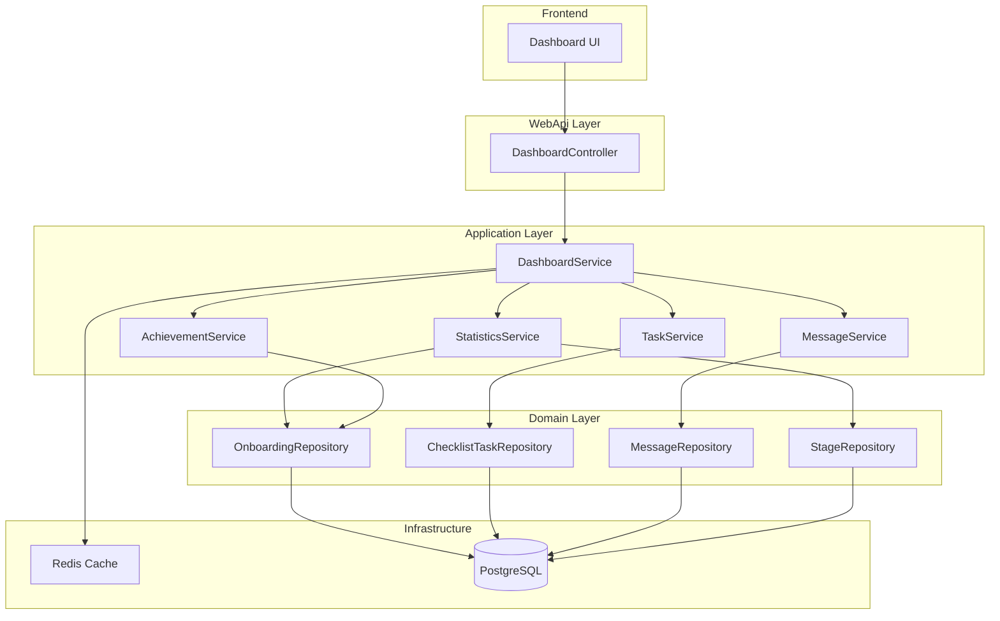

# Design Document: Dashboard API

## Overview

本设计文档定义了 FlowFlex 系统仪表盘 API 的技术架构和实现方案。仪表盘 API 提供统一的数据聚合接口，为前端提供案例统计、待办任务、消息摘要、成就记录和截止日期等数据。

API 采用单一聚合端点设计，支持按模块选择性加载数据，以优化性能和用户体验。

## Architecture

### 系统架构图



### API 端点设计

| 方法 | 路径 | 说明 |
|------|------|------|
| GET | `/api/ow/dashboard/v1` | 获取仪表盘聚合数据 |
| GET | `/api/ow/dashboard/v1/statistics` | 获取统计概览 |
| GET | `/api/ow/dashboard/v1/stage-distribution` | 获取阶段分布 |
| GET | `/api/ow/dashboard/v1/tasks` | 获取待办任务列表 |
| GET | `/api/ow/dashboard/v1/messages` | 获取消息摘要 |
| GET | `/api/ow/dashboard/v1/achievements` | 获取近期成就 |
| GET | `/api/ow/dashboard/v1/deadlines` | 获取即将到期截止日期 |

## Components and Interfaces

### 1. DashboardController

```csharp
[ApiController]
[Route("api/ow/dashboard/v1")]
[WFEAuthorize(PermissionConsts.Dashboard.Read)]
public class DashboardController : OWControllerBase
{
    private readonly IDashboardService _dashboardService;
    
    /// <summary>
    /// Get aggregated dashboard data
    /// </summary>
    [HttpGet]
    public async Task<IActionResult> GetDashboardAsync([FromQuery] DashboardQueryDto query);
    
    /// <summary>
    /// Get statistics overview
    /// </summary>
    [HttpGet("statistics")]
    public async Task<IActionResult> GetStatisticsAsync([FromQuery] string? team = null);
    
    /// <summary>
    /// Get stage distribution
    /// </summary>
    [HttpGet("stage-distribution")]
    public async Task<IActionResult> GetStageDistributionAsync([FromQuery] long? workflowId = null);
    
    /// <summary>
    /// Get pending tasks
    /// </summary>
    [HttpGet("tasks")]
    public async Task<IActionResult> GetTasksAsync([FromQuery] TaskQueryDto query);
    
    /// <summary>
    /// Get message summary
    /// </summary>
    [HttpGet("messages")]
    public async Task<IActionResult> GetMessagesAsync([FromQuery] int limit = 5);
    
    /// <summary>
    /// Get recent achievements
    /// </summary>
    [HttpGet("achievements")]
    public async Task<IActionResult> GetAchievementsAsync([FromQuery] int limit = 5, [FromQuery] string? team = null);
    
    /// <summary>
    /// Get upcoming deadlines
    /// </summary>
    [HttpGet("deadlines")]
    public async Task<IActionResult> GetDeadlinesAsync([FromQuery] int days = 7);
}
```

### 2. IDashboardService Interface

```csharp
public interface IDashboardService
{
    /// <summary>
    /// Get aggregated dashboard data
    /// </summary>
    Task<DashboardDto> GetDashboardAsync(DashboardQueryDto query);
    
    /// <summary>
    /// Get statistics overview with month-over-month comparison
    /// </summary>
    Task<DashboardStatisticsDto> GetStatisticsAsync(string? team = null);
    
    /// <summary>
    /// Get case distribution by stage
    /// </summary>
    Task<List<StageDistributionDto>> GetStageDistributionAsync(long? workflowId = null);
    
    /// <summary>
    /// Get pending tasks for current user
    /// </summary>
    Task<PagedResult<DashboardTaskDto>> GetTasksAsync(TaskQueryDto query);
    
    /// <summary>
    /// Get recent messages summary
    /// </summary>
    Task<MessageSummaryDto> GetMessageSummaryAsync(int limit = 5);
    
    /// <summary>
    /// Get recent achievements
    /// </summary>
    Task<List<AchievementDto>> GetAchievementsAsync(int limit = 5, string? team = null);
    
    /// <summary>
    /// Get upcoming deadlines
    /// </summary>
    Task<List<DeadlineDto>> GetDeadlinesAsync(int days = 7);
}
```

## Data Models

### Request DTOs

```csharp
/// <summary>
/// Dashboard query parameters
/// </summary>
public class DashboardQueryDto
{
    /// <summary>
    /// Modules to include (statistics, stageDistribution, tasks, messages, achievements, deadlines)
    /// If empty, returns all modules
    /// </summary>
    public List<string>? Modules { get; set; }
    
    /// <summary>
    /// Team filter
    /// </summary>
    public string? Team { get; set; }
    
    /// <summary>
    /// Workflow ID filter for stage distribution
    /// </summary>
    public long? WorkflowId { get; set; }
    
    /// <summary>
    /// Days range for deadlines (default: 7)
    /// </summary>
    public int DeadlineDays { get; set; } = 7;
    
    /// <summary>
    /// Limit for messages (default: 5)
    /// </summary>
    public int MessageLimit { get; set; } = 5;
    
    /// <summary>
    /// Limit for achievements (default: 5)
    /// </summary>
    public int AchievementLimit { get; set; } = 5;
}

/// <summary>
/// Task query parameters
/// </summary>
public class TaskQueryDto
{
    /// <summary>
    /// Category filter (All, Sales, Account, Other)
    /// </summary>
    public string? Category { get; set; }
    
    /// <summary>
    /// Page index (default: 1)
    /// </summary>
    public int PageIndex { get; set; } = 1;
    
    /// <summary>
    /// Page size (default: 10)
    /// </summary>
    public int PageSize { get; set; } = 10;
}
```

### Response DTOs

```csharp
/// <summary>
/// Aggregated dashboard response
/// </summary>
public class DashboardDto
{
    public DashboardStatisticsDto? Statistics { get; set; }
    public List<StageDistributionDto>? StageDistribution { get; set; }
    public PagedResult<DashboardTaskDto>? Tasks { get; set; }
    public MessageSummaryDto? Messages { get; set; }
    public List<AchievementDto>? Achievements { get; set; }
    public List<DeadlineDto>? Deadlines { get; set; }
}

/// <summary>
/// Statistics overview with trends
/// </summary>
public class DashboardStatisticsDto
{
    /// <summary>
    /// Active cases count
    /// </summary>
    public StatisticItemDto ActiveCases { get; set; }
    
    /// <summary>
    /// Completed this month count
    /// </summary>
    public StatisticItemDto CompletedThisMonth { get; set; }
    
    /// <summary>
    /// Overdue tasks count
    /// </summary>
    public StatisticItemDto OverdueTasks { get; set; }
    
    /// <summary>
    /// Average completion time in days
    /// </summary>
    public StatisticItemDto AvgCompletionTime { get; set; }
}

/// <summary>
/// Single statistic item with trend
/// </summary>
public class StatisticItemDto
{
    /// <summary>
    /// Current value
    /// </summary>
    public decimal Value { get; set; }
    
    /// <summary>
    /// Difference compared to last month
    /// </summary>
    public decimal Difference { get; set; }
    
    /// <summary>
    /// Trend direction: "up", "down", or "neutral"
    /// </summary>
    public string Trend { get; set; }
    
    /// <summary>
    /// Whether the trend is positive (improvement)
    /// For overdue tasks, decrease is positive
    /// For completion time, decrease is positive
    /// </summary>
    public bool IsPositive { get; set; }
}

/// <summary>
/// Stage distribution item
/// </summary>
public class StageDistributionDto
{
    /// <summary>
    /// Stage ID
    /// </summary>
    public long StageId { get; set; }
    
    /// <summary>
    /// Stage name
    /// </summary>
    public string StageName { get; set; }
    
    /// <summary>
    /// Case count in this stage
    /// </summary>
    public int CaseCount { get; set; }
    
    /// <summary>
    /// Stage order in workflow
    /// </summary>
    public int Order { get; set; }
    
    /// <summary>
    /// Stage color
    /// </summary>
    public string? Color { get; set; }
}

/// <summary>
/// Dashboard task item
/// </summary>
public class DashboardTaskDto
{
    /// <summary>
    /// Task ID
    /// </summary>
    public long Id { get; set; }
    
    /// <summary>
    /// Task name/title
    /// </summary>
    public string Name { get; set; }
    
    /// <summary>
    /// Priority (Low, Medium, High, Critical)
    /// </summary>
    public string Priority { get; set; }
    
    /// <summary>
    /// Due date
    /// </summary>
    public DateTimeOffset? DueDate { get; set; }
    
    /// <summary>
    /// Is overdue
    /// </summary>
    public bool IsOverdue { get; set; }
    
    /// <summary>
    /// Associated case code
    /// </summary>
    public string CaseCode { get; set; }
    
    /// <summary>
    /// Associated case name
    /// </summary>
    public string CaseName { get; set; }
    
    /// <summary>
    /// Associated onboarding ID
    /// </summary>
    public long OnboardingId { get; set; }
    
    /// <summary>
    /// Assigned team
    /// </summary>
    public string? AssignedTeam { get; set; }
    
    /// <summary>
    /// Task category
    /// </summary>
    public string? Category { get; set; }
}

/// <summary>
/// Message summary
/// </summary>
public class MessageSummaryDto
{
    /// <summary>
    /// Recent messages
    /// </summary>
    public List<DashboardMessageDto> Messages { get; set; }
    
    /// <summary>
    /// Total unread count
    /// </summary>
    public int UnreadCount { get; set; }
}

/// <summary>
/// Dashboard message item
/// </summary>
public class DashboardMessageDto
{
    /// <summary>
    /// Message ID
    /// </summary>
    public string Id { get; set; }
    
    /// <summary>
    /// Sender name
    /// </summary>
    public string SenderName { get; set; }
    
    /// <summary>
    /// Sender initials (for avatar)
    /// </summary>
    public string SenderInitials { get; set; }
    
    /// <summary>
    /// Subject
    /// </summary>
    public string Subject { get; set; }
    
    /// <summary>
    /// Body preview
    /// </summary>
    public string BodyPreview { get; set; }
    
    /// <summary>
    /// Is read
    /// </summary>
    public bool IsRead { get; set; }
    
    /// <summary>
    /// Message type labels
    /// </summary>
    public List<string> Labels { get; set; }
    
    /// <summary>
    /// Received date
    /// </summary>
    public DateTimeOffset ReceivedDate { get; set; }
    
    /// <summary>
    /// Related case code (if any)
    /// </summary>
    public string? RelatedCaseCode { get; set; }
}

/// <summary>
/// Achievement item
/// </summary>
public class AchievementDto
{
    /// <summary>
    /// Achievement ID
    /// </summary>
    public long Id { get; set; }
    
    /// <summary>
    /// Achievement title
    /// </summary>
    public string Title { get; set; }
    
    /// <summary>
    /// Achievement description
    /// </summary>
    public string Description { get; set; }
    
    /// <summary>
    /// Completion date
    /// </summary>
    public DateTimeOffset CompletionDate { get; set; }
    
    /// <summary>
    /// Associated team
    /// </summary>
    public string? Team { get; set; }
    
    /// <summary>
    /// Achievement type (CaseCompleted, MilestoneSigned, etc.)
    /// </summary>
    public string Type { get; set; }
}

/// <summary>
/// Deadline item
/// </summary>
public class DeadlineDto
{
    /// <summary>
    /// Task/Milestone ID
    /// </summary>
    public long Id { get; set; }
    
    /// <summary>
    /// Task/Milestone name
    /// </summary>
    public string Name { get; set; }
    
    /// <summary>
    /// Due date
    /// </summary>
    public DateTimeOffset DueDate { get; set; }
    
    /// <summary>
    /// Urgency category (overdue, today, tomorrow, thisWeek)
    /// </summary>
    public string Urgency { get; set; }
    
    /// <summary>
    /// Associated case code
    /// </summary>
    public string CaseCode { get; set; }
    
    /// <summary>
    /// Associated case name
    /// </summary>
    public string CaseName { get; set; }
    
    /// <summary>
    /// Associated onboarding ID
    /// </summary>
    public long OnboardingId { get; set; }
    
    /// <summary>
    /// Deadline type (Task, Milestone)
    /// </summary>
    public string Type { get; set; }
}
```

## Correctness Properties

*A property is a characteristic or behavior that should hold true across all valid executions of a system—essentially, a formal statement about what the system should do. Properties serve as the bridge between human-readable specifications and machine-verifiable correctness guarantees.*

### Property 1: Statistics Month-over-Month Comparison Accuracy

*For any* set of cases and tasks in the database, the statistics API SHALL return:
- Active cases count that matches the actual count of cases with Status = "Active"
- Completed this month count that matches cases completed within the current calendar month
- Overdue tasks count that matches tasks with DueDate < Now and IsCompleted = false
- Average completion time that equals the mean of (ActualCompletionDate - StartDate) for completed cases
- Difference values that equal (current month value - last month value)
- Trend direction that correctly reflects whether the difference is positive, negative, or zero

**Validates: Requirements 1.1, 1.2, 1.3, 1.4, 1.5, 1.6, 1.7, 1.8, 1.9**

### Property 2: Stage Distribution Ordering and Completeness

*For any* workflow with stages, the stage distribution API SHALL return:
- All stages belonging to the specified workflow
- Stages ordered by their Order field in ascending order
- Case counts that match the actual count of cases at each stage
- Overall progress percentage that equals (sum of completed stage weights / total stage weights) * 100

**Validates: Requirements 2.1, 2.2, 2.3, 2.4**

### Property 3: Task List Filtering and Ordering

*For any* set of tasks assigned to the current user, the tasks API SHALL return:
- Only tasks where AssigneeId matches the current user OR AssignedTeam is in user's teams
- Tasks filtered by category when category parameter is provided
- Tasks ordered by Priority (Critical > High > Medium > Low) then by DueDate ascending
- IsOverdue = true for tasks where DueDate < Now and IsCompleted = false
- Total count that matches the actual count of matching tasks

**Validates: Requirements 3.1, 3.2, 3.3, 3.4, 3.5, 3.6**

### Property 4: Message Summary Completeness

*For any* set of messages for the current user, the messages API SHALL return:
- At most `limit` messages ordered by ReceivedDate descending
- Each message containing SenderName, Subject, BodyPreview, ReceivedDate, and Labels
- IsRead correctly reflecting the message's read status
- UnreadCount matching the actual count of unread messages

**Validates: Requirements 4.1, 4.2, 4.3, 4.4, 4.5**

### Property 5: Achievement List Ordering

*For any* set of achievements, the achievements API SHALL return:
- At most `limit` achievements
- Achievements ordered by CompletionDate in descending order
- Each achievement containing Title, Description, CompletionDate, and Team
- Only achievements matching the team filter when provided

**Validates: Requirements 5.1, 5.2, 5.3, 5.4**

### Property 6: Deadline Categorization and Ordering

*For any* set of deadlines within the specified time range, the deadlines API SHALL return:
- Only deadlines where DueDate is within the specified days range from now
- Deadlines ordered by DueDate in ascending order
- Urgency correctly categorized as:
  - "overdue" if DueDate < Today
  - "today" if DueDate = Today
  - "tomorrow" if DueDate = Tomorrow
  - "thisWeek" otherwise
- Each deadline containing Name, DueDate, CaseCode, and CaseName

**Validates: Requirements 6.1, 6.2, 6.3, 6.4, 6.5**

### Property 7: Permission and Tenant Isolation

*For any* API request, the dashboard API SHALL:
- Only return data belonging to the current tenant (TenantId filter applied)
- Only return cases/tasks that the user has permission to view
- Aggregate data across all teams the user has access to when team filter is not specified
- Exclude data the user lacks permission to view

**Validates: Requirements 7.1, 7.2, 7.3, 7.4**

## Error Handling

### Error Codes

| 错误码 | 说明 |
|--------|------|
| 200 | 成功 |
| 400 | 参数错误（无效的模块名、无效的分页参数等） |
| 401 | 未授权（Token 无效或过期） |
| 403 | 无权限（用户无 Dashboard.Read 权限） |
| 500 | 服务器内部错误 |

### Error Response Format

```json
{
  "success": false,
  "code": "400",
  "msg": "Invalid module name: invalidModule",
  "data": null
}
```

## Testing Strategy

### Unit Tests

单元测试用于验证各个服务方法的正确性：

1. **StatisticsService Tests**
   - 测试活跃案例计数
   - 测试本月完成计数
   - 测试逾期任务计数
   - 测试平均完成时间计算
   - 测试月度对比差值计算
   - 测试趋势方向判断

2. **TaskService Tests**
   - 测试任务分页
   - 测试分类筛选
   - 测试优先级排序
   - 测试逾期标记

3. **AchievementService Tests**
   - 测试成就列表限制
   - 测试日期排序
   - 测试团队筛选

4. **DeadlineService Tests**
   - 测试时间范围筛选
   - 测试紧急程度分类
   - 测试日期排序

### Property-Based Tests

使用 FsCheck 或类似的属性测试库进行属性测试：

1. **Property 1: Statistics Accuracy**
   - 生成随机案例和任务数据
   - 验证统计计算的正确性

2. **Property 2: Stage Distribution**
   - 生成随机工作流和阶段
   - 验证排序和计数的正确性

3. **Property 3: Task Filtering**
   - 生成随机任务数据
   - 验证筛选和排序的正确性

4. **Property 7: Permission Isolation**
   - 生成多租户数据
   - 验证数据隔离的正确性

### Integration Tests

集成测试验证 API 端点的完整功能：

1. 测试聚合端点返回所有模块数据
2. 测试模块选择性加载
3. 测试权限过滤
4. 测试缓存行为

### Test Configuration

- 属性测试最少运行 100 次迭代
- 使用 xUnit 作为测试框架
- 使用 FsCheck 进行属性测试
- 使用 Moq 进行依赖模拟
