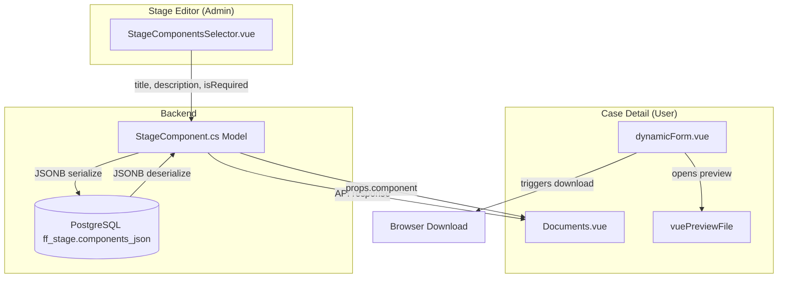
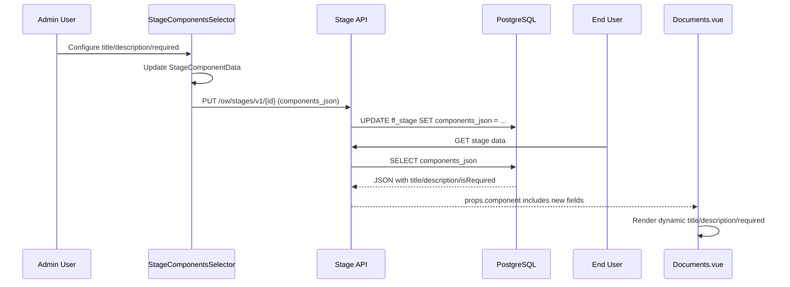
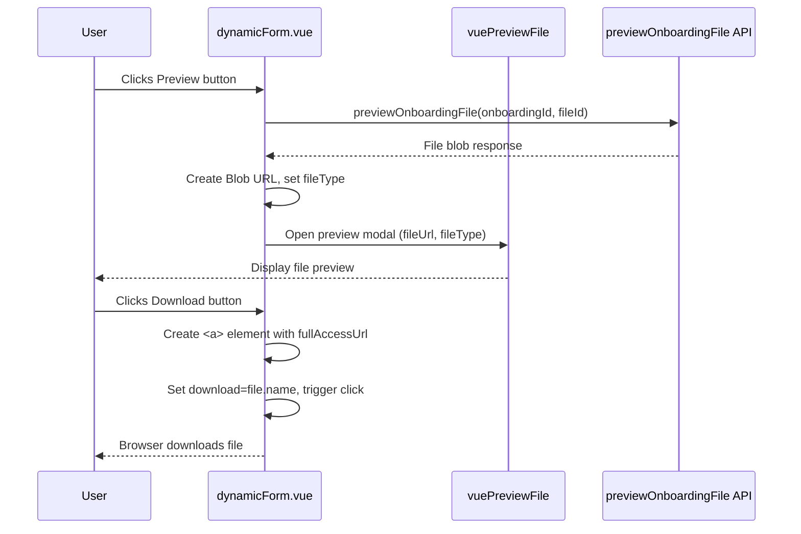

# Design Document: File Upload Enhancement

## Overview

This feature enhances the FlowFlex onboarding system with two distinct capabilities:

1. **Questionnaire File Upload Preview/Download** — Adds preview and download buttons for files already uploaded via `file_upload` question types in `dynamicForm.vue`, reusing the existing `vuePreviewFile` component pattern from `Documents.vue`.

2. **File Management Component Configuration** — Allows administrators to configure custom Title, Description, and Required properties for the `files` stage component via `StageComponentsSelector.vue`, with the configured values rendered in `Documents.vue`.

Both features are additive, requiring no database migration. New fields are serialized into the existing `components_json` JSONB column, and the frontend handles backward compatibility via fallback defaults.

## Architecture

### Component Interaction Diagram



### Data Flow: File Component Configuration



### Data Flow: File Preview/Download in dynamicForm



## Components and Interfaces

### 1. Type Changes: `StageComponentData` (Frontend)

**File:** `src/types/onboard.d.ts`

Add optional fields to the existing `StageComponentData` type:

```typescript
export type StageComponentData = {
    key: 'fields' | 'checklist' | 'questionnaires' | 'files' | 'quickLink';
    order: number;
    isEnabled: boolean;
    staticFields: { id: string; isRequired: boolean; order: number }[];
    checklistIds: string[];
    checklistNames?: string[];
    questionnaireIds: string[];
    quickLinkIds: string[];
    quickLinkNames?: string[];
    questionnaireNames?: string[];
    files?: string[];
    customerPortalAccess?: number;
    // --- New fields ---
    title?: string;
    description?: string;
    isRequired?: boolean;
};
```

### 2. Type Changes: `SelectedItem` (Frontend)

**File:** `src/types/onboard.d.ts`

Add optional fields to support inline editing in the right panel:

```typescript
export interface SelectedItem {
    id: string;
    name: string;
    description?: string;
    type: 'fields' | 'checklist' | 'questionnaires' | 'files' | 'quickLink';
    order: number;
    key: string;
    customerPortalAccess?: number;
    // --- New fields ---
    title?: string;
    isRequired?: boolean;
}
```

### 3. Backend Model: `StageComponent.cs`

**File:** `Domain.Shared/Models/StageComponent.cs`

Add three new properties:

```csharp
/// <summary>
/// Custom display title for the component (nullable, defaults handled by frontend)
/// </summary>
public string? Title { get; set; }

/// <summary>
/// Custom description text for the component (nullable)
/// </summary>
public string? Description { get; set; }

/// <summary>
/// Whether this component is required (defaults to false if not set)
/// </summary>
public bool IsRequired { get; set; }
```

These properties serialize to camelCase JSON (`title`, `description`, `isRequired`) via System.Text.Json conventions already configured in the project. They are stored in the existing `components_json` JSONB column — no migration needed.

### 4. dynamicForm.vue — Preview/Download Buttons

**File:** `src/app/views/onboard/onboardingList/components/dynamicForm.vue`

**Changes:**
- Import `vuePreviewFile` component and `View`, `Download` icons from `@element-plus/icons-vue`
- Add reactive state: `previewFileUrl`, `previewFileType`, `previewFileShow`, `offloading`
- Add template: Preview/Download icon buttons in the file metadata loop (`v-for="file in formData[question.id]"`)
- Add methods: `handlePreviewFile(file)`, `handleDownloadFile(file)`, `closePreview()`

**Button visibility logic:**
- Show buttons when `file.accessUrl || file.fullAccessUrl` is truthy
- Buttons are always clickable (read-only actions, independent of `questionIsDisabled()`)
- Hidden when file has no access URLs (file still uploading or URL not generated)

**Preview flow (mirrors Documents.vue pattern):**
1. Call `previewOnboardingFile(onboardingId, file.fileId)` to get blob
2. Determine `fileType` from file name extension
3. Create `Blob` with appropriate MIME type → `URL.createObjectURL(blob)`
4. Open `vuePreviewFile` component with the blob URL

**Download flow:**
1. Create temporary `<a>` element
2. Set `href` to `file.fullAccessUrl || file.accessUrl`
3. Set `download` attribute to `file.name`
4. Programmatically click and clean up

### 5. StageComponentsSelector.vue — Configuration Panel

**File:** `src/app/views/onboard/workflow/components/StageComponentsSelector.vue`

**Changes to the `'files'` case in `selectedItems` building:**

```javascript
case 'files':
    newSelectedItems.push({
        ...component,
        id: component.key,
        name: component.title || 'File Attachments',      // Use configured title
        description: component.description || 'Upload and manage files in this stage',
        type: 'files',
        order: component.order,
        key: component.key,
        title: component.title,                           // Pass through for editing
        isRequired: component.isRequired,                 // Pass through for editing
        customerPortalAccess: getValidPortalAccess(component?.customerPortalAccess),
    });
    break;
```

**New UI in the Selected Items right panel** (conditional on `element.type === 'files'`):

Below the existing item card content, add an expandable configuration section:

```html
<div v-if="element.type === 'files'" class="border-t p-3 space-y-3">
    <div class="space-y-1">
        <label class="text-xs font-medium">Title</label>
        <el-input
            v-model="element.title"
            placeholder="File Attachments"
            size="small"
            @change="handleFileComponentConfigChange(element)"
        />
    </div>
    <div class="space-y-1">
        <label class="text-xs font-medium">Description</label>
        <el-input
            v-model="element.description"
            placeholder="Upload and manage files in this stage"
            size="small"
            @change="handleFileComponentConfigChange(element)"
        />
    </div>
    <div class="flex items-center justify-between">
        <label class="text-xs font-medium">Required</label>
        <el-switch
            v-model="element.isRequired"
            size="small"
            @change="handleFileComponentConfigChange(element)"
        />
    </div>
</div>
```

**New method `handleFileComponentConfigChange(element)`:**

Updates the underlying `StageComponentData` for the files component with the new title, description, and isRequired values. This triggers `updateItemOrder()` to persist changes to the model.

**Changes to `updateItemOrder()` (files case):**

```javascript
} else if (item.type === 'files') {
    const existingFileComponent = getFileComponent();
    newComponents.push({
        ...existingFileComponent,
        order,
        title: item.title,
        description: item.description,
        isRequired: item.isRequired,
        customerPortalAccess: item?.customerPortalAccess,
    });
}
```

### 6. Documents.vue — Dynamic Title/Description/Required

**File:** `src/app/views/onboard/onboardingList/components/Documents.vue`

**Template changes:**

```html
<h3 class="case-component-title">
    {{ component.title || 'Documents' }}
    <span v-if="component.isRequired || documentIsRequired" class="text-red-300 ml-1">*</span>
</h3>
<p v-if="component.description" class="text-xs text-gray-400 mt-1">
    {{ component.description }}
</p>
<div class="case-component-subtitle">
    {{ documents.length }} {{ documents.length === 1 ? 'file' : 'files' }} uploaded
</div>
```

**Logic changes:**
- Required indicator now shows if `component.isRequired || documentIsRequired` (backward compatible with existing `attachmentManagementNeeded` prop)
- The `vailComponent()` method should also check `component.isRequired`:
  ```javascript
  if ((props?.documentIsRequired || props.component?.isRequired) && documents?.value?.length <= 0) {
      ElMessage.warning('Please upload at least one document');
      return false;
  }
  ```

## Data Models

### StageComponentData (Frontend TypeScript)

```typescript
// Extended type — new fields marked with comments
export type StageComponentData = {
    key: 'fields' | 'checklist' | 'questionnaires' | 'files' | 'quickLink';
    order: number;
    isEnabled: boolean;
    staticFields: { id: string; isRequired: boolean; order: number }[];
    checklistIds: string[];
    checklistNames?: string[];
    questionnaireIds: string[];
    quickLinkIds: string[];
    quickLinkNames?: string[];
    questionnaireNames?: string[];
    files?: string[];
    customerPortalAccess?: number;
    title?: string;          // NEW: custom display title
    description?: string;    // NEW: custom description
    isRequired?: boolean;    // NEW: required flag
};
```

### StageComponent (Backend C#)

```csharp
public class StageComponent
{
    // ... existing properties ...

    public string? Title { get; set; }
    public string? Description { get; set; }
    public bool IsRequired { get; set; }
}
```

### JSON Serialization Example

Existing `components_json` JSONB column value (with new fields):

```json
[
    {
        "key": "files",
        "order": 3,
        "isEnabled": true,
        "staticFields": [],
        "checklistIds": [],
        "questionnaireIds": [],
        "quickLinkIds": [],
        "customerPortalAccess": 1,
        "title": "Client Documents",
        "description": "Upload required onboarding documents",
        "isRequired": true
    }
]
```

When `title`, `description`, or `isRequired` are absent (legacy data), the frontend handles defaults:
- `title` → displays "Documents" (in Documents.vue) or "File Attachments" (in StageComponentsSelector.vue)
- `description` → not rendered
- `isRequired` → treated as `false`

### File Metadata Shape (in dynamicForm.vue formData)

Each uploaded file in `formData[question.id]` already has:

```typescript
interface UploadedFileMetadata {
    uid: string;
    name: string;
    uploadedBy: string;
    uploadDate: string;
    accessUrl?: string;
    fullAccessUrl?: string;
    fileId?: string;
}
```

Preview/Download buttons depend on `accessUrl || fullAccessUrl` being present.

## Error Handling

| Scenario | Component | Behavior |
|----------|-----------|----------|
| Preview API fails | dynamicForm.vue | Show `ElMessage.error()`, keep buttons enabled |
| File has no accessUrl | dynamicForm.vue | Hide preview/download buttons (graceful degradation) |
| Download URL is invalid | dynamicForm.vue | Browser handles the failed download natively |
| Config save fails | StageComponentsSelector.vue | Existing error handling in `updateAllComponents()` applies |
| Missing title/description in config | Documents.vue | Fallback to default values — no error state |
| IsRequired but no docs | Documents.vue | `vailComponent()` returns false with warning message |
| Unsupported file type for preview | dynamicForm.vue | Download the file instead (same pattern as Documents.vue for .doc/.msg/.eml) |

## Testing Strategy

### Unit Testing Approach

This feature involves UI components and configuration passthrough — property-based testing is not applicable here. The changes are primarily:
- Template rendering with conditional logic (title/description/required display)
- Event handlers (preview/download click actions)
- Data mapping (StageComponentData → SelectedItem → StageComponentData round-trip)

PBT does not apply because:
- The feature is primarily UI rendering and CRUD configuration
- Behavior doesn't vary meaningfully with randomized inputs
- Testing involves verifying specific DOM states and event flows
- External API calls (file preview) make repeated execution expensive

### Recommended Test Strategy

**Frontend Unit Tests (Jest + @vue/test-utils):**

1. **Documents.vue rendering:**
   - Renders custom title when `component.title` is set
   - Renders default "Documents" when `component.title` is empty/undefined
   - Renders description when `component.description` is set
   - Hides description when `component.description` is empty/undefined
   - Shows required asterisk when `component.isRequired` is true
   - Shows required asterisk when `documentIsRequired` prop is true (backward compat)
   - `vailComponent()` returns false when required and no documents uploaded

2. **dynamicForm.vue file actions:**
   - Preview button visible when file has `accessUrl`
   - Preview button hidden when file has no `accessUrl` and no `fullAccessUrl`
   - Download button visible when file has `fullAccessUrl`
   - Download button hidden when file has no access URLs
   - Buttons visible regardless of `questionIsDisabled()` state
   - Preview opens `vuePreviewFile` component with correct props
   - Download creates anchor element with correct href and download attributes

3. **StageComponentsSelector.vue configuration:**
   - Files item renders with custom title in `name` field
   - Files item renders with custom description
   - Title input updates element and triggers config change
   - Description input updates element and triggers config change
   - Required switch updates element and triggers config change
   - `updateItemOrder()` preserves title/description/isRequired on files component

**Backend Unit Tests (xUnit):**

4. **StageComponent serialization:**
   - StageComponent with Title/Description/IsRequired serializes to correct camelCase JSON
   - StageComponent without optional fields deserializes with null/default values
   - Round-trip: serialize → deserialize preserves all field values

### Test File Locations

- Frontend: `packages/flowFlex-common/src/__tests__/` (following existing test patterns)
- Backend: `packages/flowFlex-backend/Tests/FlowFlex.Tests/` (xUnit convention)

## File Change Summary

| File | Change Type | Purpose |
|------|-------------|---------|
| `packages/flowFlex-common/src/types/onboard.d.ts` | Modify type | Add `title`, `description`, `isRequired` to `StageComponentData` and `SelectedItem` |
| `packages/flowFlex-backend/Domain.Shared/Models/StageComponent.cs` | Add properties | Add `Title`, `Description`, `IsRequired` properties |
| `packages/flowFlex-common/src/app/views/onboard/onboardingList/components/dynamicForm.vue` | Add template + logic | Preview/download buttons for file_upload questions |
| `packages/flowFlex-common/src/app/views/onboard/workflow/components/StageComponentsSelector.vue` | Add template + logic | Editable title/description/required in Selected Items panel |
| `packages/flowFlex-common/src/app/views/onboard/onboardingList/components/Documents.vue` | Modify template + logic | Dynamic title/description from component config, combined required check |
