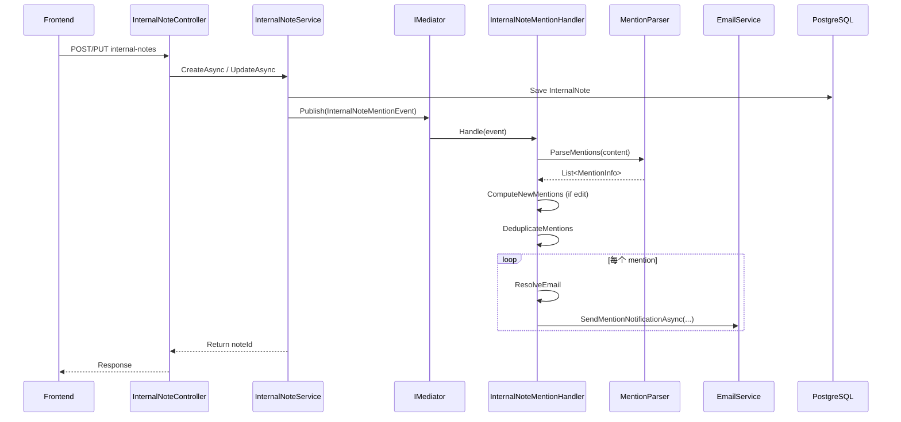

# 设计文档：Internal Notes @Mention 邮件通知

## 概述

本设计为 FlowFlex Internal Notes 系统添加 @mention 邮件通知能力。当用户在 Internal Note 中通过 `[~username]` 或 `[~email@domain.com]` 格式 @mention 内部用户或外部邮箱时，系统在保存 note 后自动异步发送邮件通知。

核心设计原则：

- **不阻塞主流程**：邮件发送异步执行，保存操作立即返回
- **幂等去重**：同一 note 中重复 @mention 同一用户只发一封邮件
- **增量通知**：编辑 note 时只通知新增的 @mention 用户
- **统一格式**：内部用户和外部邮箱使用相同的邮件模板和跳转链接

## 架构

采用 **MediatR 中介者模式**发布领域事件，实现 InternalNoteService 与通知逻辑的彻底解耦。这与项目中已有的 `ComponentDeletedCleanupHandler`、`ActionTriggerEventHandler`、`ChangeLogKafkaHandler` 等模式一致。

### 核心设计思路

1. **InternalNoteService** 只负责保存 note，保存后通过 `IMediator.Publish` 发布 `InternalNoteMentionEvent`
2. **InternalNoteMentionHandler** 订阅该事件，内部完成 mention 解析、去重、diff 计算和邮件发送
3. Service 不依赖任何通知逻辑，未来可轻松添加更多 Handler（站内消息、推送通知等）而无需修改 Service

### 优点

- InternalNoteService 不依赖任何通知逻辑，只负责发布事件
- 未来可以轻松添加更多 Handler（站内消息、推送通知等），无需修改 Service
- 与项目现有模式一致（ComponentDeletedCleanupHandler、ActionTriggerEventHandler 等）
- MediatR Notification 默认顺序执行所有 handler，handler 内部 try-catch 保证异常不影响主流程



## 组件和接口

### 1. MentionParser（静态工具类）

负责从 note content 中提取所有 `[~xxx]` 标记，判断是内部用户名还是外部邮箱。

```csharp
// 文件: Application/Services/OW/MentionParser.cs
namespace FlowFlex.Application.Services.OW;

public static class MentionParser
{
    /// <summary>
    /// 从 content 中提取所有 mention 标记
    /// </summary>
    public static List<MentionInfo> ParseMentions(string content);

    /// <summary>
    /// 计算新增的 mentions（new - old）
    /// </summary>
    public static List<MentionInfo> GetNewMentions(
        List<MentionInfo> currentMentions,
        List<MentionInfo> previousMentions);
}

public class MentionInfo
{
    /// <summary>标记原始值（username 或 email）</summary>
    public string Value { get; set; }

    /// <summary>是否为外部邮箱</summary>
    public bool IsExternal { get; set; }

    /// <summary>唯一标识（用于去重比较）</summary>
    public string Key => Value.ToLowerInvariant();
}
```

**解析规则**：

- 正则：`\[~([^\]]+)\]`
- 判断 `IsExternal`：value 匹配邮箱正则 `^[^@\s]+@[^@\s]+\.[^@\s]+$`
- 去重：基于 `Key`（小写比较）

### 2. InternalNoteMentionEvent（领域事件）

遵循项目中 `OnboardingStageCompletedEvent` 的模式，继承 `INotification`。

```csharp
// 文件: Domain.Shared/Events/InternalNoteMentionEvent.cs
using MediatR;

namespace FlowFlex.Domain.Shared.Events;

/// <summary>
/// Internal Note @mention 事件，当 note 被创建或编辑时发布
/// </summary>
public class InternalNoteMentionEvent : INotification
{
    /// <summary>Event ID</summary>
    public string EventId { get; set; } = Guid.NewGuid().ToString();

    /// <summary>Event timestamp</summary>
    public DateTimeOffset Timestamp { get; set; } = DateTimeOffset.UtcNow;

    /// <summary>Tenant ID</summary>
    public string TenantId { get; set; }

    /// <summary>Note ID</summary>
    public long NoteId { get; set; }

    /// <summary>Note 当前内容（包含 [~xxx] 标记）</summary>
    public string Content { get; set; }

    /// <summary>Note 编辑前的内容（仅编辑场景，创建时为 null）</summary>
    public string PreviousContent { get; set; }

    /// <summary>关联的 Onboarding ID</summary>
    public long OnboardingId { get; set; }

    /// <summary>操作人姓名</summary>
    public string SenderName { get; set; }

    /// <summary>Case 名称</summary>
    public string CaseName { get; set; }

    /// <summary>Case 编号</summary>
    public string CaseCode { get; set; }

    /// <summary>Stage 名称</summary>
    public string StageName { get; set; }
}
```

### 3. InternalNoteMentionHandler（事件处理器）

负责接收事件后完成 mention 解析、去重、diff 计算和邮件发送。遵循项目中 `ActionTriggerEventHandler`、`ComponentDeletedCleanupHandler` 的模式。

```csharp
// 文件: Application/Notification/InternalNoteMentionHandler.cs
using FlowFlex.Application.Services.OW;
using FlowFlex.Domain.Shared.Events;
using MediatR;
using Microsoft.Extensions.Logging;

namespace Application.Notification;

/// <summary>
/// 处理 Internal Note @mention 事件，解析 mentions 并发送邮件通知
/// </summary>
public class InternalNoteMentionHandler : INotificationHandler<InternalNoteMentionEvent>
{
    private readonly IEmailService _emailService;
    private readonly IUserRepository _userRepository;
    private readonly ILogger<InternalNoteMentionHandler> _logger;

    public InternalNoteMentionHandler(
        IEmailService emailService,
        IUserRepository userRepository,
        ILogger<InternalNoteMentionHandler> logger)
    {
        _emailService = emailService;
        _userRepository = userRepository;
        _logger = logger;
    }

    public async Task Handle(InternalNoteMentionEvent notification, CancellationToken cancellationToken)
    {
        try
        {
            _logger.LogInformation(
                "Processing mention notification for note {NoteId}, OnboardingId={OnboardingId}",
                notification.NoteId, notification.OnboardingId);

            // 1. 解析当前 content 中的 mentions
            var currentMentions = MentionParser.ParseMentions(notification.Content);

            // 2. 如果是编辑场景，计算增量 diff
            if (!string.IsNullOrEmpty(notification.PreviousContent))
            {
                var previousMentions = MentionParser.ParseMentions(notification.PreviousContent);
                currentMentions = MentionParser.GetNewMentions(currentMentions, previousMentions);
            }

            if (!currentMentions.Any()) return;

            // 3. 去重
            var uniqueMentions = currentMentions
                .GroupBy(m => m.Key)
                .Select(g => g.First())
                .ToList();

            // 4. 逐个解析邮箱并发送通知
            foreach (var mention in uniqueMentions)
            {
                try
                {
                    var email = mention.IsExternal
                        ? mention.Value
                        : await ResolveInternalUserEmailAsync(mention.Value);

                    if (string.IsNullOrEmpty(email))
                    {
                        _logger.LogWarning("Could not resolve email for mention: {Value}", mention.Value);
                        continue;
                    }

                    var onboardingUrl = $"/onboard/onboardDetail?onboardingId={notification.OnboardingId}";

                    await _emailService.SendMentionNotificationAsync(
                        email,
                        notification.SenderName,
                        notification.CaseName,
                        notification.CaseCode,
                        notification.StageName,
                        notification.Content,
                        onboardingUrl);
                }
                catch (Exception ex)
                {
                    _logger.LogError(ex, "Failed to send mention notification to {MentionValue}", mention.Value);
                    // 单个 mention 失败不影响其他 mention
                }
            }
        }
        catch (Exception ex)
        {
            _logger.LogError(ex,
                "Error processing mention event for note {NoteId}",
                notification.NoteId);
            // 不 throw —— 通知失败不应影响其他 handler 或调用方
        }
    }

    private async Task<string> ResolveInternalUserEmailAsync(string username)
    {
        var user = await _userRepository.GetByUsernameAsync(username);
        if (user == null)
        {
            _logger.LogWarning("Internal user not found: {Username}", username);
            return null;
        }
        return user.Email;
    }
}
```

### 4. IEmailService 扩展

在现有 `IEmailService` 接口新增 mention 通知方法。

```csharp
// 新增方法到 IEmailService
/// <summary>
/// Send @mention notification email
/// </summary>
/// <param name="to">Recipient email</param>
/// <param name="senderName">Person who made the mention</param>
/// <param name="caseName">Onboarding case name</param>
/// <param name="caseCode">Onboarding case code</param>
/// <param name="stageName">Stage name where the note is</param>
/// <param name="noteContent">Full note content</param>
/// <param name="onboardingUrl">URL to the onboarding detail page</param>
Task<bool> SendMentionNotificationAsync(
    string to,
    string senderName,
    string caseName,
    string caseCode,
    string stageName,
    string noteContent,
    string onboardingUrl);
```

### 5. InternalNoteService 改造

在 `CreateAsync` 和 `UpdateAsync` 方法中，保存 note 后通过 `IMediator` 发布事件。Service 不再注入 `IMentionNotificationService`，只注入 `IMediator`。

```csharp
// 新增依赖注入
private readonly IMediator _mediator;

// CreateAsync 中，保存成功后：
await _mediator.Publish(new InternalNoteMentionEvent
{
    NoteId = entity.Id,
    Content = entity.Content,
    PreviousContent = null, // 创建场景无旧内容
    OnboardingId = entity.OnboardingId,
    SenderName = senderName,
    CaseName = caseName,
    CaseCode = caseCode,
    StageName = stageName,
    TenantId = _currentTenantId
});

// UpdateAsync 中，更新成功后：
await _mediator.Publish(new InternalNoteMentionEvent
{
    NoteId = existingNote.Id,
    Content = existingNote.Content,
    PreviousContent = previousContent, // 编辑前的内容，用于增量 diff
    OnboardingId = existingNote.OnboardingId,
    SenderName = senderName,
    CaseName = caseName,
    CaseCode = caseCode,
    StageName = stageName,
    TenantId = _currentTenantId
});
```

**注意**：`_mediator.Publish` 是同步等待所有 handler 执行完毕，但 handler 内部已做 try-catch，不会抛出异常影响主流程返回。这与项目中 `ChecklistService`、`QuickLinkService` 等 publish 模式一致。

### 6. 前端 mention.vue 改造

改造 `useInternalNoteUsers` hook，支持外部邮箱输入：

```typescript
// hooks/useInternalNoteUsers.ts 改造要点
const remoteMethod = (text?: string) => {
  if (!text) {
    assignOptions.value = allAssignOptions.value;
    return;
  }

  // 过滤匹配的内部用户
  const filtered = allAssignOptions.value.filter((item) =>
    item.value.toLowerCase().includes(text.toLowerCase()),
  );

  // 如果输入匹配邮箱格式且不在内部用户列表中，添加"外部邮箱"选项
  const emailRegex = /^[^\s@]+@[^\s@]+\.[^\s@]+$/;
  if (
    emailRegex.test(text) &&
    !allAssignOptions.value.some((u) => u.email === text)
  ) {
    filtered.push({
      key: text, // 使用邮箱作为 key
      value: text, // 显示邮箱
      email: text,
      isExternal: true, // 标记为外部
    });
  }

  assignOptions.value = filtered;
};
```

**mention.vue 渲染改造**：

- 在候选列表中为外部邮箱选项增加视觉区分（如 icon 或标签）
- 选中外部邮箱后以 `[~email@domain.com]` 格式插入 content
- 渲染时检测 mention value 是否为邮箱格式，使用邮箱样式 tag 展示

## 数据模型

### InternalNote 实体（现有，无需修改结构）

```
ff_internal_notes
├── id (bigint, PK)
├── onboarding_id (bigint, FK)
├── stage_id (bigint, nullable)
├── content (varchar 4000) -- 包含 [~username] 和 [~email@domain.com] 标记
├── mentioned_user_ids (jsonb) -- 存储格式扩展为混合列表
├── ... (其他现有字段)
```

### MentionedUserIds 字段存储格式

现有 JSONB 字段，扩展存储格式为：

```json
{
  "internalUserIds": [12345, 67890],
  "externalEmails": ["vendor@example.com", "partner@corp.com"]
}
```

或简化为统一列表（保持向后兼容）：

```json
["12345", "67890", "ext:vendor@example.com", "ext:partner@corp.com"]
```

**决策**：采用统一列表方案，使用 `ext:` 前缀区分外部邮箱，保持与现有 `"[]"` 默认值的向后兼容性。

### 邮件模板数据模型

```csharp
// 模板变量
{
    "senderName": "Kai Li",           // 操作人姓名
    "caseCode": "OB-2025-001",       // Case 编号
    "caseName": "ABC Corp Onboarding", // Case 名称
    "stageName": "Document Review",   // Stage 名称
    "noteContent": "Full note text...", // Note 完整内容
    "onboardingUrl": "https://xxx/onboard/onboardDetail?onboardingId=123", // 跳转链接
    "year": "2025"
}
```

**邮件主题**：`[FlowFlex] {senderName} mentioned you in {caseName}`

**跳转链接格式**：`{BaseUrl}/onboard/onboardDetail?onboardingId={onboardingId}`

## 正确性属性

_正确性属性是在系统所有有效执行中都应当成立的特征或行为——本质上是关于系统应该做什么的形式化陈述。属性作为人类可读规格说明与机器可验证正确性保证之间的桥梁。_

### Property 1: Mention 解析完整性

_For any_ note content 字符串，MentionParser.ParseMentions 提取的 mention 集合应与 content 中实际包含的所有 `[~xxx]` 标记一一对应，不遗漏、不多余。

**Validates: Requirements 1.1**

### Property 2: 内部/外部分类正确性

_For any_ 被提取的 mention 标记，如果其 value 匹配邮箱正则，则 IsExternal 为 true；否则 IsExternal 为 false。

**Validates: Requirements 1.1, 2.5**

### Property 3: 增量 diff 正确性

_For any_ 两个 mention 列表（old 和 new），GetNewMentions 返回的结果应精确等于 new 中存在但 old 中不存在的 mention 集合（基于 Key 比较）。

**Validates: Requirements 1.6**

### Property 4: 去重一致性

_For any_ note content 包含重复 mention 标记，经去重后的 mention 列表中每个 Key 最多出现一次，且不丢失任何唯一 mention。

**Validates: Requirements 3.3**

### Property 5: 邮件内容完整性

_For any_ 有效的 sender name、case name、case code、stage name 和 note content 组合，生成的邮件主题应匹配格式 `[FlowFlex] {senderName} mentioned you in {caseName}`，且邮件正文应同时包含 senderName、caseCode、caseName、stageName、noteContent 和 onboardingUrl。

**Validates: Requirements 1.3, 2.4**

### Property 6: 错误隔离性

_For any_ note 保存操作，即使邮件发送服务抛出异常，note 保存操作本身应始终成功完成且不受影响。

**Validates: Requirements 3.1**

## 错误处理

| 场景                      | 处理策略                                                             |
| ------------------------- | -------------------------------------------------------------------- |
| 邮件发送失败              | Handler 内 try-catch 记录 Error 日志，不影响 note 保存，不重试       |
| 内部用户不存在            | Handler 记录 Warning 日志，跳过该用户，继续处理其他 mention          |
| content 为空或无 mention  | Handler 正常返回，不触发任何通知                                     |
| 外部邮箱格式无效          | 前端阻止添加；后端解析时如遇到非法格式，记录 Warning 并跳过          |
| Onboarding/Stage 查询失败 | 邮件中对应字段留空或使用默认值，不阻断通知发送                       |
| Handler 整体异常          | Handler 顶层 catch 所有异常并记录日志，不 throw，不影响 Service 返回 |

## 测试策略

### 单元测试（xUnit + Moq）

**MentionParser 测试**：

- 空 content 返回空列表
- 单个内部用户 mention 提取
- 单个外部邮箱 mention 提取
- 混合多个 mention 提取
- 重复 mention 去重
- content 中无 mention 标记
- 特殊字符在 username 中的处理

**InternalNoteMentionHandler 测试**：

- 创建场景：验证对每个 unique mention 调用一次 EmailService
- 编辑场景：验证只对 new-old diff 调用 EmailService
- 用户不存在场景：验证跳过并记录日志
- 异常场景：验证 EmailService 异常不影响方法返回

**EmailService.SendMentionNotificationAsync 测试**：

- 验证邮件主题格式正确
- 验证邮件正文包含所有必要信息

### 属性测试（xUnit + FsCheck）

- **Property 1**: 生成随机 content 字符串（含各种 `[~xxx]` 模式），验证解析完整性
- **Property 2**: 生成随机 mention values，验证 IsExternal 分类与邮箱正则一致
- **Property 3**: 生成随机 old/new mention 列表，验证 diff = new - old
- **Property 4**: 生成含重复的 mention content，验证去重后 key 唯一
- **Property 5**: 生成随机邮件参数组合，验证输出包含所有输入字段
- **Property 6**: Mock EmailService 抛异常，验证 note 操作仍成功

每个属性测试配置最少 100 次迭代。
测试标注格式：**Feature: internal-notes-mention-notification, Property {N}: {title}**

### 前端测试

- `useInternalNoteUsers` hook 测试：验证邮箱格式检测和外部选项添加逻辑
- `mention.vue` 组件测试：验证选中外部邮箱后 content 格式正确
