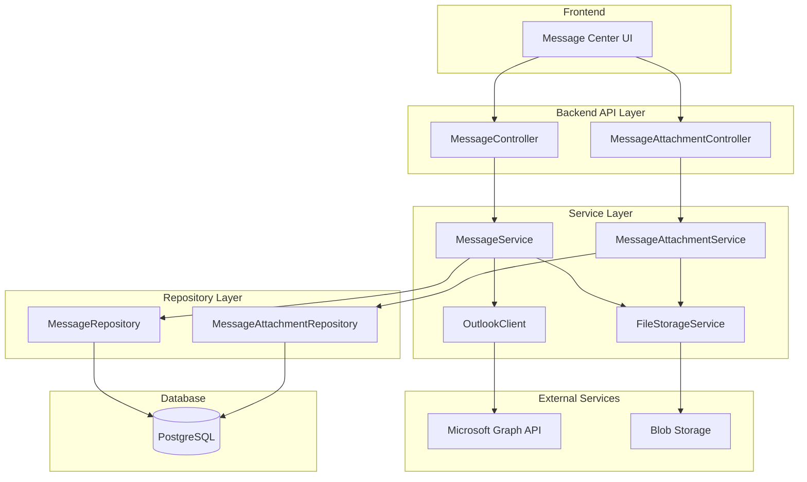

# Design Document: Message Center API

## Overview

Message Center API 是一个统一的消息管理后端服务，整合了三种消息类型的管理：Internal Message（内部消息）、Customer Email（客户邮件）和 Portal Message（Portal 消息）。该系统基于现有的 FlowFlex 后端架构，复用 Outlook 集成能力，提供 RESTful API 接口供前端调用。

### Key Features
- 统一的消息存储和管理
- 支持多种消息类型（Internal、Email、Portal）
- 文件夹管理（Inbox、Sent、Starred、Archive、Trash、Drafts）
- 标签分类（Internal、External、Important、Portal）
- 消息与 Onboarding/Case 关联
- 附件管理
- 租户隔离

### 消息类型与文件夹的关系

**重要设计原则**：Inbox、Sent、Starred、Archive、Trash、Drafts 文件夹是三种消息类型（Internal、Email、Portal）的**混合视图**。

```
┌─────────────────────────────────────────────────────────────────┐
│                    Message Center 文件夹视图                      │
├─────────────────────────────────────────────────────────────────┤
│                                                                 │
│  Inbox (收件箱)                                                  │
│  ├── Internal Messages (收到的内部消息)                           │
│  ├── Customer Emails (收到的客户邮件 - 从 Outlook 同步)            │
│  └── Portal Messages (收到的 Portal 回复)                         │
│                                                                 │
│  Sent (已发送)                                                   │
│  ├── Internal Messages (发送的内部消息)                           │
│  ├── Customer Emails (发送的客户邮件)                             │
│  └── Portal Messages (发送的 Portal 消息)                         │
│                                                                 │
│  Starred (星标) - 跨所有消息类型                                   │
│  Archive (归档) - 跨所有消息类型                                   │
│  Trash (回收站) - 跨所有消息类型                                   │
│  Drafts (草稿箱)                                                 │
│  ├── Internal Message Drafts (本地存储)                          │
│  ├── Customer Email Drafts (同步到 Outlook Drafts)               │
│  └── Portal Message Drafts (本地存储)                            │
│                                                                 │
└─────────────────────────────────────────────────────────────────┘
```

### 数据来源

| 消息类型 | 数据来源 | 存储方式 |
|---------|---------|---------|
| Internal Message | 本地数据库 | 完全本地存储 |
| Customer Email | Outlook (Microsoft Graph API) | 本地缓存 + Outlook 同步 |
| Portal Message | 本地数据库 | 完全本地存储 |

## Architecture



## Components and Interfaces

### 1. MessageController

REST API 控制器，处理消息相关的 HTTP 请求。所有消息类型（Internal、Email、Portal）使用统一的接口，通过 `messageType` 参数区分。

```csharp
[ApiController]
[Route("api/ow/messages")]
public class MessageController : ControllerBase
{
    // ==================== 消息列表与详情 ====================
    // GET /api/ow/messages
    //   - 获取消息列表（分页），支持按 folder、label、messageType 过滤
    //   - Query 参数:
    //     - pageIndex: 页码 (默认 1)
    //     - pageSize: 每页数量 (默认 20)
    //     - folder: 文件夹 (Inbox/Sent/Starred/Archive/Trash/Drafts)
    //     - label: 标签 (Internal/External/Important/Portal)
    //     - messageType: 消息类型 (Internal/Email/Portal)
    //     - searchTerm: 搜索关键词
    //     - relatedEntityId: 关联实体 ID
    //   - 自动合并本地消息和 Outlook 邮件
    //
    // 示例:
    //   GET /api/ow/messages?folder=Inbox          → 获取收件箱所有消息
    //   GET /api/ow/messages?folder=Sent           → 获取已发送消息
    //   GET /api/ow/messages?folder=Starred        → 获取星标消息
    //   GET /api/ow/messages?folder=Archive        → 获取归档消息
    //   GET /api/ow/messages?folder=Trash          → 获取回收站消息
    //   GET /api/ow/messages?folder=Drafts         → 获取草稿箱消息
    //   GET /api/ow/messages?folder=Inbox&label=Internal  → 获取收件箱中的内部消息
    //   GET /api/ow/messages?folder=Inbox&messageType=Email → 获取收件箱中的邮件
    
    // GET /api/ow/messages/{id}
    //   - 获取消息详情，自动标记为已读
    //   - 对于 Email 类型，如果本地无缓存则从 Outlook 获取
    
    // ==================== 消息创建与发送 ====================
    // POST /api/ow/messages
    //   - 创建并发送消息（根据 messageType 自动处理）
    //   - Internal: 本地存储并投递到收件人
    //   - Email: 通过 Outlook 发送
    //   - Portal: 本地存储并推送到 Portal
    //   - Body: { messageType, recipients, subject, body, relatedEntityId, attachments, saveAsDraft }
    
    // PUT /api/ow/messages/{id}
    //   - 更新消息（仅草稿可更新）
    //   - Email 草稿同步更新到 Outlook
    
    // ==================== 消息操作 ====================
    // DELETE /api/ow/messages/{id}
    //   - 删除消息（移到 Trash）
    //   - Email 类型同步删除到 Outlook DeletedItems
    
    // DELETE /api/ow/messages/{id}/permanent
    //   - 永久删除消息
    //   - Email 类型从 Outlook 永久删除
    
    // POST /api/ow/messages/{id}/restore
    //   - 从 Trash 恢复消息
    //   - Email 类型从 Outlook DeletedItems 恢复
    
    // POST /api/ow/messages/{id}/star
    //   - 星标消息
    
    // DELETE /api/ow/messages/{id}/star
    //   - 取消星标
    
    // POST /api/ow/messages/{id}/archive
    //   - 归档消息
    
    // POST /api/ow/messages/{id}/read
    //   - 标记已读
    //   - Email 类型同步到 Outlook
    
    // POST /api/ow/messages/{id}/unread
    //   - 标记未读
    //   - Email 类型同步到 Outlook
    
    // ==================== 回复与转发 ====================
    // POST /api/ow/messages/{id}/reply
    //   - 回复消息，自动设置收件人和主题前缀
    //   - Body: { body, attachments }
    
    // POST /api/ow/messages/{id}/forward
    //   - 转发消息
    //   - Body: { recipients, body, attachments }
    
    // ==================== 草稿 ====================
    // POST /api/ow/messages/drafts
    //   - 保存草稿
    //   - Email 草稿同步到 Outlook Drafts
    
    // POST /api/ow/messages/drafts/{id}/send
    //   - 发送草稿
    //   - Email 草稿通过 Outlook 发送
    
    // ==================== 统计与同步 ====================
    // GET /api/ow/messages/folders/stats
    //   - 获取所有文件夹统计（总数、未读数、按类型细分）
    
    // POST /api/ow/messages/sync
    //   - 手动触发 Outlook 邮件同步
}
```

### 2. IMessageService

消息服务接口，定义核心业务逻辑。接口设计为统一处理所有消息类型，内部根据 `messageType` 分发到不同的处理逻辑。

```csharp
public interface IMessageService
{
    // ==================== 消息 CRUD ====================
    /// <summary>
    /// 获取消息列表（分页），自动合并本地消息和 Outlook 邮件
    /// </summary>
    Task<PageModelDto<MessageListItemDto>> GetPagedAsync(MessageQueryDto query);
    
    /// <summary>
    /// 获取消息详情，自动标记为已读
    /// </summary>
    Task<MessageDetailDto> GetByIdAsync(long id);
    
    /// <summary>
    /// 创建并发送消息，根据 messageType 自动处理
    /// - Internal: 本地存储
    /// - Email: 通过 Outlook 发送
    /// - Portal: 本地存储并推送到 Portal
    /// </summary>
    Task<long> CreateAsync(MessageCreateDto input);
    
    /// <summary>
    /// 更新消息（仅草稿可更新）
    /// </summary>
    Task<bool> UpdateAsync(long id, MessageUpdateDto input);
    
    /// <summary>
    /// 删除消息（移到 Trash），Email 类型同步到 Outlook
    /// </summary>
    Task<bool> DeleteAsync(long id);
    
    /// <summary>
    /// 永久删除消息，Email 类型从 Outlook 永久删除
    /// </summary>
    Task<bool> PermanentDeleteAsync(long id);
    
    /// <summary>
    /// 从 Trash 恢复消息，Email 类型从 Outlook DeletedItems 恢复
    /// </summary>
    Task<bool> RestoreAsync(long id);
    
    // ==================== 消息操作 ====================
    Task<bool> StarAsync(long id);
    Task<bool> UnstarAsync(long id);
    Task<bool> ArchiveAsync(long id);
    Task<bool> MarkAsReadAsync(long id);
    Task<bool> MarkAsUnreadAsync(long id);
    
    // ==================== 回复和转发 ====================
    Task<long> ReplyAsync(long id, MessageReplyDto input);
    Task<long> ForwardAsync(long id, MessageForwardDto input);
    
    // ==================== 草稿 ====================
    /// <summary>
    /// 保存草稿，Email 类型同步到 Outlook Drafts
    /// </summary>
    Task<long> SaveDraftAsync(MessageCreateDto input);
    
    /// <summary>
    /// 发送草稿，Email 类型通过 Outlook 发送
    /// </summary>
    Task<long> SendDraftAsync(long id);
    
    // ==================== 统计与同步 ====================
    Task<List<FolderStatsDto>> GetFolderStatsAsync();
    Task<int> GetUnreadCountAsync();
    
    /// <summary>
    /// 手动触发 Outlook 邮件同步
    /// </summary>
    Task<int> SyncOutlookEmailsAsync();
}
```

### 3. 混合消息查询逻辑

由于 Inbox/Sent 等文件夹是三种消息类型的混合视图，查询逻辑需要合并多个数据源：

```csharp
// 混合查询流程
public async Task<PageModelDto<MessageListItemDto>> GetPagedAsync(MessageQueryDto query)
{
    // 1. 查询本地消息 (Internal + Portal)
    var localMessages = await _messageRepository.GetPagedAsync(
        query.Folder, 
        query.Label, 
        query.MessageType,
        query.SearchTerm,
        query.PageIndex,
        query.PageSize
    );
    
    // 2. 如果需要同步 Outlook 邮件且用户已绑定邮箱
    if (query.IncludeOutlookSync && await HasEmailBindingAsync())
    {
        // 根据 Folder 映射到 Outlook 文件夹
        var outlookFolder = MapToOutlookFolder(query.Folder);
        
        // 从 Outlook 获取邮件
        var outlookEmails = await _outlookClient.GetEmailsAsync(
            outlookFolder,
            query.SearchTerm,
            query.PageSize
        );
        
        // 同步到本地缓存
        await SyncOutlookEmailsToLocalAsync(outlookEmails);
    }
    
    // 3. 合并结果并按时间排序
    var mergedMessages = MergeAndSort(localMessages, query.SortField, query.SortDirection);
    
    return new PageModelDto<MessageListItemDto>(
        query.PageIndex, 
        query.PageSize, 
        mergedMessages, 
        totalCount
    );
}

// Folder 到 Outlook 文件夹的映射
private string MapToOutlookFolder(string folder) => folder switch
{
    "Inbox" => "inbox",
    "Sent" => "sentitems",
    "Drafts" => "drafts",
    "Trash" => "deleteditems",
    _ => null  // Starred, Archive 是本地概念，不映射到 Outlook
};
```

### 4. MessageAttachmentController

附件控制器，处理附件上传和下载。

```csharp
[ApiController]
[Route("api/ow/messages")]
public class MessageAttachmentController : ControllerBase
{
    // GET /api/ow/messages/{messageId}/attachments - 获取附件列表
    // GET /api/ow/messages/{messageId}/attachments/{attachmentId} - 下载附件
    // POST /api/ow/messages/{messageId}/attachments - 上传附件
    // DELETE /api/ow/messages/{messageId}/attachments/{attachmentId} - 删除附件
}
```

## Data Models

### Message Entity

```csharp
[SugarTable("ff_messages")]
public class Message : OwEntityBase
{
    // 基本信息
    [SugarColumn(ColumnName = "subject")]
    public string Subject { get; set; }
    
    [SugarColumn(ColumnName = "body", ColumnDataType = "text")]
    public string Body { get; set; }
    
    [SugarColumn(ColumnName = "body_preview")]
    public string BodyPreview { get; set; }
    
    // 消息类型: Internal, Email, Portal
    [SugarColumn(ColumnName = "message_type")]
    public string MessageType { get; set; }
    
    // 文件夹: Inbox, Sent, Starred, Archive, Trash
    [SugarColumn(ColumnName = "folder")]
    public string Folder { get; set; }
    
    // 标签: Internal, External, Important, Portal (JSON array)
    [SugarColumn(ColumnName = "labels", ColumnDataType = "jsonb", IsJson = true)]
    public string Labels { get; set; }
    
    // 发送者信息
    [SugarColumn(ColumnName = "sender_id")]
    public long? SenderId { get; set; }
    
    [SugarColumn(ColumnName = "sender_name")]
    public string SenderName { get; set; }
    
    [SugarColumn(ColumnName = "sender_email")]
    public string SenderEmail { get; set; }
    
    // 接收者信息 (JSON array)
    [SugarColumn(ColumnName = "recipients", ColumnDataType = "jsonb", IsJson = true)]
    public string Recipients { get; set; }
    
    // 抄送和密送 (for Email type)
    [SugarColumn(ColumnName = "cc_recipients", ColumnDataType = "jsonb", IsJson = true)]
    public string CcRecipients { get; set; }
    
    [SugarColumn(ColumnName = "bcc_recipients", ColumnDataType = "jsonb", IsJson = true)]
    public string BccRecipients { get; set; }
    
    // 关联实体
    [SugarColumn(ColumnName = "related_entity_type")]
    public string RelatedEntityType { get; set; } // Onboarding, Case
    
    [SugarColumn(ColumnName = "related_entity_id")]
    public long? RelatedEntityId { get; set; }
    
    [SugarColumn(ColumnName = "related_entity_code")]
    public string RelatedEntityCode { get; set; }
    
    // 状态
    [SugarColumn(ColumnName = "is_read")]
    public bool IsRead { get; set; }
    
    [SugarColumn(ColumnName = "is_starred")]
    public bool IsStarred { get; set; }
    
    [SugarColumn(ColumnName = "is_draft")]
    public bool IsDraft { get; set; }
    
    [SugarColumn(ColumnName = "has_attachments")]
    public bool HasAttachments { get; set; }
    
    // 时间
    [SugarColumn(ColumnName = "sent_date")]
    public DateTimeOffset? SentDate { get; set; }
    
    [SugarColumn(ColumnName = "received_date")]
    public DateTimeOffset? ReceivedDate { get; set; }
    
    // 会话线程
    [SugarColumn(ColumnName = "parent_message_id")]
    public long? ParentMessageId { get; set; }
    
    [SugarColumn(ColumnName = "conversation_id")]
    public string ConversationId { get; set; }
    
    // Portal 相关
    [SugarColumn(ColumnName = "portal_id")]
    public long? PortalId { get; set; }
    
    // 外部邮件 ID (for Outlook integration)
    [SugarColumn(ColumnName = "external_message_id")]
    public string ExternalMessageId { get; set; }
    
    // 所有者 (消息属于哪个用户)
    [SugarColumn(ColumnName = "owner_id")]
    public long OwnerId { get; set; }
}
```

### MessageAttachment Entity

```csharp
[SugarTable("ff_message_attachments")]
public class MessageAttachment : OwEntityBase
{
    [SugarColumn(ColumnName = "message_id")]
    public long MessageId { get; set; }
    
    [SugarColumn(ColumnName = "file_name")]
    public string FileName { get; set; }
    
    [SugarColumn(ColumnName = "file_size")]
    public long FileSize { get; set; }
    
    [SugarColumn(ColumnName = "content_type")]
    public string ContentType { get; set; }
    
    [SugarColumn(ColumnName = "storage_path")]
    public string StoragePath { get; set; }
    
    [SugarColumn(ColumnName = "external_attachment_id")]
    public string ExternalAttachmentId { get; set; }
}
```

### DTOs

```csharp
// 消息列表项
public class MessageListItemDto
{
    public long Id { get; set; }
    public string Subject { get; set; }
    public string BodyPreview { get; set; }
    public string SenderName { get; set; }
    public string SenderEmail { get; set; }
    public string MessageType { get; set; }
    public List<string> Labels { get; set; }
    public string RelatedEntityCode { get; set; }
    public bool IsRead { get; set; }
    public bool IsStarred { get; set; }
    public bool HasAttachments { get; set; }
    public DateTimeOffset? ReceivedDate { get; set; }
}

// 消息详情
public class MessageDetailDto : MessageListItemDto
{
    public string Body { get; set; }
    public List<RecipientDto> Recipients { get; set; }
    public List<RecipientDto> CcRecipients { get; set; }
    public string RelatedEntityType { get; set; }
    public long? RelatedEntityId { get; set; }
    public DateTimeOffset? SentDate { get; set; }
    public long? ParentMessageId { get; set; }
    public List<MessageAttachmentDto> Attachments { get; set; }
}

// 创建消息
public class MessageCreateDto
{
    [Required]
    public string MessageType { get; set; } // Internal, Email, Portal
    
    public List<RecipientDto> Recipients { get; set; }
    public List<RecipientDto> CcRecipients { get; set; }
    public List<RecipientDto> BccRecipients { get; set; }
    
    [Required]
    [StringLength(500)]
    public string Subject { get; set; }
    
    [Required]
    public string Body { get; set; }
    
    public string RelatedEntityType { get; set; }
    public long? RelatedEntityId { get; set; }
    
    public long? PortalId { get; set; }
    
    public List<long> AttachmentIds { get; set; }
    
    public bool SaveAsDraft { get; set; }
}

// 查询参数
public class MessageQueryDto
{
    public int PageIndex { get; set; } = 1;
    public int PageSize { get; set; } = 20;
    public string Folder { get; set; }  // Inbox, Sent, Starred, Archive, Trash, Drafts
    public string Label { get; set; }   // Internal, External, Important, Portal
    public string MessageType { get; set; }  // Internal, Email, Portal (可选，用于按消息类型过滤)
    public string SearchTerm { get; set; }
    public long? RelatedEntityId { get; set; }
    public string SortField { get; set; } = "ReceivedDate";
    public string SortDirection { get; set; } = "desc";
    public bool IncludeOutlookSync { get; set; } = true;  // 是否同步 Outlook 邮件
}

// 消息更新（仅草稿可更新）
public class MessageUpdateDto
{
    public List<RecipientDto> Recipients { get; set; }
    public List<RecipientDto> CcRecipients { get; set; }
    public List<RecipientDto> BccRecipients { get; set; }
    public string Subject { get; set; }
    public string Body { get; set; }
    public string RelatedEntityType { get; set; }
    public long? RelatedEntityId { get; set; }
    public long? PortalId { get; set; }
    public List<long> AttachmentIds { get; set; }
}

// 回复消息
public class MessageReplyDto
{
    [Required]
    public string Body { get; set; }
    public List<long> AttachmentIds { get; set; }
}

// 转发消息
public class MessageForwardDto
{
    [Required]
    public List<RecipientDto> Recipients { get; set; }
    public string Body { get; set; }
    public List<long> AttachmentIds { get; set; }
}

// 文件夹统计
public class FolderStatsDto
{
    public string Folder { get; set; }  // Inbox, Sent, Starred, Archive, Trash, Drafts
    public int TotalCount { get; set; }
    public int UnreadCount { get; set; }
    public int DraftCount { get; set; }  // 仅 Drafts 文件夹使用
    
    // 按消息类型细分统计
    public int InternalCount { get; set; }
    public int EmailCount { get; set; }
    public int PortalCount { get; set; }
}

// 接收者
public class RecipientDto
{
    public long? UserId { get; set; }
    public string Name { get; set; }
    public string Email { get; set; }
}
```

## Correctness Properties

*A property is a characteristic or behavior that should hold true across all valid executions of a system-essentially, a formal statement about what the system should do. Properties serve as the bridge between human-readable specifications and machine-verifiable correctness guarantees.*

Based on the prework analysis, the following correctness properties have been identified:

### Property 1: Message list pagination and sorting
*For any* message list request with pagination parameters, the returned messages SHALL be sorted by received date in descending order, and the page size SHALL not exceed the requested size.
**Validates: Requirements 1.1**

### Property 2: Folder filtering correctness
*For any* message list request with a folder filter, all returned messages SHALL have their folder field equal to the specified folder.
**Validates: Requirements 1.2**

### Property 3: Label filtering correctness
*For any* message list request with a label filter, all returned messages SHALL contain the specified label in their labels array.
**Validates: Requirements 1.3**

### Property 4: Search results relevance
*For any* message search with a keyword, all returned messages SHALL contain the search term in either the subject or body field (case-insensitive).
**Validates: Requirements 1.4**

### Property 5: Message list item completeness
*For any* message list item returned, the item SHALL contain all required fields: sender name, subject, preview text, date, labels, related entity code, read status, and starred status.
**Validates: Requirements 1.5, 2.1**

### Property 6: Auto-read on view
*For any* unread message, after retrieving its details, the message's read status SHALL be true.
**Validates: Requirements 2.2**

### Property 7: Message creation validation
*For any* message creation request with empty or whitespace-only subject or body, the system SHALL reject the request with a validation error.
**Validates: Requirements 3.2**

### Property 8: Sent folder copy
*For any* successfully sent message, a copy SHALL exist in the sender's Sent folder with matching subject and body.
**Validates: Requirements 3.3, 4.4, 5.2**

### Property 9: Related entity association
*For any* message created with a related entity, the message SHALL have the related entity ID and type correctly stored and retrievable.
**Validates: Requirements 3.4, 5.3**

### Property 10: Star operation idempotence
*For any* message, starring it multiple times SHALL result in the same state as starring it once (isStarred = true), and the message SHALL appear in the Starred folder view.
**Validates: Requirements 6.1**

### Property 11: Archive operation correctness
*For any* message, after archiving, the message's folder SHALL be "Archive".
**Validates: Requirements 6.3**

### Property 12: Delete operation correctness
*For any* message, after deletion, the message's folder SHALL be "Trash".
**Validates: Requirements 6.4**

### Property 13: Permanent delete removes record
*For any* message in Trash, after permanent deletion, querying for that message SHALL return not found.
**Validates: Requirements 6.5**

### Property 14: Reply subject prefix
*For any* reply to a message, if the original subject does not start with "RE:", the reply subject SHALL start with "RE:".
**Validates: Requirements 7.4**

### Property 15: Forward subject prefix
*For any* forwarded message, if the original subject does not start with "FW:", the forwarded message subject SHALL start with "FW:".
**Validates: Requirements 7.5**

### Property 16: Folder statistics consistency
*For any* folder statistics request, the unread count SHALL equal the actual count of messages in that folder where isRead = false.
**Validates: Requirements 8.1, 8.2, 8.3**

### Property 17: Tenant isolation
*For any* message operation, the system SHALL only return or modify messages where tenantId matches the current user's tenant.
**Validates: Requirements 10.1, 10.2, 10.3**

### Property 18: Draft save and update
*For any* draft save operation, the message SHALL be stored with isDraft = true and folder = "Drafts", and SHALL be retrievable from the Drafts folder.
**Validates: Requirements 3.1 (draft variant)**

### Property 19: Draft send converts to sent message
*For any* draft that is sent, the message SHALL have isDraft = false and folder = "Sent" after the send operation completes.
**Validates: Requirements 3.1, 3.3**

### Property 20: Outlook deleted emails retrieval
*For any* request to get Outlook deleted emails, the system SHALL return emails from the Outlook Trash/DeletedItems folder via Microsoft Graph API.
**Validates: Requirements 4.1 (deleted variant)**

### Property 21: Outlook email restore
*For any* Outlook deleted email restore operation, the email SHALL be moved from DeletedItems to Inbox in Outlook and the local message record SHALL be updated accordingly.
**Validates: Requirements 6.4 (restore variant)**

### Property 22: Outlook draft creation
*For any* Outlook draft creation, the draft SHALL be created in Outlook's Drafts folder via Microsoft Graph API and a local record SHALL be stored with isDraft = true.
**Validates: Requirements 13.1**

### Property 23: Outlook draft update
*For any* Outlook draft update, the draft content in Outlook SHALL be updated via Microsoft Graph API and the local record SHALL reflect the changes.
**Validates: Requirements 13.2**

### Property 24: Outlook draft send
*For any* Outlook draft send operation, the draft SHALL be sent via Microsoft Graph API, moved to Sent Items in Outlook, and the local record SHALL have isDraft = false and folder = "Sent".
**Validates: Requirements 13.3**

### Property 25: Outlook draft delete
*For any* Outlook draft delete operation, the draft SHALL be removed from Outlook's Drafts folder via Microsoft Graph API and the local record SHALL be deleted.
**Validates: Requirements 13.4**

## Error Handling

### Error Codes

| Code | HTTP Status | Description |
|------|-------------|-------------|
| MSG_001 | 400 | Invalid message type |
| MSG_002 | 400 | Subject is required |
| MSG_003 | 400 | Body is required |
| MSG_004 | 400 | At least one recipient is required |
| MSG_005 | 404 | Message not found |
| MSG_006 | 403 | Access denied to message |
| MSG_007 | 400 | Email binding required for customer email |
| MSG_008 | 404 | Attachment not found |
| MSG_009 | 400 | Invalid folder |
| MSG_010 | 400 | Invalid label |
| MSG_011 | 500 | Failed to send email via Outlook |
| MSG_012 | 400 | Related entity not found |

### Error Response Format

```json
{
  "success": false,
  "code": "MSG_005",
  "message": "Message not found",
  "data": null
}
```

## Testing Strategy

### Property-Based Testing

The project will use **FsCheck** (via FsCheck.Xunit) for property-based testing in C#. Each correctness property will be implemented as a property-based test with a minimum of 100 iterations.

Property tests will be tagged with comments in the format:
`// **Feature: message-center-api, Property {number}: {property_text}**`

### Unit Testing

Unit tests will cover:
- Service method behavior with specific inputs
- Edge cases (empty lists, null values, boundary conditions)
- Error handling scenarios
- Integration points with repositories

### Test Organization

```
Tests/
├── MessageCenter/
│   ├── MessageServiceTests.cs          # Unit tests
│   ├── MessageServicePropertyTests.cs  # Property-based tests
│   ├── MessageControllerTests.cs       # API integration tests
│   └── Generators/
│       └── MessageGenerators.cs        # FsCheck generators
```

### Key Test Scenarios

1. **Pagination Tests**: Verify correct page size, sorting, and total count
2. **Filtering Tests**: Verify folder and label filtering accuracy
3. **Search Tests**: Verify search term matching in subject and body
4. **CRUD Tests**: Verify create, read, update, delete operations
5. **State Transition Tests**: Verify star, archive, delete state changes
6. **Tenant Isolation Tests**: Verify cross-tenant access is denied
7. **Validation Tests**: Verify input validation rules
