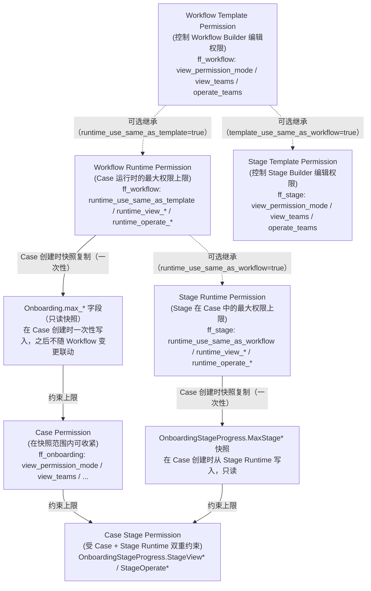
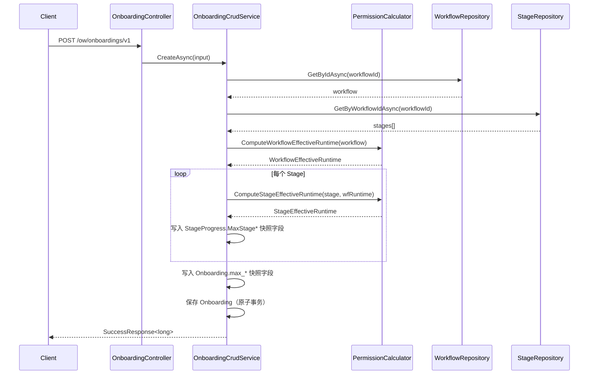
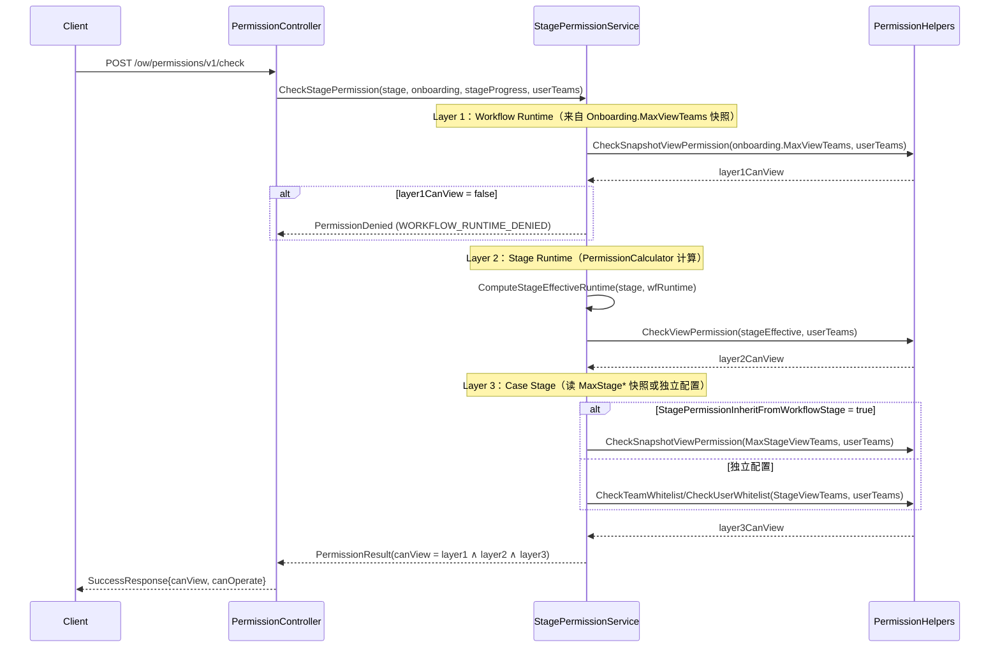

# Design Document: OW-736 权限模型重构 V2

## 概述

OW-736 对 FlowFlex 的权限模型进行全面重构，消除五项核心缺陷：

1. Workflow Permission 同时用于模板编辑和 Case 运行，两个场景未区分
2. Stage Permission 只控制 Workflow Builder 中的配置，不控制实际 Case 中的 Stage
3. Case Permission 可以设置比 Workflow 更大的范围（权限可反向扩大）
4. Case Stage 没有独立的 Runtime Permission
5. Roll Back Teams 可以选没有 Stage Operate Permission 的 Team

重构后引入 **Template / Runtime 双层分离**设计与**快照语义**（Case 创建时从 Workflow Runtime 复制权限上限，之后与 Workflow 变更解耦），形成 `Workflow Runtime → Case → Case Stage` 四级自顶向下收紧的约束链。

---

## 架构

### 权限层级结构（修正版）



> **关键设计说明**：Template → Runtime 之间是**可选的继承关系**（通过标志位控制，动态读取，不是快照）。只有 **Runtime → Case（通过 Onboarding.max_*）**和 **Stage Runtime → Case Stage（通过 MaxStage* 字段）** 才是**一次性快照复制**。两者是本质不同的机制。

### 三层权限取交集（StagePermissionService 核心逻辑）

```
effective_stage_permission = Workflow_Runtime(快照) ∩ Stage_Runtime(Effective) ∩ Case_Stage
```

- **Layer 1**：从 `Onboarding.max_view_teams`（快照）读取，不查 Workflow 实体
- **Layer 2**：从 `PermissionCalculator.ComputeStageEffectiveRuntime(stage, workflowRuntime)` 计算
- **Layer 3**：`StagePermissionInheritFromWorkflowStage = true` 时使用 `MaxStageViewTeams` 快照；否则使用 `StageViewTeams`

### 约束规则

- **Child ⊆ Parent**：子级权限只能收紧，不能扩大
- **Operate ⊆ View**：操作权限必须是查看权限的子集（所有层级）
- **Template 与 Runtime 完全独立**：有模板编辑权限不代表有 Case 访问权限
- **快照不可变**：Case 创建后 `max_*` 字段只读；如需同步最新权限须手动触发 reapply 接口

### ViewPermissionMode 层级支持矩阵

| 层级 | Public | VisibleTo | InvisibleTo | Private |
|---|---|---|---|---|
| Workflow Template | ✓ | ✓ | ✓ | — |
| Workflow Runtime | ✓ | ✓ | ✓ | — |
| Stage Template | ✓ | ✓ | ✓ | — |
| Stage Runtime | ✓ | ✓ | ✓ | — |
| Case | ✓ | ✓ | ✓ | ✓ |
| Case Stage | ✓ | ✓ | ✓ | — |

---

## 组件与接口

### 组件 1：PermissionCalculator（新建静态辅助类）

**文件位置**：`Application/Services/Shared/PermissionCalculator.cs`

**为什么这样设计**：将 Effective Permission 计算集中于无副作用的纯函数，避免在多个 Service 中重复实现，也避免在 AutoMapper Profile 中注入 Repository 的反模式（AutoMapper 只做 1:1 映射，不做计算）。

```csharp
/// <summary>
/// 静态纯函数辅助类，集中处理所有 Effective Permission 计算逻辑。
/// 无副作用，无数据库访问，所有输入通过参数传入。
/// </summary>
public static class PermissionCalculator
{
    /// <summary>
    /// 计算 Workflow 的 Effective Runtime Permission。
    /// runtime_use_same_as_template=true → 返回 Template 字段值
    /// runtime_use_same_as_template=false → 返回 runtime_* 字段值
    /// </summary>
    public static WorkflowEffectiveRuntime ComputeWorkflowEffectiveRuntime(Workflow workflow);

    /// <summary>
    /// 计算 Stage 的 Effective Runtime Permission。
    /// runtime_use_same_as_workflow=true → 返回 workflowRuntime 值
    /// runtime_use_same_as_workflow=false → 返回 Stage runtime_* 字段值（必须是 workflowRuntime 的子集）
    /// </summary>
    public static StageEffectiveRuntime ComputeStageEffectiveRuntime(
        Stage stage,
        WorkflowEffectiveRuntime workflowRuntime);

    /// <summary>
    /// 校验 teams 是否是 maxTeams 的子集。
    /// 空列表或 null 视为全集（始终返回 true）。
    /// </summary>
    public static bool IsSubsetOf(List<string> teams, List<string> maxTeams);
}

/// <summary>Workflow Effective Runtime Permission 计算结果</summary>
public record WorkflowEffectiveRuntime(
    ViewPermissionModeEnum ViewMode,
    List<string> ViewTeams,
    List<string> OperateTeams
);

/// <summary>Stage Effective Runtime Permission 计算结果</summary>
public record StageEffectiveRuntime(
    ViewPermissionModeEnum ViewMode,
    List<string> ViewTeams,
    List<string> OperateTeams,
    List<string> RollBackTeams
);
```

**Effective 字段填充规则（严格执行）**：

```csharp
// ✅ 正确：Service 层映射后手动填充
var dto = _mapper.Map<WorkflowOutputDto>(entity);
var effective = PermissionCalculator.ComputeWorkflowEffectiveRuntime(entity);
dto.EffectiveRuntimeViewPermissionMode = effective.ViewMode;
dto.EffectiveRuntimeViewTeams = effective.ViewTeams;
dto.EffectiveRuntimeOperateTeams = effective.OperateTeams;

// ❌ 错误：在 AutoMapper Profile 中注入 Repository 并调用数据库
```

---

### 组件 2：OnboardingCrudService（改造）

**文件位置**：`Application/Services/OW/OnboardingServices/OnboardingCrudService.cs`

**改造要点**：在 `CreateAsync` 方法中，保存 Onboarding 实体之前，原子性地写入 Workflow 和所有 Stage 的 Runtime 权限快照。

```csharp
// CreateAsync 新增步骤（在 db.Insertable 之前）：
var workflow = await _workflowRepository.GetByIdAsync(input.WorkflowId);
var stages = await _stageRepository.GetByWorkflowIdAsync(input.WorkflowId);

var wfRuntime = PermissionCalculator.ComputeWorkflowEffectiveRuntime(workflow);

// 写入 Onboarding 快照字段（Workflow 维度）
onboarding.MaxViewPermissionMode = wfRuntime.ViewMode;
onboarding.MaxViewTeams = JsonSerializer.Serialize(wfRuntime.ViewTeams);
onboarding.MaxOperateTeams = JsonSerializer.Serialize(wfRuntime.OperateTeams);

// 写入每个 StageProgress 快照（Stage 维度）
foreach (var progress in onboarding.StagesProgress)
{
    var stage = stages.FirstOrDefault(s => s.Id == progress.StageId);
    if (stage == null) continue;

    var stageRuntime = PermissionCalculator.ComputeStageEffectiveRuntime(stage, wfRuntime);
    progress.MaxStageViewPermissionMode = stageRuntime.ViewMode;
    progress.MaxStageViewTeams = stageRuntime.ViewTeams;
    progress.MaxStageOperatePermissionMode = stageRuntime.OperateMode;
    progress.MaxStageOperateTeams = stageRuntime.OperateTeams;
    progress.MaxStageRollBackTeams = stageRuntime.RollBackTeams;
}
```

---

### 组件 3：CasePermissionService（改造）

**文件位置**：`Application/Services/OW/Permission/CasePermissionService.cs`

**改造要点**：将 Public（继承）模式下"实时查询 Workflow 实体"的逻辑，替换为读取 `Onboarding.max_*` 快照字段。

| 场景 | 原逻辑 | 新逻辑 |
|---|---|---|
| Public / 继承模式 View | `await _workflowRepository.GetByIdAsync` → `workflow.ViewTeams` | `onboarding.MaxViewTeams`（直接读快照） |
| Public / 继承模式 Operate | `workflow.OperateTeams` | `onboarding.MaxOperateTeams`（直接读快照） |
| 非继承模式（`UseWorkflowRuntimePermission=false`）保存校验 | 无校验 | `IsSubsetOf(view_teams, max_view_teams)` 不满足则抛 `CRMException` |

**为什么这样设计**：快照语义要求 Case 的权限上限在创建时固定，后续 Workflow 变更不影响已有 Case。读快照也避免了一次不必要的数据库查询。

---

### 组件 4：StagePermissionService（改造）

**文件位置**：`Application/Services/OW/Permission/StagePermissionService.cs`

**改造要点**：在原有 `Workflow ∩ Stage` 两层基础上增加第三层 `Case Stage`，三层取交集。数据来源对照：

| Layer | 改造前读取 | 改造后读取 |
|---|---|---|
| Layer 1: Workflow Runtime | 实时查询 `ff_workflow` 并读 `ViewTeams` | 读 `Onboarding.MaxViewTeams` 快照（传入参数） |
| Layer 2: Stage Runtime | `Stage.ViewTeams`（Template 字段） | `PermissionCalculator.ComputeStageEffectiveRuntime(stage, wfRuntime).ViewTeams` |
| Layer 3: Case Stage | 不存在 | `MaxStageViewTeams`（inherit=true）或 `StageViewTeams/StageViewUsers` |

```csharp
// 新增的第三层判断（在原有两层检查通过后追加）：
private bool CheckCaseStageViewPermission(
    OnboardingStageProgress progress,
    List<string> userTeamIds,
    string userId)
{
    // 继承状态：使用 MaxStage* 快照
    if (progress.StagePermissionInheritFromWorkflowStage != false)
    {
        // null 也视为继承（向后兼容旧数据）
        return CheckAgainstSnapshot(progress.MaxStageViewPermissionMode,
                                    progress.MaxStageViewTeams, userTeamIds);
    }

    // 独立配置：使用 StageViewTeams / StageViewUsers
    return progress.StageViewPermissionSubjectType == PermissionSubjectTypeEnum.Team
        ? _helpers.CheckTeamWhitelist(
              JsonSerializer.Serialize(progress.StageViewTeams), userTeamIds)
        : _helpers.CheckUserWhitelist(
              JsonSerializer.Serialize(progress.StageViewUsers), userId);
}
```

---

### 组件 5：OnboardingController（新增两个端点）

**文件位置**：`WebApi/Controllers/OW/OnboardingController.cs`

```csharp
// PUT /ow/onboardings/v1/{id}/stage-permissions/{stageId}
[HttpPut("{id}/stage-permissions/{stageId}")]
[WFEAuthorize(PermissionConsts.Case.Update)]
public async Task<IActionResult> UpdateStagePermissionsAsync(
    long id, long stageId, [FromBody] CaseStagePermissionInputDto input)
    => Success(await _onboardingPermissionService.UpdateStagePermissionAsync(id, stageId, input));

// POST /ow/onboardings/v1/{id}/reapply-workflow-permission
[HttpPost("{id}/reapply-workflow-permission")]
[WFEAuthorize(PermissionConsts.Case.Update)]
public async Task<IActionResult> ReapplyWorkflowPermissionAsync(long id)
    => Success(await _onboardingPermissionService.ReapplyWorkflowPermissionAsync(id));
```

---

## 数据模型

### 1. ff_workflow 新增字段（Migration 1）

**Migration 文件**：`Migration_202609080001_AddWorkflowRuntimePermission.cs`

**为什么不加 `runtime_use_same_team_for_operate`**：Workflow Runtime 层 Operate Teams 始终是独立选择器（BA 已确认），Runtime 层不需要"与 View 共用"语义，直接存独立 Team 列表。

```sql
ALTER TABLE ff_workflow
    ADD COLUMN IF NOT EXISTS runtime_use_same_as_template BOOLEAN NOT NULL DEFAULT TRUE,
    ADD COLUMN IF NOT EXISTS runtime_view_permission_mode SMALLINT NOT NULL DEFAULT 0,
    ADD COLUMN IF NOT EXISTS runtime_view_teams JSONB NULL,
    ADD COLUMN IF NOT EXISTS runtime_operate_teams JSONB NULL;
```

**Entity 新增字段**（`Domain/Entities/OW/Workflow.cs`）：

```csharp
/// <summary>Runtime 是否复用 Template 权限（true = 直接继承 Template 字段）</summary>
[SugarColumn(ColumnName = "runtime_use_same_as_template")]
public bool RuntimeUseSameAsTemplate { get; set; } = true;

/// <summary>Runtime View 权限模式（RuntimeUseSameAsTemplate=false 时生效）</summary>
[SugarColumn(ColumnName = "runtime_view_permission_mode")]
public ViewPermissionModeEnum RuntimeViewPermissionMode { get; set; } = ViewPermissionModeEnum.Public;

/// <summary>Runtime 可查看 Team 列表（JSONB）</summary>
[SugarColumn(ColumnName = "runtime_view_teams", ColumnDataType = "jsonb", IsJson = true)]
public string RuntimeViewTeams { get; set; }

/// <summary>Runtime 可操作 Team 列表（JSONB，独立配置，无 use_same 标志）</summary>
[SugarColumn(ColumnName = "runtime_operate_teams", ColumnDataType = "jsonb", IsJson = true)]
public string RuntimeOperateTeams { get; set; }
```

**Effective Runtime 计算规则**：
- `RuntimeUseSameAsTemplate = true` → Effective = `{ ViewMode, ViewTeams, OperateTeams }` (Template 字段)
- `RuntimeUseSameAsTemplate = false` → Effective = `{ RuntimeViewPermissionMode, RuntimeViewTeams, RuntimeOperateTeams }`

---

### 2. ff_stage 新增字段（Migration 2）

**Migration 文件**：`Migration_202609080002_AddStageRuntimePermission.cs`

**为什么 Stage Runtime 保留 `runtime_use_same_team_for_operate`**：Stage 层与 Workflow 层不同，Stage Runtime Operate 可以选择"与 Runtime View 共用同一批 Team"（BA 确认），因此需要该标志。

```sql
ALTER TABLE ff_stage
    ADD COLUMN IF NOT EXISTS template_use_same_as_workflow BOOLEAN NOT NULL DEFAULT TRUE,
    ADD COLUMN IF NOT EXISTS runtime_use_same_as_workflow BOOLEAN NOT NULL DEFAULT TRUE,
    ADD COLUMN IF NOT EXISTS runtime_view_permission_mode SMALLINT NOT NULL DEFAULT 0,
    ADD COLUMN IF NOT EXISTS runtime_view_teams JSONB NULL,
    ADD COLUMN IF NOT EXISTS runtime_operate_teams JSONB NULL,
    ADD COLUMN IF NOT EXISTS runtime_use_same_team_for_operate BOOLEAN NOT NULL DEFAULT TRUE;
```

**Entity 新增字段**（`Domain/Entities/OW/Stage.cs`）：

```csharp
/// <summary>Stage Template 是否继承 Workflow Template 权限（true = 动态跟随 Workflow Template）</summary>
[SugarColumn(ColumnName = "template_use_same_as_workflow")]
public bool TemplateUseSameAsWorkflow { get; set; } = true;

/// <summary>Stage Runtime 是否复用 Workflow Runtime 权限（true = 直接继承）</summary>
[SugarColumn(ColumnName = "runtime_use_same_as_workflow")]
public bool RuntimeUseSameAsWorkflow { get; set; } = true;

/// <summary>Stage Runtime View 权限模式（RuntimeUseSameAsWorkflow=false 时生效）</summary>
[SugarColumn(ColumnName = "runtime_view_permission_mode")]
public ViewPermissionModeEnum RuntimeViewPermissionMode { get; set; } = ViewPermissionModeEnum.Public;

/// <summary>Stage Runtime 可查看 Team 列表（JSONB）</summary>
[SugarColumn(ColumnName = "runtime_view_teams", ColumnDataType = "jsonb", IsJson = true)]
public string RuntimeViewTeams { get; set; }

/// <summary>Stage Runtime 可操作 Team 列表（JSONB）</summary>
[SugarColumn(ColumnName = "runtime_operate_teams", ColumnDataType = "jsonb", IsJson = true)]
public string RuntimeOperateTeams { get; set; }

/// <summary>Stage Runtime Operate 是否复用 View Teams（仅 RuntimeUseSameAsWorkflow=false 时有意义）</summary>
[SugarColumn(ColumnName = "runtime_use_same_team_for_operate")]
public bool RuntimeUseSameTeamForOperate { get; set; } = true;

// roll_back_teams 已有字段，语义重新定位为 Runtime 层，列名/字段名不变，无需 Migration
```

**Effective Stage Runtime 计算规则**：
- `RuntimeUseSameAsWorkflow = true` → Effective = Workflow Effective Runtime
- `RuntimeUseSameAsWorkflow = false` → Effective = Stage `runtime_*` 字段，且 `effective_teams ⊆ workflow_effective_teams`

---

### 3. ff_onboarding 新增字段（Migration 3，含历史回填）

**Migration 文件**：`Migration_202609080003_AddOnboardingPermissionSnapshot.cs`

**为什么快照字段设为 nullable**：历史 Case 在 Migration 执行前不存在快照值，设为 nullable 后可用 `IS NULL` 作为幂等检查条件，旧代码读到 null 也可兼容处理。

```sql
-- Step 1: 新增列
ALTER TABLE ff_onboarding
    ADD COLUMN IF NOT EXISTS max_view_permission_mode SMALLINT NULL,
    ADD COLUMN IF NOT EXISTS max_view_teams JSONB NULL,
    ADD COLUMN IF NOT EXISTS max_operate_teams JSONB NULL;

-- Step 2: 批量回填历史数据（幂等：只处理 max_view_permission_mode IS NULL 的记录）
UPDATE ff_onboarding o
SET
    max_view_permission_mode = CASE
        WHEN w.runtime_use_same_as_template THEN w.view_permission_mode
        ELSE w.runtime_view_permission_mode
    END,
    max_view_teams = CASE
        WHEN w.runtime_use_same_as_template THEN w.view_teams
        ELSE w.runtime_view_teams
    END,
    max_operate_teams = CASE
        WHEN w.runtime_use_same_as_template THEN w.operate_teams
        ELSE w.runtime_operate_teams
    END
FROM ff_workflow w
WHERE o.workflow_id = w.id
  AND o.is_valid = TRUE
  AND o.max_view_permission_mode IS NULL;
```

**Step 3（C# 代码，在 Migration `Up()` 中执行）**：回填 `OnboardingStageProgress` JSONB 快照字段（无独立表，需要 C# 反序列化再写回）：

1. 查询所有 `is_valid=true AND stages_progress_json IS NOT NULL` 的 Case（分批，每批 100 条）
2. 对每个 Case 反序列化 `stages_progress_json`，检查 `MaxStageViewTeams == null`（幂等条件）
3. 加载对应 Workflow 和 Stage，调用 `PermissionCalculator.ComputeStageEffectiveRuntime` 计算
4. 写入 `MaxStageViewPermissionMode`、`MaxStageViewTeams`、`MaxStageOperatePermissionMode`、`MaxStageOperateTeams`、`MaxStageRollBackTeams`
5. 将序列化结果 UPDATE 回 `stages_progress_json`

> **工作量评估**：SQL 回填约 1h，C# JSONB 回填逻辑约 7h（含批处理、序列化/反序列化、测试），合计约 **8h**。

**Entity 新增字段**（`Domain/Entities/OW/Onboarding.cs`）：

```csharp
/// <summary>快照：Workflow Runtime View 权限模式（Case 创建时写入，只读）</summary>
[SugarColumn(ColumnName = "max_view_permission_mode")]
public ViewPermissionModeEnum? MaxViewPermissionMode { get; set; }

/// <summary>快照：Workflow Runtime 可查看 Team 列表（Case 创建时写入，只读）</summary>
[SugarColumn(ColumnName = "max_view_teams", ColumnDataType = "jsonb", IsJson = true)]
public string MaxViewTeams { get; set; }

/// <summary>快照：Workflow Runtime 可操作 Team 列表（Case 创建时写入，只读）</summary>
[SugarColumn(ColumnName = "max_operate_teams", ColumnDataType = "jsonb", IsJson = true)]
public string MaxOperateTeams { get; set; }
```

---

### 4. OnboardingStageProgress 新增字段（无 Migration，内嵌 JSONB）

**文件位置**：`Domain/Entities/OW/OnboardingStageProgress.cs`

JSON 反序列化向后兼容：旧数据中缺失字段 → null → 视为继承状态（`StagePermissionInheritFromWorkflowStage` 的 null 与 true 等价）。

**Case Stage 实际配置字段（用户可配置）**：

```csharp
/// <summary>是否继承 Workflow Stage Runtime Permission（null 或 true = 继承，向后兼容）</summary>
public bool? StagePermissionInheritFromWorkflowStage { get; set; } = true;

/// <summary>Case Stage View Permission Mode</summary>
public ViewPermissionModeEnum? StageViewPermissionMode { get; set; }

/// <summary>Case Stage View Permission Subject Type（Team / User）</summary>
public PermissionSubjectTypeEnum StageViewPermissionSubjectType { get; set; }
    = PermissionSubjectTypeEnum.Team;

/// <summary>Case Stage View Teams（VisibleTo/InvisibleTo 模式下生效）</summary>
public List<string> StageViewTeams { get; set; }

/// <summary>Case Stage View Users（Individual Users 模式）</summary>
public List<string> StageViewUsers { get; set; }

/// <summary>Case Stage Operate 是否复用 View</summary>
public bool StageUseSameTeamForOperate { get; set; } = true;

/// <summary>Case Stage Operate Permission Subject Type</summary>
public PermissionSubjectTypeEnum StageOperatePermissionSubjectType { get; set; }
    = PermissionSubjectTypeEnum.Team;

/// <summary>Case Stage Operate Teams（StageUseSameTeamForOperate=false 时生效）</summary>
public List<string> StageOperateTeams { get; set; }

/// <summary>Case Stage Operate Users</summary>
public List<string> StageOperateUsers { get; set; }

/// <summary>Case Stage Roll Back 是否继承 Workflow Stage Roll Back</summary>
public bool StageRollBackInherit { get; set; } = true;

/// <summary>Case Stage Roll Back 是否复用 Operate 权限</summary>
public bool StageRollBackUseSameAsOperate { get; set; } = true;

/// <summary>Case Stage Roll Back Permission Subject Type</summary>
public PermissionSubjectTypeEnum StageRollBackPermissionSubjectType { get; set; }
    = PermissionSubjectTypeEnum.Team;

/// <summary>Case Stage Roll Back Teams（独立配置时生效）</summary>
public List<string> StageRollBackTeams { get; set; }

/// <summary>Case Stage Roll Back Users</summary>
public List<string> StageRollBackUsers { get; set; }
```

**Case Stage 权限快照（Case 创建时写入，只读）**：

```csharp
/// <summary>快照：Stage Effective Runtime View 权限模式</summary>
public ViewPermissionModeEnum? MaxStageViewPermissionMode { get; set; }

/// <summary>快照：Stage Effective Runtime View Teams</summary>
public List<string> MaxStageViewTeams { get; set; }

/// <summary>快照：Stage Effective Runtime Operate 权限模式</summary>
public ViewPermissionModeEnum? MaxStageOperatePermissionMode { get; set; }

/// <summary>快照：Stage Effective Runtime Operate Teams</summary>
public List<string> MaxStageOperateTeams { get; set; }

/// <summary>快照：Stage Effective Runtime Roll Back Teams</summary>
public List<string> MaxStageRollBackTeams { get; set; }
```

> **为什么快照中 Mode 和 Teams 都要存**：下游的三层交集计算需要知道 Mode（Public / VisibleTo / InvisibleTo）才能判断用户是否在范围内，只存 Teams 不足以确定访问语义。

---

### 5. DTO 变更

#### WorkflowInputDto 新增

```csharp
public bool RuntimeUseSameAsTemplate { get; set; } = true;
public ViewPermissionModeEnum RuntimeViewPermissionMode { get; set; } = ViewPermissionModeEnum.Public;
public List<string> RuntimeViewTeams { get; set; }
public List<string> RuntimeOperateTeams { get; set; }
// 注意：无 RuntimeUseSameTeamForOperate（Workflow Runtime 层不需要）
```

#### WorkflowOutputDto 新增

```csharp
// Runtime 配置（回显）
public bool RuntimeUseSameAsTemplate { get; set; }
public ViewPermissionModeEnum RuntimeViewPermissionMode { get; set; }
public List<string> RuntimeViewTeams { get; set; }
public List<string> RuntimeOperateTeams { get; set; }

// Effective Runtime（后端计算，AutoMapper 不负责，Service 层手动填充）
public ViewPermissionModeEnum EffectiveRuntimeViewPermissionMode { get; set; }
public List<string> EffectiveRuntimeViewTeams { get; set; }
public List<string> EffectiveRuntimeOperateTeams { get; set; }
```

#### StageInputDto 新增

```csharp
public bool TemplateUseSameAsWorkflow { get; set; } = true;
public bool RuntimeUseSameAsWorkflow { get; set; } = true;
public ViewPermissionModeEnum RuntimeViewPermissionMode { get; set; } = ViewPermissionModeEnum.Public;
public List<string> RuntimeViewTeams { get; set; }
public List<string> RuntimeOperateTeams { get; set; }
public bool RuntimeUseSameTeamForOperate { get; set; } = true;
// RollBackTeams 已有字段保留，语义重新定位为 Runtime 层，字段名不变
```

#### StageOutputDto 新增

```csharp
// 继承标志（回显）
public bool TemplateUseSameAsWorkflow { get; set; }
public bool RuntimeUseSameAsWorkflow { get; set; }
public ViewPermissionModeEnum RuntimeViewPermissionMode { get; set; }
public List<string> RuntimeViewTeams { get; set; }
public List<string> RuntimeOperateTeams { get; set; }
public bool RuntimeUseSameTeamForOperate { get; set; }

// Effective（Service 层手动填充，不在 AutoMapper 中计算）
public ViewPermissionModeEnum EffectiveRuntimeViewPermissionMode { get; set; }
public List<string> EffectiveRuntimeViewTeams { get; set; }
public List<string> EffectiveRuntimeOperateTeams { get; set; }
public List<string> EffectiveRollBackTeams { get; set; }
```

#### OnboardingInputDto 新增

```csharp
/// <summary>是否继承 Workflow Runtime Permission（true = 使用 max_* 快照，false = 独立配置）</summary>
public bool UseWorkflowRuntimePermission { get; set; } = true;
```

#### OnboardingOutputDto 新增

```csharp
public bool UseWorkflowRuntimePermission { get; set; }

// 最大范围快照（只读，前端用于限制 choosable range）
public ViewPermissionModeEnum? MaxViewPermissionMode { get; set; }
public List<string> MaxViewTeams { get; set; }
public List<string> MaxOperateTeams { get; set; }
```

#### CaseStagePermissionInputDto（新增 DTO）

```csharp
public class CaseStagePermissionInputDto
{
    public bool InheritFromWorkflowStage { get; set; } = true;

    // View（非继承时填写）
    public ViewPermissionModeEnum? ViewPermissionMode { get; set; }
    public PermissionSubjectTypeEnum ViewPermissionSubjectType { get; set; }
    public List<string> ViewTeams { get; set; }
    public List<string> ViewUsers { get; set; }

    // Operate
    public bool UseSameTeamForOperate { get; set; } = true;
    public PermissionSubjectTypeEnum OperatePermissionSubjectType { get; set; }
    public List<string> OperateTeams { get; set; }
    public List<string> OperateUsers { get; set; }

    // Roll Back
    public bool RollBackInherit { get; set; } = true;
    public bool RollBackUseSameAsOperate { get; set; } = true;
    public PermissionSubjectTypeEnum RollBackPermissionSubjectType { get; set; }
    public List<string> RollBackTeams { get; set; }
    public List<string> RollBackUsers { get; set; }
}
```

#### OnboardingStageProgressDto 新增

```csharp
// Case Stage 实际配置（回显）
public bool? StagePermissionInheritFromWorkflowStage { get; set; }
public ViewPermissionModeEnum? StageViewPermissionMode { get; set; }
public PermissionSubjectTypeEnum StageViewPermissionSubjectType { get; set; }
public List<string> StageViewTeams { get; set; }
public List<string> StageViewUsers { get; set; }
public bool StageUseSameTeamForOperate { get; set; }
public PermissionSubjectTypeEnum StageOperatePermissionSubjectType { get; set; }
public List<string> StageOperateTeams { get; set; }
public List<string> StageOperateUsers { get; set; }
public bool StageRollBackInherit { get; set; }
public bool StageRollBackUseSameAsOperate { get; set; }
public PermissionSubjectTypeEnum StageRollBackPermissionSubjectType { get; set; }
public List<string> StageRollBackTeams { get; set; }
public List<string> StageRollBackUsers { get; set; }

// Effective（Service 层计算，前端弹窗继承状态展示用）
public List<string> EffectiveViewTeams { get; set; }
public List<string> EffectiveOperateTeams { get; set; }
public List<string> EffectiveRollBackTeams { get; set; }
```

---

## 时序图

### Case 创建时快照写入流程



### Case Stage 权限校验流程（三层取交集）



---

## API 设计

### 现有端点变更（无破坏性改动，仅新增字段）

| 端点 | 变更类型 | 说明 |
|---|---|---|
| `PUT /ow/workflows/v1/{id}` | Input/Output DTO 新增字段 | 新增 Runtime Permission 字段 |
| `PUT /ow/stages/v1/{id}` | Input/Output DTO 新增字段 | 新增 Template 继承 + Runtime Permission 字段 |
| `PUT /ow/onboardings/v1/{id}` | Input/Output DTO 新增字段 | 新增 UseWorkflowRuntimePermission + max_* 快照只读字段 |
| `POST /ow/permissions/v1/check` | 内部逻辑变更，契约不变 | 返回 `canView` / `canOperate`，只改内部三层计算逻辑 |

### 新增端点

#### `PUT /ow/onboardings/v1/{id}/stage-permissions/{stageId}`

- **Controller 位置**：`OnboardingController`（现有文件，新增方法）
- **权限**：`WFEAuthorize(PermissionConsts.Case.Update)`
- **Request Body**：`CaseStagePermissionInputDto`
- **Response**：`SuccessResponse<bool>`
- **校验规则**：
  - `InheritFromWorkflowStage = false` + `ViewPermissionMode = VisibleTo` + 无 Teams/Users → 返回验证错误
  - `ViewTeams ⊄ MaxStageViewTeams` → 返回业务错误

#### `POST /ow/onboardings/v1/{id}/reapply-workflow-permission`

- **Controller 位置**：`OnboardingController`（现有文件，新增方法）
- **权限**：`WFEAuthorize(PermissionConsts.Case.Update)`
- **Request Body**：无
- **Response**：`SuccessResponse<bool>`
- **行为**：重新计算 Workflow 当前 Effective Runtime，覆盖 Case 的 `max_*` 快照字段（不覆盖 Stage 快照）

---

## 前端组件设计

### 5.1 WorkflowPermissionsDialog（改造）

**触发入口**：
1. Edit Workflow 弹窗 → Permissions tab
2. Workflow 详情页 (`/onboard/onboardWorkflow?id=xxx`) → 右上角 Permissions 按钮

两个入口共用同一弹窗，标题"Workflow Permissions"，副标题为 Workflow 名称。

**区块结构**：

```
WorkflowPermissionsDialog.vue
├── Template Permissions 区块
│   ├── View Permission（下拉：Public / Visible to / Invisible to）
│   │   ├── Visible to → Team 多选 + EFFECTIVE TEAMS 预览
│   │   └── Invisible to → Hidden from Team 多选 + EFFECTIVE TEAMS 预览
│   └── Operate Permission
│       ├── [✓] Use same team that have view permission
│       └── 未勾选 → 独立 Team 多选 + EFFECTIVE TEAMS 预览
│
└── Runtime Permissions 区块
    ├── [副标题] Set the maximum runtime access for cases and stages using this workflow.
    ├── [  ] Use same permissions as Template Permissions（默认 false）
    │    ├── 勾选 → View + Operate 只读展示 Effective Teams（继承自 Template）
    │    └── 未勾选 → 展开独立配置
    ├── Runtime View Teams（左栏）
    │   ├── 下拉：Public / Visible to / Invisible to
    │   └── 对应 Team 多选 + EFFECTIVE TEAMS 预览
    └── Runtime Operate Teams（右栏）
        ├── 无 "Use same" checkbox（Runtime Operate 始终独立选择）
        └── Team 多选 + EFFECTIVE TEAMS 预览
```

---

### 5.2 StageEditPermissionsTab（重做）

**位置**：Edit Stage 弹窗 → Permissions tab（与 Basic Info / Components tab 并列）

```
StageEditPermissionsTab.vue
├── Template Permissions 区块
│   ├── [✓] Use same permissions as Workflow Template Permissions（默认 true）
│   │    ├── 勾选 → 只读预览"Matches the workflow's Template view/operate permission. EFFECTIVE TEAMS: [...]"
│   │    └── 未勾选 → 展开独立配置（View 下拉 + Operate 含 Use same checkbox）
│
├── Runtime Permissions 区块
│   ├── [✓] Use same permission as Workflow Runtime Permissions（默认 true）
│   │    ├── 勾选 → 只读预览"Matches the workflow's Runtime view/operate permission. EFFECTIVE TEAMS: [...]"
│   │    └── 未勾选 → 展开独立配置
│   │         ├── Runtime View Teams（下拉 + Team 多选）
│   │         └── Runtime Operate Teams（独立选择器，无 Use same checkbox）
│
└── Roll Back Teams 区块
    ├── 说明："Can only include teams that also have Runtime Operate permission."
    ├── Team 多选（choosable range 限制在 Effective Runtime Operate Teams 范围内）
    └── EFFECTIVE TEAMS 预览
```

---

### 5.3 Case Access Control 区块（改造）

**位置**：Create/Edit Case 弹窗 → Access Control 区块

**固定说明文字（始终显示）**：
> "Case permission can only narrow the workflow's permission, copied in at creation — it can't grant more access than the workflow (or Case Operate more than Case View), and later workflow changes won't affect existing cases."

**区块结构**：

```
Case Access Control
├── [说明文字]
├── [  ] Use same permission as Workflow Runtime Permissions（默认 false）
│    ├── 勾选 → View + Operate 只读展示 Effective Teams（来自 max_* 快照）
│    └── 未勾选 → 展开独立配置（现有逻辑 + choosable 范围限制）
│
├── View Permission（左栏）
│   ├── 下拉：Public / Visible to / Invisible to / Private
│   ├── Visible to/Invisible to → choosable range 限制在 MaxViewTeams 内
│   └── Private → 只显示 Individual Users 选择器
│
└── Operate Permission（右栏）
    ├── [✓] Use same teams and users that have view permission
    └── 未勾选 → choosable range 限制在当前 Case View Teams 内
```

---

### 5.4 CaseStagePermissionDialog（全新组件）

**文件路径**：`src/app/components/global/CaseStagePermissionDialog/index.vue`

**触发入口**：Case 详情页右侧 Case Progress 面板，每个 Stage 卡片右侧的护盾图标（shield icon）

**状态机（5 种状态）**：

```
状态 1：继承（StagePermissionInheritFromWorkflowStage = true，默认）
[✓] Use same permission as workflow stage runtime
→ View / Operate / Roll Back 均只读展示 EFFECTIVE TEAMS（来自 MaxStage* 快照）

状态 2：取消继承，View 选 Visible to
[ ] Use same permission as workflow stage runtime
View: [Visible to ▼] → Team/User 选择器
Operate: [✓] Use same teams and users that have view permission
Roll Back: [✓] Use same teams and users that have operate permission

状态 3：取消继承，View 选 Invisible to
View: [Invisible to ▼] → Hidden from Team 选择器
Operate: 同上（或独立配置）

状态 4：Operate 取消复用 View，独立配置
Operate: [ ] Use same... → 展开 User Teams / Individual Users 选择器
choosable range = MaxStageOperateTeams ∩ Case Stage View Effective Teams

状态 5：Roll Back 取消复用 Operate，独立配置
Roll Back: [ ] Use same... → 展开 User Teams / Individual Users 选择器
choosable range = effective Case Stage Operate Teams
```

**保存校验规则**：

| 字段 | 规则 |
|---|---|
| View Permission | 非继承 + Visible to + 无 Teams/Users → 验证错误（400） |
| Operate Permission | 可为空（代表没有操作权限，不报错） |
| Roll Back Permission | 可为空（代表没有 Roll Back 权限，不报错） |
| View 模式限制 | Case Stage 层不支持 Private 模式 |
| 整体约束 | Operate ⊆ View ∩ MaxStageOperateTeams；Roll Back ⊆ effective Operate |

**API 调用**：保存时调用 `PUT /ow/onboardings/v1/{id}/stage-permissions/{stageId}`，成功后刷新 Stage Progress 显示。

---

## Correctness Properties

*A property is a characteristic or behavior that should hold true across all valid executions of a system — essentially, a formal statement about what the system should do. Properties serve as the bridge between human-readable specifications and machine-verifiable correctness guarantees.*

### Property 1: 权限约束链单调收紧

*For any* Workflow Runtime 授权 Team 集合 W、Case 授权 Team 集合 C、Case Stage 授权 Team 集合 CS，当配置被系统接受时，必须满足 `CS ⊆ C ⊆ W`，且每一层的 Operate Teams 必须是该层 View Teams 的子集。

**Validates: Requirements 1.1, 1.2, 1.3**

---

### Property 2: Workflow Effective Runtime 计算确定性（纯函数）

*For any* Workflow 实体，`PermissionCalculator.ComputeWorkflowEffectiveRuntime` 对相同输入必须始终产生相同输出，且：
- 当 `RuntimeUseSameAsTemplate = true` 时，输出等于 Template 字段值 `(ViewPermissionMode, ViewTeams, OperateTeams)`
- 当 `RuntimeUseSameAsTemplate = false` 时，输出等于 `(RuntimeViewPermissionMode, RuntimeViewTeams, RuntimeOperateTeams)`

**Validates: Requirements 2.2, 2.3, 14.4**

---

### Property 3: 快照写入完整性（Round-trip）

*For any* Workflow 及其关联 Stage 列表，执行 Case 创建后，读取 `Onboarding.max_view_teams` 的值必须与创建时 `PermissionCalculator.ComputeWorkflowEffectiveRuntime(workflow).ViewTeams` 计算结果完全一致；每个 `MaxStageViewTeams` 必须与 `PermissionCalculator.ComputeStageEffectiveRuntime(stage, wfRuntime).ViewTeams` 一致。

**Validates: Requirements 1.5, 4.2, 4.4, 6.1, 6.2, 6.3, 6.4**

---

### Property 4: 快照不可变性

*For any* 已创建的 Case，对其父 Workflow 的 Runtime Permission 进行任意次修改后，该 Case 的 `max_view_permission_mode`、`max_view_teams`、`max_operate_teams` 字段值必须与创建时写入的值完全一致（除非手动触发 reapply）。

**Validates: Requirements 1.5, 4.4**

---

### Property 5: Stage Effective Runtime 子集约束

*For any* Stage 独立配置的 Runtime Permission（`RuntimeUseSameAsWorkflow = false`），`PermissionCalculator.ComputeStageEffectiveRuntime` 计算出的 View Teams 必须是父 Workflow Effective Runtime View Teams 的子集。

**Validates: Requirements 3.5, 1.7**

---

### Property 6: 三层权限取交集单调性

*For any* Case 中某个 Stage 的权限计算，将任意一层（Workflow Runtime / Stage Runtime / Case Stage）的权限收紧，最终 `CanView` 结果只能等于原值或变为 false，不可扩大。形式化：若 `layer_i_teams' ⊆ layer_i_teams`，则 `effective'_CanView ≤ effective_CanView`。

**Validates: Requirements 8.1, 8.4**

---

### Property 7: 权限校验输入越界拒绝

*For any* Case 权限配置请求，若 `view_teams ⊄ max_view_teams`（团队集合不是快照的子集），系统必须拒绝请求并返回业务错误；若 Stage Runtime 独立配置的 `runtime_view_teams ⊄ workflow_effective_view_teams`，同样必须拒绝。

**Validates: Requirements 1.6, 1.7, 7.3**

---

### Property 8: Roll Back Teams 约束

*For any* Stage 的 `roll_back_teams` 配置或 Case Stage 的独立 Roll Back 配置，其中每一个 Team ID 必须同时存在于对应的有效 Operate Teams 中（`roll_back_teams ⊆ effective_operate_teams`）。

**Validates: Requirements 9.6, 9.7**

---

### Property 9: IsSubsetOf 空集单位元

*For any* maxTeams 集合，`PermissionCalculator.IsSubsetOf(null, maxTeams)` 和 `PermissionCalculator.IsSubsetOf([], maxTeams)` 必须始终返回 `true`（空集是任意集合的子集）。

**Validates: Requirements 14.3**

---

### Property 10: 历史数据回填幂等性

*For any* 已有快照字段（`max_view_permission_mode IS NOT NULL`）的历史 Case，重复执行 Migration `Up()` 方法不得修改其已存在的快照值；对于 `OnboardingStageProgress` 的 JSONB 回填，`MaxStageViewTeams != null` 的记录同样不得被覆盖。

**Validates: Requirements 19.3, 20.3**

---

## 错误处理

### 场景 1：Case 权限越界

- **触发条件**：设置 Case 权限时，`view_teams ⊄ max_view_teams` 快照范围
- **响应**：`CRMException(ErrorCodeEnum.PermissionBoundaryExceeded, "Selected teams exceed the snapshot boundary")`
- **前端预防**：choosable tree 限制可选范围；后端作为二次校验兜底

### 场景 2：Stage Runtime 权限越界

- **触发条件**：独立配置 Stage Runtime 时，`runtime_view_teams ⊄ workflow_effective_view_teams`
- **响应**：`CRMException(ErrorCodeEnum.PermissionBoundaryExceeded, "Stage Runtime permission must be subset of Workflow Runtime")`

### 场景 3：Case 创建时快照写入失败

- **触发条件**：加载 Workflow 或 Stage 时抛异常
- **响应**：整个 Case 创建事务回滚，返回服务器错误，记录详细日志
- **恢复**：事务原子性保证，不会出现部分写入的快照

### 场景 4：Roll Back 权限不足

- **触发条件**：执行 Roll Back 操作的用户不在有效 Roll Back Teams 范围内
- **响应**：HTTP 403，`CRMException(ErrorCodeEnum.RollBackPermissionDenied, "...")`

### 场景 5：历史数据回填时 Workflow 缺失

- **触发条件**：历史 Case 的关联 Workflow 已被删除（`is_valid=false`）
- **响应**：记录 Warning 日志，跳过该 Case，不中断整体 Migration 执行
- **恢复**：运维手动评估孤立 Case

### 场景 6：Case Stage Visible to 无 Teams

- **触发条件**：`InheritFromWorkflowStage=false` + `ViewPermissionMode=VisibleTo` + 无 Teams/Users
- **响应**：HTTP 400 验证错误，`"ViewTeams or ViewUsers must not be empty when ViewPermissionMode is VisibleTo"`

---

## 测试策略

### 单元测试

**PermissionCalculator（纯函数，重点覆盖）**：

- `ComputeWorkflowEffectiveRuntime`：`RuntimeUseSameAsTemplate = true/false` 两条路径
- `ComputeStageEffectiveRuntime`：继承 vs 独立配置 + 子集约束
- `IsSubsetOf`：空集、完全子集、超出范围、null 输入四类边界

**StagePermissionService（三层取交集）**：

- 三层均通过 → `CanView = true`
- Layer 1 拒绝 → 直接拒绝，不继续检查 Layer 2/3
- Layer 2 拒绝 → 拒绝
- Layer 3 拒绝 → 拒绝
- Layer 1 来源验证：确认读取 `Onboarding.MaxViewTeams`，而非调用 Workflow Repository
- Roll Back 权限的四种计算路径

**CasePermissionService（快照读取）**：

- 继承模式 (`UseWorkflowRuntimePermission=true`)：验证读 `max_view_teams` 快照，不触发 Workflow Repository
- 非继承模式：验证子集校验逻辑，越界时抛 `CRMException`

**OnboardingCrudService（快照写入）**：

- 创建 Case 后，验证 `Onboarding.MaxViewTeams` 等于 `PermissionCalculator.ComputeWorkflowEffectiveRuntime(workflow).ViewTeams`
- 验证每个 Stage 的 `MaxStageViewTeams` 等于 `ComputeStageEffectiveRuntime` 的输出

### 属性测试（Property-Based Tests）

**测试框架**：后端使用 [FsCheck](https://fscheck.github.io/FsCheck/) + xUnit

**每个属性测试最少运行 100 次迭代（随机输入）**。每个属性测试需在注释中标注对应的设计属性。

标注格式：`// Feature: ow-736-permission-model-v2, Property {N}: {property_title}`

**Property 1 测试（权限约束链）**：
```csharp
// Feature: ow-736-permission-model-v2, Property 1: 权限约束链单调收紧
[Property]
public Property CasePermission_MustBeSubsetOf_WorkflowRuntimePermission(
    NonEmptyArray<string> allTeams,
    SubArray<string> workflowTeams,
    SubArray<string> caseTeams)
{
    // 生成随机 Team 集合，其中 caseTeams ⊆ workflowTeams
    return Prop.ForAll(...)
}
```

**Property 2 测试（Effective Runtime 确定性）**：
```csharp
// Feature: ow-736-permission-model-v2, Property 2: Workflow Effective Runtime 计算确定性
[Property]
public Property ComputeWorkflowEffectiveRuntime_IsDeterministic(WorkflowArb workflow)
{
    var result1 = PermissionCalculator.ComputeWorkflowEffectiveRuntime(workflow);
    var result2 = PermissionCalculator.ComputeWorkflowEffectiveRuntime(workflow);
    return result1.Equals(result2).ToProperty();
}
```

**Property 6 测试（三层取交集单调性）**：
```csharp
// Feature: ow-736-permission-model-v2, Property 6: 三层权限取交集单调性
// Tightening any layer cannot expand effective permission
```

**Property 9 测试（IsSubsetOf 空集单位元）**：
```csharp
// Feature: ow-736-permission-model-v2, Property 9: IsSubsetOf 空集单位元
[Property]
public Property IsSubsetOf_EmptyOrNull_AlwaysTrue(List<string> maxTeams)
{
    return (PermissionCalculator.IsSubsetOf(null, maxTeams) &&
            PermissionCalculator.IsSubsetOf(new List<string>(), maxTeams)).ToProperty();
}
```

### 集成测试

- **Case 创建 E2E**：创建 Case → 验证 `max_*` 字段已写入 → 修改 Workflow Runtime → 验证 `max_*` 未变化
- **Reapply Workflow Permission**：调用接口 → 验证 `max_*` 字段已更新为最新 Workflow Runtime
- **三层权限 E2E**：分别构造三层权限配置，验证 `POST /ow/permissions/v1/check` 结果符合预期交集逻辑

---

## Migration 执行顺序与注册

| 顺序 | 文件名 | 说明 | 依赖 |
|---|---|---|---|
| 1 | `Migration_202609080001_AddWorkflowRuntimePermission.cs` | `ff_workflow` 新增 4 字段 | 无 |
| 2 | `Migration_202609080002_AddStageRuntimePermission.cs` | `ff_stage` 新增 6 字段 | 无 |
| 3 | `Migration_202609080003_AddOnboardingPermissionSnapshot.cs` | `ff_onboarding` 新增 3 字段 + SQL 回填 + C# JSONB 回填 | 依赖 Migration 1 的 `runtime_use_same_as_template` 列 |

**MigrationManager.cs 注册**（按上述顺序追加到 migrations 数组末尾）：

```csharp
("202609080001_AddWorkflowRuntimePermission",
    (Action)(() => Migration_202609080001_AddWorkflowRuntimePermission.Up(_db))),
("202609080002_AddStageRuntimePermission",
    (Action)(() => Migration_202609080002_AddStageRuntimePermission.Up(_db))),
("202609080003_AddOnboardingPermissionSnapshot",
    (Action)(() => Migration_202609080003_AddOnboardingPermissionSnapshot.Up(_db))),
```

> **为什么必须按此顺序**：Migration 3 的 SQL 回填语句引用 `w.runtime_use_same_as_template`（`ff_workflow` 字段）和 `w.runtime_view_permission_mode` 等字段，这些字段由 Migration 1 添加。若 Migration 3 先执行，SQL 会因列不存在而报错。所有 DDL 使用 `IF NOT EXISTS` / `IF EXISTS` 保证幂等性。

---

## 依赖

**后端（无新增包）**：
- SqlSugar ORM（现有）
- System.Text.Json（JSONB 序列化/反序列化，现有）
- FsCheck（新增，仅 Tests 项目使用：`FsCheck.Xunit`）

**前端（无新增包）**：
- Vue 3 + Element Plus + Pinia（现有）
- `checkPermissionHook`（数据级资源权限校验，现有）
- `vPerMission`（模块级功能权限，现有）
