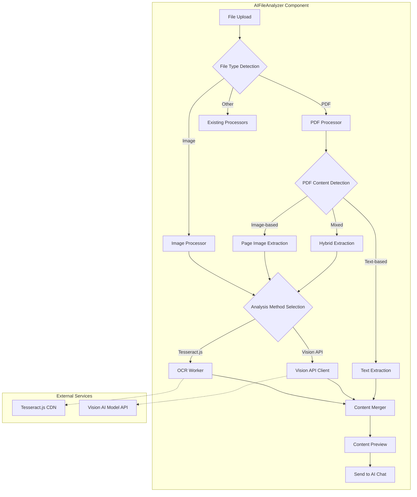
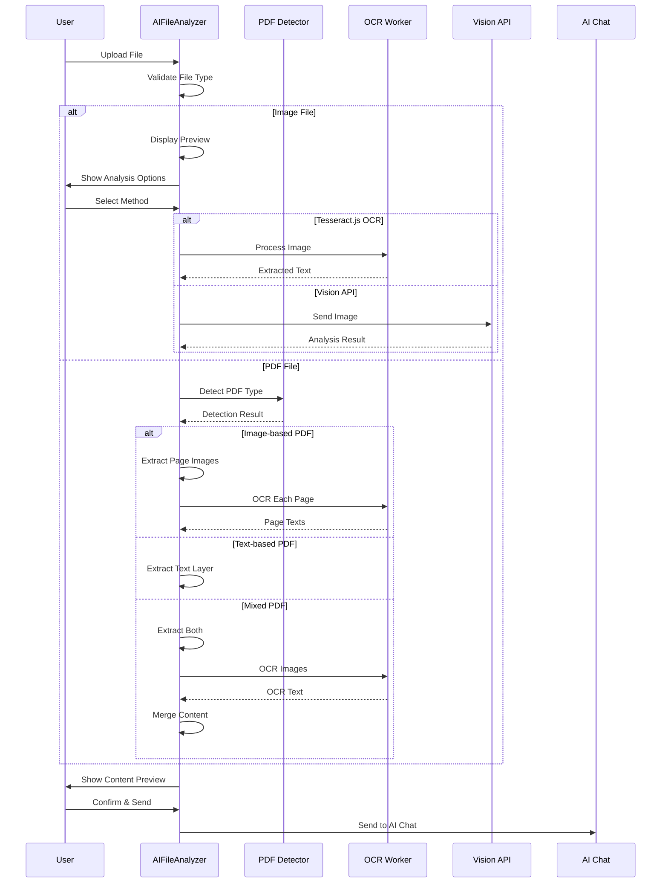
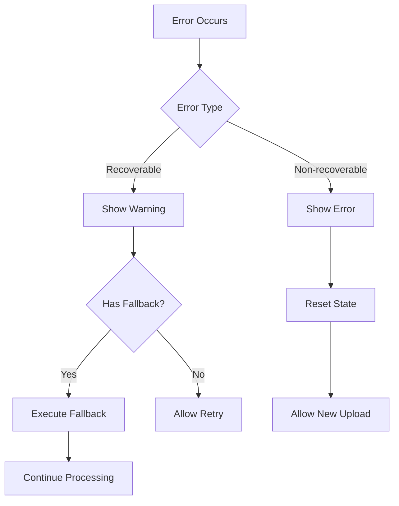

# Design Document: PDF Image OCR

## Overview

本设计文档描述了 AI Workflow Generator 组件中图片识别和 OCR 功能的技术实现方案。该功能将增强现有的 AIFileAnalyzer 组件，使其能够：

1. 支持直接上传图片文件（JPG、PNG、GIF、BMP、WebP）进行分析
2. 识别扫描版 PDF 和 PDF 中的嵌入图片内容
3. 提供 Tesseract.js 本地 OCR 和 Vision API 两种图像识别方案

## Architecture

### 系统架构图



### 数据流图



## Components and Interfaces

### 1. OCR Utility Module (`ocrUtils.ts`)

```typescript
// OCR configuration interface
interface OCRConfig {
  language: string;           // OCR language code (e.g., 'eng', 'chi_sim')
  workerPath?: string;        // Custom worker path
  corePath?: string;          // Custom core path
  langPath?: string;          // Custom language data path
}

// OCR result interface
interface OCRResult {
  text: string;               // Extracted text
  confidence: number;         // Recognition confidence (0-100)
  blocks: OCRBlock[];         // Text blocks with positions
}

interface OCRBlock {
  text: string;
  confidence: number;
  bbox: { x0: number; y0: number; x1: number; y1: number };
}

// Main OCR service interface
interface IOCRService {
  initialize(config?: OCRConfig): Promise<void>;
  recognizeImage(imageData: ImageData | Blob | string): Promise<OCRResult>;
  recognizeMultiple(images: Array<ImageData | Blob | string>): Promise<OCRResult[]>;
  terminate(): Promise<void>;
  isInitialized(): boolean;
  setLanguage(language: string): Promise<void>;
}
```

### 2. PDF Detection Module (`pdfDetector.ts`)

```typescript
// PDF type detection result
interface PDFDetectionResult {
  type: 'text-based' | 'image-based' | 'mixed';
  pageCount: number;
  textDensity: number;        // Characters per page average
  hasImages: boolean;
  imagePages: number[];       // Page numbers containing images
  textPages: number[];        // Page numbers with extractable text
}

// PDF detector interface
interface IPDFDetector {
  detectPDFType(pdfData: ArrayBuffer): Promise<PDFDetectionResult>;
  extractPageAsImage(pdfData: ArrayBuffer, pageNum: number): Promise<Blob>;
  extractAllPagesAsImages(pdfData: ArrayBuffer): AsyncGenerator<{ pageNum: number; image: Blob }>;
}
```

### 3. Image Processor Module (`imageProcessor.ts`)

```typescript
// Image processing options
interface ImageProcessingOptions {
  maxWidth?: number;          // Maximum width for resizing
  maxHeight?: number;         // Maximum height for resizing
  quality?: number;           // JPEG quality (0-1)
  format?: 'jpeg' | 'png';    // Output format
}

// Image processor interface
interface IImageProcessor {
  loadImage(file: File | Blob): Promise<HTMLImageElement>;
  resizeImage(image: HTMLImageElement, options: ImageProcessingOptions): Promise<Blob>;
  getImageData(image: HTMLImageElement): ImageData;
  createPreviewUrl(file: File | Blob): string;
  revokePreviewUrl(url: string): void;
}
```

### 4. Content Merger Module (`contentMerger.ts`)

```typescript
// Content source types
type ContentSource = 'text-layer' | 'ocr' | 'vision-api';

// Content block with source tracking
interface ContentBlock {
  content: string;
  source: ContentSource;
  pageNumber?: number;
  confidence?: number;
}

// Merged content result
interface MergedContent {
  fullText: string;
  blocks: ContentBlock[];
  statistics: {
    totalCharacters: number;
    totalWords: number;
    ocrCharacters: number;
    textLayerCharacters: number;
    averageConfidence: number;
  };
}

// Content merger interface
interface IContentMerger {
  merge(blocks: ContentBlock[]): MergedContent;
  deduplicate(text1: string, text2: string, threshold?: number): string;
  orderByPage(blocks: ContentBlock[]): ContentBlock[];
}
```

### 5. Vision API Client (`visionApiClient.ts`)

```typescript
// Vision API request
interface VisionAnalysisRequest {
  image: Blob | string;       // Image blob or base64
  prompt?: string;            // Custom analysis prompt
  modelId?: string;           // Specific model to use
}

// Vision API response
interface VisionAnalysisResponse {
  analysis: string;           // AI analysis result
  modelUsed: string;
  processingTime: number;
}

// Vision API client interface
interface IVisionApiClient {
  isVisionSupported(modelId?: string): Promise<boolean>;
  analyzeImage(request: VisionAnalysisRequest): Promise<VisionAnalysisResponse>;
  analyzeImages(requests: VisionAnalysisRequest[]): Promise<VisionAnalysisResponse[]>;
}
```

## Data Models

### File Processing State

```typescript
interface FileProcessingState {
  file: File | null;
  status: 'idle' | 'detecting' | 'processing' | 'completed' | 'error';
  progress: {
    stage: string;
    current: number;
    total: number;
    percentage: number;
  };
  detectionResult?: PDFDetectionResult;
  extractedContent?: MergedContent;
  error?: string;
  analysisMethod?: 'tesseract' | 'vision-api';
}
```

### Processing Options

```typescript
interface ProcessingOptions {
  ocrLanguage: string;
  useVisionApi: boolean;
  autoDetectPdfType: boolean;
  maxPagesWarningThreshold: number;
  enableContentPreview: boolean;
  enableManualEditing: boolean;
}
```

## Correctness Properties

*A property is a characteristic or behavior that should hold true across all valid executions of a system-essentially, a formal statement about what the system should do. Properties serve as the bridge between human-readable specifications and machine-verifiable correctness guarantees.*

### Property Reflection

After analyzing the prework, the following redundancies were identified and consolidated:
- Properties 2.4 and 1.4 both test OCR text extraction - consolidated into a single OCR round-trip property
- Properties 4.1 and 2.5 both test content merging - consolidated into content merger property
- Properties 3.3 and 9.2 both test error message generation - consolidated into error handling property

### Properties

**Property 1: Image file type validation**
*For any* file with an extension, the file type validator SHALL return true if and only if the extension is one of: jpg, jpeg, png, gif, bmp, webp (case-insensitive)
**Validates: Requirements 1.1**

**Property 2: OCR text extraction round-trip**
*For any* image containing readable text, performing OCR on the image SHALL extract text that contains the original text content (allowing for minor OCR errors)
**Validates: Requirements 1.4, 2.4**

**Property 3: PDF type detection accuracy**
*For any* PDF file, the detector SHALL correctly classify it as text-based (if text density > threshold), image-based (if text density < threshold and has images), or mixed (if both conditions apply)
**Validates: Requirements 2.1**

**Property 4: Automatic OCR triggering**
*For any* PDF detected as image-based or mixed, the system SHALL trigger OCR processing for the image pages
**Validates: Requirements 2.2**

**Property 5: PDF page image extraction completeness**
*For any* PDF with N pages requiring OCR, the image extraction process SHALL produce exactly N images
**Validates: Requirements 2.3**

**Property 6: Content merger preserves all content**
*For any* set of content blocks from different sources, the merged result SHALL contain all unique content from all sources
**Validates: Requirements 2.5, 4.1**

**Property 7: Error handling produces descriptive messages**
*For any* error condition during OCR processing, the system SHALL produce an error message that describes the specific issue
**Validates: Requirements 3.3, 9.2**

**Property 8: Statistics calculation accuracy**
*For any* extracted content, the character count in statistics SHALL equal the actual length of the content string
**Validates: Requirements 3.4**

**Property 9: Content ordering by page**
*For any* set of content blocks with page numbers, the merged content SHALL order blocks by ascending page number
**Validates: Requirements 4.2**

**Property 10: Content deduplication effectiveness**
*For any* two content strings with overlapping text, the deduplication function SHALL remove duplicate portions while preserving unique content
**Validates: Requirements 4.3**

**Property 11: Vision API fallback on failure**
*For any* Vision API call that fails, the system SHALL fall back to Tesseract.js OCR and produce a result
**Validates: Requirements 5.4**

**Property 12: Language configuration affects OCR**
*For any* OCR operation with a specified language, the OCR engine SHALL be configured with that language before processing
**Validates: Requirements 6.2**

**Property 13: Large PDF warning threshold**
*For any* PDF with page count exceeding 50, the system SHALL generate a warning about processing time
**Validates: Requirements 7.2**

**Property 14: Content source tracking**
*For any* content block in the merged result, the source field SHALL correctly indicate whether it came from 'text-layer', 'ocr', or 'vision-api'
**Validates: Requirements 8.2**

## Error Handling

### Error Categories

| Error Type | Description | User Message | Recovery Action |
|------------|-------------|--------------|-----------------|
| `FILE_TYPE_UNSUPPORTED` | File extension not in supported list | "Unsupported file type. Supported formats: TXT, PDF, DOCX, XLSX, CSV, MD, JSON, JPG, PNG, GIF, BMP, WebP" | Allow user to select different file |
| `FILE_SIZE_EXCEEDED` | File exceeds 10MB limit | "File size exceeds 10MB limit" | Allow user to select smaller file |
| `PDF_CORRUPTED` | PDF cannot be parsed | "Failed to parse PDF file. Please ensure the file is not corrupted." | Allow user to select different file |
| `OCR_INIT_FAILED` | Tesseract.js failed to initialize | "OCR engine failed to initialize. Please try again." | Retry initialization or use Vision API |
| `OCR_PROCESSING_FAILED` | OCR processing error | "Failed to extract text from image. Please try again." | Retry or use Vision API |
| `VISION_API_UNAVAILABLE` | Vision API not configured or model doesn't support vision | "Vision API is not available. Using OCR instead." | Automatic fallback to OCR |
| `VISION_API_FAILED` | Vision API call failed | "Vision analysis failed. Using OCR instead." | Automatic fallback to OCR |
| `NO_CONTENT_EXTRACTED` | No readable content found | "No readable content found in the file" | Allow user to try different analysis method |
| `MEMORY_EXCEEDED` | Browser memory limit reached | "Processing stopped due to memory constraints. Try a smaller file." | Cancel and suggest smaller file |

### Error Handling Flow



## Testing Strategy

### Dual Testing Approach

本功能采用单元测试和属性测试相结合的测试策略：

- **单元测试**: 验证特定示例、边界情况和错误条件
- **属性测试**: 验证应在所有输入上成立的通用属性

### Property-Based Testing Framework

使用 **fast-check** 作为属性测试库，配置每个属性测试运行至少 100 次迭代。

### Test Structure

```
packages/flowFlex-common/src/app/components/ai/__tests__/
├── ocrUtils.test.ts           # OCR utility unit tests
├── ocrUtils.property.test.ts  # OCR property-based tests
├── pdfDetector.test.ts        # PDF detector unit tests
├── pdfDetector.property.test.ts
├── imageProcessor.test.ts     # Image processor unit tests
├── contentMerger.test.ts      # Content merger unit tests
├── contentMerger.property.test.ts
└── AIFileAnalyzer.test.ts     # Component integration tests
```

### Property Test Annotations

每个属性测试必须使用以下格式标注：
```typescript
// **Feature: pdf-image-ocr, Property 1: Image file type validation**
// **Validates: Requirements 1.1**
```

### Unit Test Coverage

单元测试应覆盖：
- 文件类型验证的边界情况（空文件名、多个扩展名、大小写混合）
- PDF 检测的特定示例（纯文本 PDF、纯图片 PDF、混合 PDF）
- OCR 错误处理场景
- Vision API 回退逻辑
- 内容合并的边界情况（空内容、单一来源、重复内容）

### Integration Test Scenarios

1. 上传 JPG 图片 → 选择 Tesseract OCR → 验证文本提取
2. 上传扫描版 PDF → 自动检测 → OCR 处理 → 验证内容
3. 上传混合 PDF → 提取文本层 + OCR → 验证合并内容
4. Vision API 失败 → 验证自动回退到 OCR
5. 大文件处理 → 验证警告显示和取消功能
