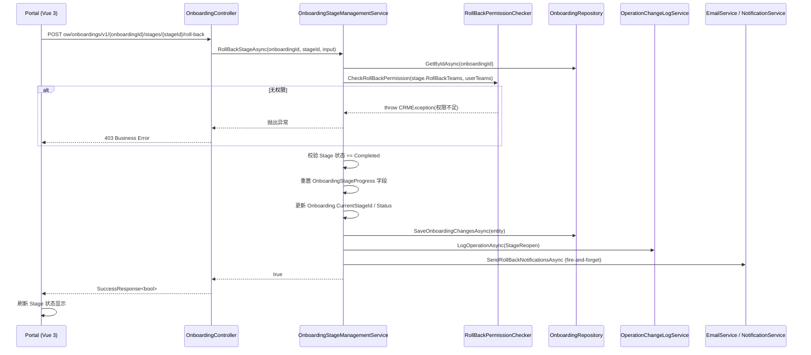

# Design Document: Roll Back Completed Stage

## Overview

本功能允许有权限的内部用户将一个已完成（Completed）的 Onboarding Stage 重新打开（Roll Back），
将其状态恢复为 InProgress，以便修正填写内容后再次 Complete。

**核心思路**：在现有 Stage 完成/进度体系之上，增加一个反向操作（RollBack），权限通过新增
`RollBackTeams`（JSONB whitelist）控制，逻辑上与 `OperateTeams` 完全对称。Roll Back 本身
不撤销已执行的 ConditionAction；Stage 重新 Complete 时，现有 `EvaluateAndExecuteStageConditionAsync`
流程自动重新触发。

---

## Architecture

### 数据流



### 分层职责

| 层 | 改动 | 说明 |
|----|------|------|
| DB / Migration | 新增 `roll_back_teams` 列 | `ff_stage` 表，jsonb 类型 |
| Domain Entity | `Stage` 新增 `RollBackTeams` 属性 | `[SugarColumn(..., ColumnDataType = "jsonb")]` |
| Application DTO | `RollBackStageInput` 请求 DTO | `StageId`（路由）、`Reason?` |
| Service Interface | `IOnboardingStageManagementService` | 新增 `RollBackStageAsync` |
| Service Impl | `OnboardingStageManagementService` | 实现核心 Roll Back 逻辑 |
| Controller | `OnboardingController` | 新增 `POST .../stages/{stageId}/roll-back` |
| Frontend API | `onboarding.ts` | 新增 `rollBackStage()` 函数 |
| Frontend UI | Stage 卡片组件 | Roll Back 按钮 + 确认弹窗 |

---

## Components and Interfaces

### 后端接口变更

#### `IOnboardingStageManagementService` — 新增方法

```csharp
/// <summary>
/// Roll back a completed stage to InProgress
/// </summary>
/// <param name="onboardingId">Onboarding ID</param>
/// <param name="stageId">Stage ID to roll back</param>
/// <param name="input">Roll back input (optional reason)</param>
/// <returns>True if successful</returns>
Task<bool> RollBackStageAsync(long onboardingId, long stageId, RollBackStageInput input);
```

#### `RollBackStageInput` DTO

```csharp
// Application.Contracts/Dtos/OW/Onboarding/RollBackStageInput.cs
namespace FlowFlex.Application.Contracts.Dtos.OW.Onboarding
{
    /// <summary>
    /// Input DTO for rolling back a completed stage
    /// </summary>
    public class RollBackStageInput
    {
        /// <summary>
        /// Optional reason for rolling back the stage (recorded in operation log)
        /// </summary>
        public string? Reason { get; set; }
    }
}
```

#### API 端点

```
POST ow/onboardings/v1/{onboardingId}/stages/{stageId}/roll-back
Authorization: Bearer {token}
Body: { "reason": "optional reason string" }
Response: SuccessResponse<bool>
```

### 前端 API 函数

```typescript
// packages/flowFlex-common/src/app/apis/ow/onboarding.ts（新增）
export const rollBackStage = (
    onboardingId: string,
    stageId: string,
    reason?: string
) =>
    defHttp.post<boolean>({
        url: `${prefix}/ow/onboardings/${apiVersion}/${onboardingId}/stages/${stageId}/roll-back`,
        data: { reason },
    });
```

### Stage 卡片 UI 变更

- 在 Completed 状态的 Stage 卡片操作区新增 **Roll Back** 按钮
- 按钮显示条件：`stage.status === 'Completed' && stage.canRollBack === true`
  - `canRollBack` 字段由后端在 StageProgress 输出 DTO 中返回，避免额外权限 API 调用
- 点击后弹出确认对话框（`el-dialog`）：
  - 包含说明文字（"此操作将重新打开该 Stage，使其回到 InProgress 状态"）
  - 可选 Reason 文本框（`el-input type="textarea"`）
  - 确认按钮触发 `rollBackStage()` API 调用

---

## Data Models

### DB 变更：`ff_stage` 表新增列

```sql
-- Migration: Migration_20260806000001_AddRollBackTeamsToStage.cs
ALTER TABLE ff_stage
ADD COLUMN IF NOT EXISTS roll_back_teams jsonb;
```

存储格式与 `operate_teams` 完全一致，为团队 ID 的 JSON 数组：

```json
["team-id-1", "team-id-2"]
```

- `null` 或空数组 → 不允许任何人执行 Roll Back（安全默认值，与 `operate_teams` 为空表示所有人可操作不同）

### `Stage` Entity 变更

```csharp
/// <summary>
/// Roll Back Teams - JSONB array of team IDs allowed to roll back completed stages.
/// NULL or empty array means no one can roll back (security default).
/// </summary>
[SugarColumn(ColumnName = "roll_back_teams", ColumnDataType = "jsonb", IsJson = true)]
public string RollBackTeams { get; set; }
```

### `OnboardingStageProgress` 字段（已有，无需新增）

Roll Back 只修改现有的 `OnboardingStageProgress` 中以下字段：

| 字段 | Roll Back 后的值 |
|------|----------------|
| `Status` | `"InProgress"` |
| `IsCompleted` | `false` |
| `CompletionTime` | `null` |
| `CompletedBy` | `null` |
| `CompletedById` | `null` |
| `IsCurrent` | `true` |

### `Onboarding` 状态联动（条件触发）

当被 Roll Back 的 Stage 是 Onboarding 中**最后完成的 Stage**，且 `onboarding.Status == "Completed"` 时：

| 字段 | Roll Back 后的值 |
|------|----------------|
| `Status` | `"InProgress"` |
| `ActualCompletionDate` | `null` |
| `CurrentStageId` | 被 Roll Back 的 StageId |
| `CurrentStageOrder` | 被 Roll Back 的 Stage.Order |

### StageProgress 输出 DTO 变更

在现有 `OnboardingStageProgressOutputDto`（或同类 DTO）中新增：

```csharp
/// <summary>
/// Whether the current user has permission to roll back this stage
/// </summary>
public bool CanRollBack { get; set; }
```

此字段在查询 Stage 进度时由服务层根据 `RollBackTeams` 计算并填充，前端直接使用，
无需发起单独的权限检查请求。

---

## Correctness Properties

*A property is a characteristic or behavior that should hold true across all valid executions of a system — essentially, a formal statement about what the system should do. Properties serve as the bridge between human-readable specifications and machine-verifiable correctness guarantees.*

### Property 1: RollBack 操作的状态不变量

*For any* Onboarding 和其中一个状态为 `Completed` 的 Stage，在权限校验通过的前提下，
执行 `RollBackStageAsync` 之后：
该 Stage 对应的 `OnboardingStageProgress` 必须满足 `Status == "InProgress"` 且
`IsCompleted == false` 且 `CompletionTime == null` 且 `CompletedBy == null`，
同时 `IsCurrent == true` 且 `Onboarding.CurrentStageId == stageId`。

**Validates: Requirements 1.1, 1.2**

### Property 2: 无效输入时 RollBack 操作被拒绝

*For any* 以下任意一种无效输入，`RollBackStageAsync` 必须抛出 `CRMException` 并且
**不修改** Onboarding 或 Stage 进度的任何状态：
- 目标 Stage 状态不是 `Completed`（如 `InProgress`、`Skipped`、`NotStarted`）
- 目标 Stage 不属于该 Onboarding 对应的 Workflow

**Validates: Requirements 1.3, 1.4**

### Property 3: RollBackTeams Whitelist 权限语义

*For any* Stage 的 `RollBackTeams` 配置和当前用户的团队集合：
- 若 `RollBackTeams` 为 `null` 或空数组，则**任何用户**的 Roll Back 请求必须被拒绝
- 若 `RollBackTeams` 非空，则只有当用户所属团队与 `RollBackTeams` 有**非空交集**时，
  权限检查才返回通过；否则拒绝

**Validates: Requirements 2.2, 2.3, 2.4**

### Property 4: Onboarding 状态联动重置不变量

*For any* `Status == "Completed"` 的 Onboarding，在其任意一个 Completed Stage 被
Roll Back 后，`Onboarding.Status` 必须变为 `"InProgress"`，且 `ActualCompletionDate`
必须为 `null`。

**Validates: Requirements 1.5**

---

## Error Handling

### 业务错误（`CRMException`）

| 场景 | 错误码 | 提示消息 |
|------|--------|---------|
| Onboarding 不存在 | `DataNotFound` | "Onboarding not found" |
| Stage 不存在或不属于该 Workflow | `DataNotFound` | "Stage not found or does not belong to the current workflow" |
| Stage 状态不是 Completed | `BusinessError` | "Only completed stages can be rolled back" |
| RollBackTeams 为空/null | `Forbidden` | "This stage has no roll back permission configured" |
| 执行者团队不在 RollBackTeams 中 | `Forbidden` | "You do not have permission to perform this operation" |

### 非阻断性异常

| 场景 | 处理方式 |
|------|---------|
| 通知发送失败（邮件/消息服务） | 记录 `Logger.LogError`，不阻断 Roll Back 响应 |
| 操作日志写入失败 | 记录 `Logger.LogError`，不阻断 Roll Back 响应 |

### 前端错误展示

- API 返回非 2xx 时，Axios 拦截器自动调用 `ElMessage.error(response.message)` 展示后端错误信息
- 确认弹窗在请求期间禁用确认按钮（loading 状态），防止重复提交

---

## Testing Strategy

### 单元测试（xUnit + Moq + FluentAssertions）

重点覆盖以下场景：

**RollBackStageAsync 核心逻辑：**
- Happy path：Completed Stage → Roll Back 成功，进度字段正确重置
- Happy path：Onboarding 整体状态为 Completed 时，联动重置为 InProgress
- 错误路径：Stage 不是 Completed 状态 → 抛出 BusinessError
- 错误路径：Stage 不属于该 Workflow → 抛出 DataNotFound
- 错误路径：Onboarding 不存在 → 抛出 DataNotFound

**RollBackTeams 权限校验：**
- `RollBackTeams` 为 null → 拒绝（任意用户团队）
- `RollBackTeams` 为空数组 → 拒绝（任意用户团队）
- 用户团队在 whitelist 内 → 允许
- 用户团队不在 whitelist 内 → 拒绝

**通知与日志（mock-based）：**
- Roll Back 成功后调用日志服务，日志类型为 `StageReopen`
- 通知发送失败时 Roll Back 仍返回成功

### 属性测试（Property-Based Tests）

使用 **FsCheck**（.NET 生态标准 PBT 库）验证上述 4 个 Correctness Properties。
每个 property 测试至少运行 **100 次迭代**，通过生成器随机生成：
- 任意合法的 `OnboardingStageProgress` 对象（Status、各字段组合）
- 任意合法的 `RollBackTeams` JSON 列表
- 任意用户团队 ID 列表

每个属性测试注释标注引用的设计属性，格式：
```csharp
// Feature: roll-back-completed-stage, Property 1: RollBack 操作的状态不变量
```

### 前端测试（Jest + @vue/test-utils）

- Stage 卡片：快照测试验证 Completed 状态显示 Roll Back 按钮
- Stage 卡片：`canRollBack == false` 时不渲染按钮
- 确认弹窗：通知 API 调用携带正确参数（`onboardingId`、`stageId`、`reason`）
- 错误场景：API 失败后展示 `ElMessage.error`

### 集成测试

- 验证 Migration 执行后 `ff_stage` 表确实存在 `roll_back_teams` 列
- 验证操作日志 `StageReopen` 记录在 `ow_operation_change_log` 表中可查询到（对应 Requirement 4.3）
