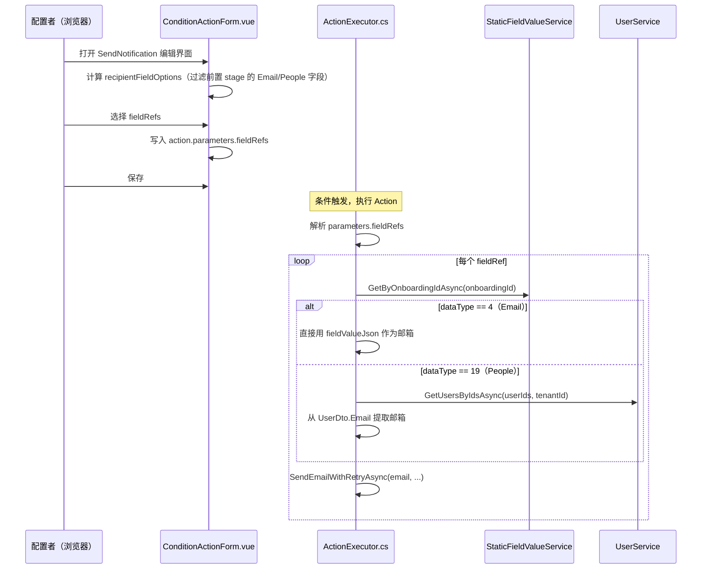

# 设计文档：Send Notification Field Recipients

## 概述

为 FlowFlex 的 Condition Action "Send Notification" 增加第三种收件人选择方式——**Select Field**。用户在配置通知时可额外选择来自当前 Stage 之前的 Stage 中 Email（dataType=4）或 People（dataType=19）类型的 Dynamic Field。系统执行通知时读取这些字段的实际值，解析出邮箱地址并发送邮件。

本次改动范围：
- **前端**：`ConditionActionForm.vue` — 新增 Select Field 选择器、更新校验逻辑、支持回显
- **后端**：`ActionExecutor.cs` 中的 `ExecuteSendNotificationAsync` — 解析 `fieldRefs` 参数，按字段类型获取邮箱并发送

不需要数据库 Migration，`fieldRefs` 作为新 key 存储在现有 `parameters` JSONB 字段中。

---

## 架构

### 数据流



### 前端组件层次

```
ConditionActionForm.vue
├── recipientFieldOptions (computed) ← 新增
│   └── 遍历 props.stages.slice(0, currentStageIndex)
│       └── 筛选 dataType === 4 || dataType === 19
└── template: SendNotification section
    ├── Select User (FlowflexUserSelector)
    ├── Select Team (FlowflexUserSelector)
    └── Select Field (el-select, 新增) ← 绑定 fieldRefs
```

---

## 组件与接口

### 前端：新增计算属性 `recipientFieldOptions`

**文件**：`packages/flowFlex-common/src/app/views/onboard/workflow/components/condition/ConditionActionForm.vue`

```typescript
// 字段选项接口（新增）
interface RecipientFieldOption {
    key: string;       // stageId_fieldId
    id: string;        // fieldId
    name: string;      // 字段名称
    stageId: string;
    stageName: string;
    dataType: number;  // 4 = Email, 19 = People
}

interface RecipientFieldOptionGroup {
    stageName: string;
    stageId: string;
    fields: RecipientFieldOption[];
}

// 按 Stage 分组的字段选项（只包含当前 stage 之前的 stage，筛选 Email/People 类型）
const recipientFieldOptions = computed<RecipientFieldOptionGroup[]>(() => {
    const groups: RecipientFieldOptionGroup[] = [];

    // 遍历当前 stage 之前的 stages（不含当前 stage）
    props.stages.slice(0, props.currentStageIndex).forEach((stage) => {
        const fieldsComponent = stage.components?.find((c) => c.key === 'fields');
        if (!fieldsComponent?.staticFields?.length) return;

        const fields: RecipientFieldOption[] = [];
        fieldsComponent.staticFields.forEach((field) => {
            const fieldInfo = staticFieldsMap.value.get(field.id);
            if (
                fieldInfo &&
                (fieldInfo.dataType === propertyTypeEnum.Email ||
                    fieldInfo.dataType === propertyTypeEnum.Pepole)
            ) {
                fields.push({
                    key: `${stage.id}_${field.id}`,
                    id: field.id,
                    name: fieldInfo.fieldName || field.id,
                    stageId: stage.id,
                    stageName: stage.name,
                    dataType: fieldInfo.dataType,
                });
            }
        });

        if (fields.length > 0) {
            groups.push({ stageName: stage.name, stageId: stage.id, fields });
        }
    });

    return groups;
});
```

### 前端：下拉框数据绑定

Select Field 的 v-model 绑定到一个中间计算的 key 数组，并在 change 时同步写入 `fieldRefs`：

```typescript
// 将 fieldRefs 转换为 key 数组用于 el-select v-model
const getFieldRefKeys = (action: ActionFormItem): string[] => {
    const refs = getActionParams(action).fieldRefs as FieldRefItem[] | undefined;
    return refs?.map((r) => `${r.stageId}_${r.fieldId}`) ?? [];
};

// 处理 Select Field 选中变化
const handleFieldRefsChange = (action: ActionFormItem, keys: string[]) => {
    const params = getActionParams(action);
    params.fieldRefs = keys.map((key) => {
        // 查找字段元数据
        for (const group of recipientFieldOptions.value) {
            const field = group.fields.find((f) => f.key === key);
            if (field) {
                return {
                    stageId: field.stageId,
                    fieldId: field.id,
                    fieldName: field.name,
                    dataType: field.dataType,
                };
            }
        }
        // 若 staticFieldsMap 尚未加载，回退到已保存的 fieldRefs 中匹配项
        const existing = (params.fieldRefs as FieldRefItem[] | undefined)?.find(
            (r) => `${r.stageId}_${r.fieldId}` === key
        );
        return existing ?? { stageId: '', fieldId: key, fieldName: key, dataType: 0 };
    });
};
```

### 前端：类型定义补充

**文件**：`types/condition.d.ts`（或现有类型文件）

```typescript
// 新增 FieldRefItem 类型
export interface FieldRefItem {
    stageId: string;
    fieldId: string;
    fieldName: string;
    dataType: number; // 4 = Email, 19 = People
}
```

ActionFormItem.parameters 已是 `Record<string, any>`，`fieldRefs` 作为新 key 无需修改接口。

### 后端：`ExecuteSendNotificationAsync` 扩展逻辑

**文件**：`packages/flowFlex-backend/Application/Services/OW/StageCondition/ActionExecutor.cs`

新增内部 DTO：
```csharp
private class FieldRefItem
{
    [JsonProperty("stageId")]
    public string StageId { get; set; } = string.Empty;

    [JsonProperty("fieldId")]
    public string FieldId { get; set; } = string.Empty;

    [JsonProperty("fieldName")]
    public string FieldName { get; set; } = string.Empty;

    [JsonProperty("dataType")]
    public int DataType { get; set; }
}
```

扩展 `ExecuteSendNotificationAsync` 方法，在现有 `users`/`teams` 解析之后追加 `fieldRefs` 处理：

```csharp
// 解析 fieldRefs
var fieldRefs = new List<FieldRefItem>();
if (action.Parameters.TryGetValue("fieldRefs", out var fieldRefsObj) && fieldRefsObj != null)
{
    fieldRefs = JsonConvert.DeserializeObject<List<FieldRefItem>>(fieldRefsObj.ToString()) 
                ?? new List<FieldRefItem>();
}

// 更新校验：三者均为空才报错
if (!userIds.Any() && !teamIds.Any() && !fieldRefs.Any())
{
    result.Success = false;
    result.ErrorMessage = "Either users, teams, or fieldRefs must specify at least one valid recipient";
    return result;
}

// 处理 fieldRefs
if (fieldRefs.Any())
{
    var allFieldValues = await _staticFieldValueService.GetByOnboardingIdAsync(context.OnboardingId);
    var fieldValueDict = allFieldValues?
        .ToDictionary(fv => fv.PropertyId.ToString(), fv => fv)
        ?? new Dictionary<string, StaticFieldValueDto>();

    foreach (var fieldRef in fieldRefs)
    {
        if (!fieldValueDict.TryGetValue(fieldRef.FieldId, out var fieldValue))
            continue; // 字段尚未填写，跳过

        var rawValue = fieldValue.FieldValueJson;
        if (string.IsNullOrWhiteSpace(rawValue))
            continue;

        if (fieldRef.DataType == 4) // Email
        {
            // 直接用字段值作为邮箱
            var email = rawValue.Trim('"');
            if (!string.IsNullOrWhiteSpace(email))
            {
                var sent = await SendEmailWithRetryAsync(email, context.OnboardingId.ToString(), 
                    caseName, previousStageName, currentStageName, caseUrl, customSubject, customEmailBody);
                if (sent) { successCount++; sentEmails.Add(email); }
                else { failedRecipients.Add($"field:{fieldRef.FieldId}(send failed)"); }
            }
        }
        else if (fieldRef.DataType == 19) // People
        {
            // 解析 user ID（单字符串或字符串数组）
            var userIdList = ParsePeopleFieldValue(rawValue);
            if (!userIdList.Any()) continue;

            var parsedIds = userIdList
                .Where(id => long.TryParse(id, out _))
                .Select(id => long.Parse(id))
                .ToList();

            if (!parsedIds.Any()) continue;

            var users = await _userService.GetUsersByIdsAsync(parsedIds, context.TenantId);
            foreach (var user in users ?? Enumerable.Empty<UserDto>())
            {
                if (string.IsNullOrWhiteSpace(user.Email)) continue;
                var sent = await SendEmailWithRetryAsync(user.Email, context.OnboardingId.ToString(),
                    caseName, previousStageName, currentStageName, caseUrl, customSubject, customEmailBody);
                if (sent) { successCount++; sentEmails.Add(user.Email); }
                else { failedRecipients.Add($"field:{fieldRef.FieldId}:user:{user.Id}(send failed)"); }
            }
        }
    }

    result.ResultData["fieldRefsCount"] = fieldRefs.Count;
}
```

新增辅助方法：
```csharp
/// <summary>
/// 解析 People 字段值，支持单 ID 字符串或 JSON 字符串数组
/// </summary>
private static List<string> ParsePeopleFieldValue(string rawValue)
{
    if (string.IsNullOrWhiteSpace(rawValue)) return new List<string>();
    
    try
    {
        // 尝试解析为数组
        var arr = JsonConvert.DeserializeObject<List<string>>(rawValue);
        if (arr != null) return arr.Where(id => !string.IsNullOrWhiteSpace(id)).ToList();
    }
    catch { /* 不是 JSON 数组，继续尝试单值 */ }
    
    // 单个字符串值（可能带引号）
    var single = rawValue.Trim('"');
    return string.IsNullOrWhiteSpace(single) ? new List<string>() : new List<string> { single };
}
```

---

## 数据模型

### `action.parameters.fieldRefs`（前端存储格式）

```json
[
  {
    "stageId": "1234567890123456789",
    "fieldId": "9876543210987654321",
    "fieldName": "Primary Contact Email",
    "dataType": 4
  },
  {
    "stageId": "1234567890123456789",
    "fieldId": "1111111111111111111",
    "fieldName": "Account Manager",
    "dataType": 19
  }
]
```

### Email 字段值（`field_value_json`）

```
"adam@nxtascent.com"
```
（带引号的 JSON 字符串，解析时需 `Trim('"')`）

### People 字段值（`field_value_json`）

单值：
```
"1935628523372941312"
```

多值：
```
["1935628523372941312", "1935628523372941313"]
```

---

## 正确性属性

*属性是对系统正确行为的形式化陈述——在所有有效输入下均应成立的不变量，是需求规格与可验证代码之间的桥梁。*

### 属性 1：字段过滤正确性

*对任意* stage 列表和 currentStageIndex，`recipientFieldOptions` 中的所有字段 dataType 必须为 4 或 19，且其所属 stage 必须位于 currentStageIndex 对应 stage 之前（索引 < currentStageIndex）。

**验证需求：1.2**

---

### 属性 2：分组聚合正确性

*对任意* 包含多个 stage 字段的输入，`recipientFieldOptions` 中同一 stageId 的字段必须归属于同一个分组，且分组数量等于出现了有效字段的不同 stageId 数量。

**验证需求：1.3**

---

### 属性 3：fieldRefs 写入结构正确性

*对任意* 选中的 key 数组，`handleFieldRefsChange` 写入的 `fieldRefs` 中每条记录必须包含 `stageId`、`fieldId`、`fieldName`、`dataType` 四个字段，且 `stageId + '_' + fieldId === key`。

**验证需求：2.1**

---

### 属性 4：收件人校验完备性

*对任意* `users`（长度 ≥ 0）、`teams`（长度 ≥ 0）、`fieldRefs`（长度 ≥ 0）的组合：
- 若三者均为空 → 校验失败
- 若三者中至少一个非空 → 校验通过

**验证需求：3.1、3.2**

---

### 属性 5：People 字段值解析健壮性

*对任意* 非空字符串 `rawValue`，`ParsePeopleFieldValue` 的结果满足：
- 若 rawValue 是合法 JSON 字符串数组 → 返回数组中所有非空字符串
- 若 rawValue 是单个非空字符串（含或不含外层引号）→ 返回包含该 ID 的单元素列表
- 返回列表中不存在空字符串

**验证需求：5.3**

---

### 属性 6：发送统计不变量

*对任意* 执行 `ExecuteSendNotificationAsync` 的结果，`result.ResultData["sentEmails"]` 列表的长度必须等于 `result.ResultData["successCount"]` 的值（含 fieldRefs 贡献的计数）。

**验证需求：5.6**

---

## 错误处理

| 情况 | 处理方式 |
|---|---|
| `fieldRefs` JSON 格式错误 | `DeserializeObject` 返回 null，当作空列表处理，不抛异常 |
| 字段在 `StaticFieldValue` 中不存在（用户未填）| 跳过该 fieldRef，不计入失败 |
| Email 字段值为空字符串 | 跳过，不计入失败 |
| People 字段值无法解析为有效用户 ID | 跳过，不计入失败（`long.TryParse` 过滤） |
| `GetUsersByIdsAsync` 返回空 | 跳过，不记录失败（字段值可能引用了已删除用户） |
| 邮件发送失败（含重试后失败）| 计入 `failedRecipients`，格式 `field:{fieldId}(send failed)` |
| `staticFieldsMap` 未加载完成时用户打开编辑界面 | 等待 `loadStaticFieldsMapping` 完成后再渲染（`isLoading` 骨架屏） |
| 回显时 fieldRef.fieldId 不在 staticFieldsMap | 回退显示 `fieldRef.fieldName` |

---

## 测试策略

本功能的核心逻辑由两部分组成：

1. **前端过滤与分组逻辑**（纯计算，适合属性测试）
2. **后端 `ParsePeopleFieldValue`**（纯函数，适合属性测试）
3. **后端 `ExecuteSendNotificationAsync` 的 fieldRefs 处理分支**（有依赖注入，适合 Mock 单测）

**属性测试库选择：**
- 后端（C#）：使用 [FsCheck](https://fscheck.github.io/FsCheck/)（xUnit 集成）
- 前端（TypeScript/Vue）：使用 [fast-check](https://fast-check.dev/)（Jest 集成）

**测试覆盖计划：**

| 属性 | 测试类型 | 库 | 最小迭代次数 |
|---|---|---|---|
| 属性 1：字段过滤正确性 | 属性测试 | fast-check | 100 |
| 属性 2：分组聚合正确性 | 属性测试 | fast-check | 100 |
| 属性 3：fieldRefs 写入结构正确性 | 属性测试 | fast-check | 100 |
| 属性 4：收件人校验完备性 | 属性测试 | fast-check | 100 |
| 属性 5：People 字段值解析健壮性 | 属性测试 | FsCheck | 100 |
| 属性 6：发送统计不变量 | 属性测试 | FsCheck + xUnit Mock | 100 |
| UI 展示 Select Field 选择器 | 示例测试 | @vue/test-utils | 1 |
| 仅 fieldRefs 不为空时正常执行 | 示例测试 | xUnit + Mock | 1 |
| 回显已保存的 fieldRefs | 示例测试 | @vue/test-utils | 1 |

**单元测试重点（示例测试）：**
- Email 字段直接发邮件场景
- People 字段单 ID / 多 ID 场景
- `users`/`teams` 均为空，只有 `fieldRefs` 时不报错
- 字段值为 null/空时跳过，不记录失败
