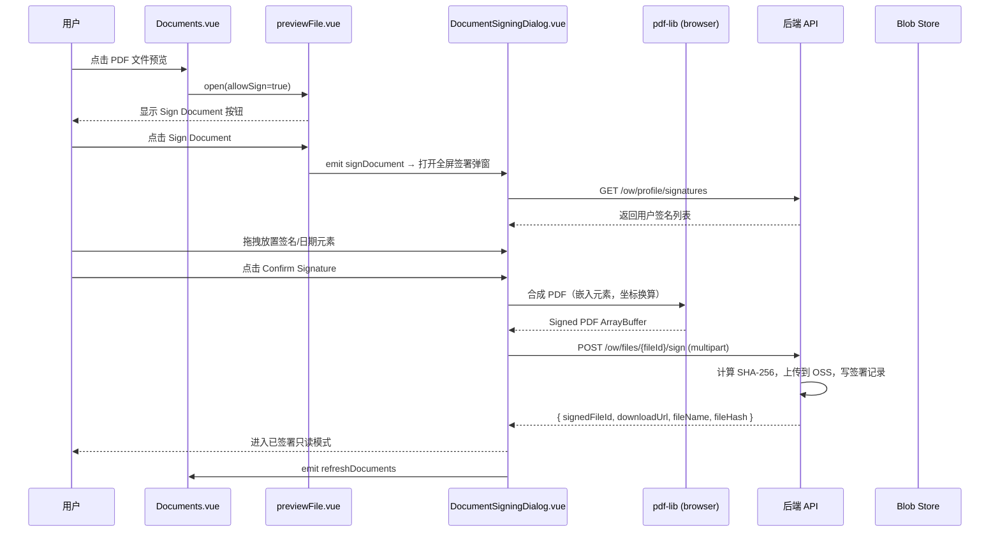

# Design Document: User Profile & Document Signing

## Overview

本功能合并两个相关特性（OW-703 + OW-704），形成完整的电子签名闭环：

- **OW-703**：在用户个人中心（Profile 页）提供电子签名管理功能，让用户预存最多 7 个签名，签名与用户绑定、跨租户可用。
- **OW-704**：在 Documents 组件中为 PDF 文件提供在线签署入口，前端使用 pdf-lib 在浏览器内合成已签署 PDF，后端接收文件、独立计算 SHA-256 哈希并落库。

两者具有明确的前置依赖关系：Profile 签名列表 API（`GET /ow/profile/signatures`）是签署对话框中"From Profile"标签页的数据来源。

### 技术选型

| 关注点 | 选择 | 理由 |
|--------|------|------|
| PDF 渲染 | PDF.js 3.11.174（CDN，复用 pdfDetector.ts 的 `loadPdfJs()`） | 项目已有封装，避免重复引入 |
| PDF 合成 | pdf-lib（前端浏览器） | 无服务器负载，用户感知延迟低；后端只做存储 |
| 手写画板 | vue-signature-pad | Vue 3 生态，轻量 |
| 元素交互 | Pointer Events API | 统一鼠标/触屏，原生 API 无额外依赖 |
| 哈希计算 | Web Crypto API（前端），`SHA256` .NET 内置（后端） | 后端自行计算，不信任前端传值 |
| 后端新包 | 无（不引入 PDFsharp 等库） | 后端只接收文件，无需处理 PDF 内容 |

---

## Architecture

### 整体数据流



### 模块依赖图

```
Documents.vue
  └── previewFile.vue (新增 allowSign prop + signDocument emit)
        └── DocumentSigningDialog.vue [新建]
              ├── SigningToolbar.vue [新建]
              ├── PageThumbnails.vue [新建]
              ├── PdfViewer.vue [新建]
              │     └── SigningOverlay.vue [新建]
              └── AddSignatureDialog.vue [新建]
                    ├── FromProfileTab.vue [新建]
                    └── DrawTab.vue [新建]

Profile 页（新建）
  └── AddSignatureDialog.vue（复用，但调用方式为 inline 而非签署流程中）
```

---

## Components and Interfaces

### 1. 前端路由：Profile 页

**文件**：`src/app/router/routers/modules/profile.ts`

```typescript
const profile: AppRouteModule = {
    path: '/profile',
    name: 'Profile',
    component: LAYOUT,
    redirect: '/profile/index',
    meta: {
        hideChildrenInMenu: true,
        hidden: true,           // 不在侧边栏显示
        title: 'My Profile',
        code: '',               // 无权限码，所有登录用户可访问
        status: true,
    },
    children: [
        {
            path: 'index',
            name: 'UserProfile',
            component: () => import('@/views/profile/index.vue'),
            meta: {
                title: 'My Profile',
                code: '',
                hidden: true,
                status: true,
            },
        },
    ],
};
```

### 2. userLayout.vue 改造

在 `<el-popover>` 内容中，现有 Log Out 按钮前插入"My Profile"导航入口：

```html
<!-- 紧接在 email tag 之后，Log Out 按钮之前 -->
<div class="flex items-center my-3 cursor-pointer" @click="goToProfile">
    <el-icon class="mr-2"><User /></el-icon>
    <span class="text-sm">My Profile</span>
</div>
```

`goToProfile()` 调用 `router.push('/profile')`。

### 3. Profile 页（`src/app/views/profile/index.vue`）

**职责**：展示用户签名列表，支持新增与删除。

**Props/State**：
- `signatures: SignatureItem[]` — 从 `GET /ow/profile/signatures` 加载
- `maxSignatures = 7` — 上限常量

**关键 UI 逻辑**：
- 签名卡片网格，每张卡展示 base64 PNG 预览 + 删除按钮
- 空态：引导文案 + "Add Signature"按钮
- 达到 7 个时"Add Signature"按钮禁用，并显示 tooltip

### 4. AddSignatureDialog.vue（新建，可复用）

**文件**：`src/app/views/profile/components/AddSignatureDialog.vue`

**模式**：Dialog（非全屏），`v-model:visible`

**标签页**：
- **From Profile**：调 `GET /ow/profile/signatures`，展示签名卡片，点击后 emit `signatureSelected(imageBase64)`
  - 空态：显示"去 My Profile 添加"和"切换到 Draw"引导
- **Draw**：`vue-signature-pad` 画布（白色背景，300×150px），Clear 按钮、"Use Signature" / "Save" 按钮
  - 在 Profile 页场景：点击"Save"调 `POST /ow/profile/signatures`
  - 在签署弹窗场景：点击"Use Signature"emit `signatureSelected(imageBase64)`，**不存库**

**Props**：
```typescript
interface Props {
    visible: boolean
    mode: 'profile' | 'signing'   // 区分两种使用场景
}
```

### 5. previewFile.vue 改造

**新增 Prop**：
```typescript
const props = defineProps({
    // ...existing props...
    allowSign: {
        type: Boolean,
        default: false,   // 默认关闭，不影响其他调用方
    },
    isSigned: {
        type: Boolean,
        default: false,
    },
    fileId: {
        type: [String, Number],
        default: null,
    },
})
```

**新增 Emit**：
```typescript
const emit = defineEmits(['closeOffice', 'renderedOffice', 'signDocument'])
```

**工具栏新增 Sign Document 按钮**（条件渲染）：
```html
<!-- 仅当 allowSign=true 且 type==='pdf' 且 !isSigned 时显示 -->
<el-button
    v-if="allowSign && type === 'pdf' && !isSigned"
    type="primary"
    @click="handleSignDocument"
>
    Sign Document
</el-button>
```

`handleSignDocument` 先 `closeOffice()`，再 `emit('signDocument', { fileId, fileUrl })`。

### 6. Documents.vue 改造

**变化点**：
1. 打开 previewFile 时传入 `allow-sign="true"`、`:is-signed="row.isSigned"`、`:file-id="row.id"`
2. 监听 `@sign-document="handleSignDocument"` 事件，打开 `DocumentSigningDialog`
3. 文件列表列新增：Signed badge（绿色）、signer name、sign time；已签署文件隐藏 Delete 按钮

### 7. DocumentSigningDialog.vue（新建，全屏）

**文件**：`src/app/views/onboard/onboardingList/components/signing/DocumentSigningDialog.vue`

**Props**：
```typescript
interface Props {
    visible: boolean
    fileId: string | number
    fileUrl: string
    fileName: string
}
```

**内部状态**：
```typescript
interface SigningState {
    mode: 'preview' | 'edit' | 'signed'
    pdfDoc: PDFDocumentProxy | null          // PDF.js 文档对象
    currentPage: number
    totalPages: number
    scale: number                             // 50–200，百分比
    elements: Map<number, PlacedElement[]>    // pageIndex → elements
    isSaving: boolean
    signedFileData: SignedFileResponse | null
}
```

**三态工具栏**（由 SigningToolbar.vue 渲染）：
- `preview`：仅显示关闭按钮（来自 previewFile 打开前的过渡态，实际上直接进入 edit）
- `edit`：Add Signature、Add Date、Confirm Signature（disabled 当无元素）、× 关闭
- `signed`：Download、Print、绿色 Signed badge、× 关闭

### 8. PdfViewer.vue + SigningOverlay.vue

**PdfViewer.vue**：
- 接收 `pdfDoc`、`pageNumber`、`scale`
- 在 canvas 上调用 PDF.js 渲染当前页
- 缩放时重新调用 `page.getViewport({ scale })` 并重绘 canvas，**不使用 CSS transform**

**SigningOverlay.vue**：
- 绝对定位覆盖在 canvas 上方（`position: absolute; top: 0; left: 0; pointer-events: none`）
- 每个 PlacedElement 为 `position: absolute`，`pointer-events: auto`
- 选中态显示 3 个 handle：左上角移动（紫色圆点）、右上角删除（红色 ×）、右下角缩放（黑色圆点）

### 9. PageThumbnails.vue

- 左侧固定宽度（180px）滚动区域
- 每个缩略图为独立 canvas，通过 `IntersectionObserver` 懒加载渲染
- 当前页高亮，点击 emit `pageChanged(pageIndex)`

---

## Data Models

### 前端类型定义

```typescript
// src/app/views/profile/types.ts

export interface SignatureItem {
    id: string           // snowflake long as string
    imageBase64: string
    createdDate: string  // ISO 8601
}

export interface PlacedElement {
    id: string           // 本地 UUID
    type: 'signature' | 'date'
    pageIndex: number    // 0-based
    // 存储 PDF.js pt（已除以 scale），非 canvas px
    x: number
    y: number
    width: number
    height: number
    imageBase64?: string  // type==='signature' 时
    dateText?: string     // type==='date' 时，格式 MM/DD/YYYY
}

export interface SignedFileResponse {
    signedFileId: string
    downloadUrl: string
    fileName: string
    fileHash: string    // SHA-256 hex
}
```

### 坐标系说明

所有 `PlacedElement` 中的坐标以 **PDF.js pt** 为单位存储（viewport.scale 已抵消）：

```
canvasPx ÷ viewport.scale = pdfJsPt  (左上角原点)
```

嵌入 pdf-lib 时转换为 pdf-lib 坐标系（左下角原点）：

```
pdfLibX = pdfJsPt.x
pdfLibY = pageHeight - pdfJsPt.y - element.height
```

### 后端 Entity

#### UserSignature（新建）

```csharp
[SugarTable("ff_user_signature")]
public class UserSignature : EntityBaseCreateInfo
// EntityBaseCreateInfo 提供：id(PK), create_date, modify_date,
// create_by, modify_by, create_user_id, modify_user_id, is_valid
// 注意：不继承 OwEntityBase，因此无 app_code / tenant_id 字段
{
    [SugarColumn(ColumnName = "user_id")]
    public long UserId { get; set; }

    /// <summary>
    /// Base64 编码的 PNG 图片数据
    /// </summary>
    [SugarColumn(ColumnName = "image_data", ColumnDataType = "TEXT")]
    public string ImageData { get; set; }
}
```

> **重要**：`UserSignature` 继承 `EntityBaseCreateInfo`（通过 `EntityBase` 获得 `is_valid` 软删除），而非 `OwEntityBase`，从而不含 `app_code` / `tenant_id` 字段（符合 ADR-0001）。

#### OnboardingFile 扩展字段（Migration 添加）

现有 `ff_onboarding_file` 表新增以下字段：

| 字段名 | 类型 | 说明 |
|--------|------|------|
| `is_signed` | bool | 是否已签署，默认 false |
| `source_file_id` | bigint nullable | 原始文件 ID（已签署文件指向原始文件） |
| `file_hash` | varchar(64) nullable | SHA-256 哈希（hex） |
| `signer_name` | varchar(200) nullable | 签署人姓名 |
| `sign_time` | timestamptz nullable | 签署时间（UTC） |

对应 C# Entity 新增属性：

```csharp
[SugarColumn(ColumnName = "is_signed")]
public bool IsSigned { get; set; } = false;

[SugarColumn(ColumnName = "source_file_id")]
public long? SourceFileId { get; set; }

[SugarColumn(ColumnName = "file_hash", Length = 64)]
public string FileHash { get; set; }

[SugarColumn(ColumnName = "signer_name", Length = 200)]
public string SignerName { get; set; }

[SugarColumn(ColumnName = "sign_time")]
public DateTimeOffset? SignTime { get; set; }
```

### API DTO

#### ProfileSignatureOutputDto

```csharp
public class ProfileSignatureOutputDto
{
    [JsonConverter(typeof(LongToStringConverter))]
    public long Id { get; set; }
    public string ImageBase64 { get; set; }
    public DateTimeOffset CreatedDate { get; set; }
}
```

#### CreateSignatureInputDto

```csharp
public class CreateSignatureInputDto
{
    [Required]
    public string ImageBase64 { get; set; }
}
```

#### SignDocumentInputDto（multipart/form-data）

```csharp
public class SignDocumentInputDto
{
    [Required]
    public IFormFile File { get; set; }
    [Required]
    public string SignerName { get; set; }
    [Required]
    public string SignedAt { get; set; }   // ISO 8601 UTC
}
```

#### SignDocumentOutputDto

```csharp
public class SignDocumentOutputDto
{
    [JsonConverter(typeof(LongToStringConverter))]
    public long SignedFileId { get; set; }
    public string DownloadUrl { get; set; }
    public string FileName { get; set; }
    public string FileHash { get; set; }
}
```

---

## Correctness Properties

*A property is a characteristic or behavior that should hold true across all valid executions of a system — essentially, a formal statement about what the system should do. Properties serve as the bridge between human-readable specifications and machine-verifiable correctness guarantees.*

本特性包含纯函数逻辑（坐标换算、文件命名、SHA-256、软删除、签名上限约束），适合使用属性测试。UI 渲染和 API 契约测试使用 example-based 测试。

### Property 1: 坐标换算可逆性

*For any* 有效的 canvas 坐标 `(canvasPx, scale, pageHeight)`，将其换算为 pdfJsPt 再换算为 pdf-lib 坐标后，反向还原回 pdfJsPt 坐标应得到原始值（即换算函数与其逆函数构成 round-trip）。

具体：`pdfLibY = pageHeight - (canvasPx.y / scale) - elementHeight`，可验证 `pageHeight - pdfLibY - elementHeight == canvasPx.y / scale`。

**Validates: Requirements 14.3**

### Property 2: 签名上限不变式

*For any* 初始签名数量 `n`（`0 ≤ n < 7`），执行任意次合法的新增操作后，系统中该用户的签名数量始终 `≤ 7`。即在后端 `CreateSignatureAsync` 中，当 `count >= 7` 时拒绝请求。

**Validates: Requirements 4.1, 4.2**

### Property 3: 软删除不变式

*For any* 有效签名（`is_valid = true`），调用删除 API 后，数据库行仍然存在且 `is_valid = false`（而非物理删除）。

**Validates: Requirements 5.1, 6.4**

### Property 4: 用户签名数据隔离

*For any* 两个不同 `user_id` 的用户，`GET /ow/profile/signatures` 返回的结果集互不相交（不含对方的签名），无论当前 `app_code` / `tenant_id` 上下文如何。

**Validates: Requirements 6.3**

### Property 5: 跨用户删除权限拒绝

*For any* 签名 S 属于用户 A，用户 B（B ≠ A）尝试 `DELETE /ow/profile/signatures/{S.id}` 时，系统始终返回 403 错误，且 S 的 `is_valid` 不变。

**Validates: Requirements 7.4**

### Property 6: allowSign 条件渲染不变式

*For any* 文件预览场景，当且仅当同时满足 `allowSign=true`、`type==='pdf'`、`isSigned=false` 三个条件时，"Sign Document"按钮才显示。任意条件不满足则不显示。

**Validates: Requirements 8.1, 8.2, 8.3**

### Property 7: 元素位置边界 clamp 不变式

*For any* 拖拽操作产生的目标坐标 `(targetX, targetY)` 和页面尺寸 `(pageWidth, pageHeight)`，经过 clamp 后的坐标满足：
- `0 ≤ clampedX ≤ pageWidth - elementWidth`
- `0 ≤ clampedY ≤ pageHeight - elementHeight`

**Validates: Requirements 13.2, 13.5**

### Property 8: 元素尺寸 clamp 不变式

*For any* resize 操作产生的目标尺寸，经过 clamp 后：
- 签名元素：`width ≥ 50`，`height ≥ 20`
- 日期元素：`width ≥ 60`，`height ≥ 16`

**Validates: Requirements 13.3, 13.6**

### Property 9: SHA-256 哈希确定性

*For any* 相同字节内容的文件，后端 `ComputeSha256` 方法每次返回相同的 64 位 hex 字符串。

**Validates: Requirements 15.2**

### Property 10: 已签署文件命名格式

*For any* 原始文件名 `originalName`、签署人 `signerName`、签署日期 `date`，生成的签署文件名满足正则：`^.+_已签署_.+_\d{8}\.pdf$`，即形如 `{original}_已签署_{signer}_{MMDDYYYY}.pdf`。

**Validates: Requirements 17.1**

### Property 11: 跨页元素完整性

*For any* 在多页 PDF 上放置了元素的签署会话，`elements: Map<number, PlacedElement[]>` 中各页的元素集合在翻页前后保持不变（翻页操作不清空其他页的元素）。

**Validates: Requirements 18.1, 18.2**

---

## Error Handling

### 前端错误处理

| 场景 | 处理方式 |
|------|---------|
| PDF.js 加载失败（加密/损坏） | 显示 "该 PDF 已加密，无法在线签署"，不进入编辑模式（Requirement 9.6） |
| pdf-lib 合成失败 | 保留编辑模式，显示 `ElMessage.error`，允许重试（Requirement 14.6） |
| 后端上传签名请求失败（4xx/5xx） | 保留编辑模式（含已放置元素），显示错误信息，允许重试（Requirement 14.6） |
| 上传文件 > 500KB | 前端 `beforeUpload` 钩子拒绝，`ElMessage.error`（Requirement 3.5） |
| 非 PNG/JPG 格式 | 前端 `accept` 属性限制 + `beforeUpload` 二次校验（Requirement 3.6） |
| 关闭签署弹窗时有未保存元素 | 显示确认对话框（Requirement 10.4） |
| PDF > 20MB 或 > 100 页 | 显示加载提示但不阻塞（Requirement 9.7） |
| 签名已达 7 个 | 禁用 Add Signature 按钮 + tooltip 提示（Requirement 4.2, 4.3） |

### 后端错误处理

| 场景 | HTTP 状态 | 描述 |
|------|-----------|------|
| 文件不存在 | 404 | `fileId` 不存在 |
| 文件已签署 | 400 | `is_signed = true` 时拒绝再次签署 |
| base64 解码后 > 500KB | 400 | 签名图片大小超限 |
| 删除他人签名 | 403 | user_id 不匹配 |
| 签署数量超限 | 400 | count ≥ 7 时拒绝新增 |
| 签署管道任意步骤失败 | 500 | 事务回滚，返回详细错误；无孤立文件或记录（Requirement 15.5） |

### 事务原子性（签署管道）

`SignDocumentAsync` 方法逻辑：

```
1. 验证 file 存在且 is_signed = false
2. 计算 SHA-256（内存操作，不依赖事务）
3. 上传到 Blob Store（外部操作）
4. 开启 DB 事务：
   a. 插入新 OnboardingFile 记录（已签署文件）
   b. 追加 OperationChangeLog 记录
   c. 提交事务
5. 如步骤 3 或 4 失败：
   - 步骤 3 成功但 4 失败：尝试删除 Blob（best-effort），否则记录孤立 blob 日志
   - 返回 500 错误
```

---

## Testing Strategy

### 单元测试（Backend，xUnit + Moq）

| 测试目标 | 重点 |
|---------|------|
| `UserSignatureService.CreateAsync` | 上限 7 的边界（6→7 允许，7→8 拒绝） |
| `UserSignatureService.DeleteAsync` | 软删除验证（is_valid=false，行仍存在） |
| `UserSignatureService.DeleteAsync` | 跨用户删除返回 403 |
| `DocumentSigningService.ComputeSha256` | 相同输入产生相同输出 |
| `DocumentSigningService.BuildSignedFileName` | 文件命名格式验证 |
| `DocumentSigningService.SignDocumentAsync` | 已签署文件二次签署被拒 |
| Repository filter | `GetByUserId` 不含 app_code/tenant_id 过滤 |

### 单元测试（Frontend，Jest + @vue/test-utils）

| 测试目标 | 重点 |
|---------|------|
| `previewFile.vue` | allowSign/isSigned/type 三个条件的组合渲染 |
| `coordinateUtils.ts` | `toPdfLibCoords` 函数的 property 测试（100+ 次随机输入） |
| `clampPosition` | 边界 clamp 不变式（property 测试） |
| `clampSize` | 最小尺寸 clamp 不变式（property 测试） |
| Profile 页 | 签名数量 ≤ 7 UI 状态（Add 按钮禁用） |
| Profile 页 | 空态渲染 |

### 属性测试（Frontend，fast-check）

使用 [fast-check](https://github.com/dubzzz/fast-check) 库，每个属性测试运行 100 次随机输入：

```typescript
// Property 1: 坐标换算 round-trip
fc.property(
    fc.float({ min: 1, max: 1000 }),   // canvasY
    fc.float({ min: 0.5, max: 2.0 }),  // scale
    fc.float({ min: 100, max: 2000 }), // pageHeight
    fc.float({ min: 10, max: 200 }),   // elementHeight
    (canvasY, scale, pageHeight, elementHeight) => {
        const pdfJsY = canvasY / scale
        const pdfLibY = pageHeight - pdfJsY - elementHeight
        expect(pageHeight - pdfLibY - elementHeight).toBeCloseTo(pdfJsY, 5)
    }
)

// Property 7/8: clamp 不变式
fc.property(
    fc.record({ x: fc.integer(), y: fc.integer(), w: fc.integer({ min: 10 }), h: fc.integer({ min: 10 }) }),
    ({ x, y, w, h }) => {
        const clamped = clampPosition(x, y, w, h, PAGE_W, PAGE_H)
        expect(clamped.x).toBeGreaterThanOrEqual(0)
        expect(clamped.x + w).toBeLessThanOrEqual(PAGE_W)
    }
)
```

**Tag 格式**：每个属性测试注释注明 `Feature: user-profile-and-document-signing, Property N: <title>`。

### 属性测试（Backend，FsCheck via xUnit）

```csharp
// Property 9: SHA-256 确定性
[FsCheck.NUnit.Property]
public void ComputeSha256_SameInput_ProducesSameHash(byte[] data)
{
    var hash1 = _service.ComputeSha256(data);
    var hash2 = _service.ComputeSha256(data);
    Assert.Equal(hash1, hash2);
    Assert.Equal(64, hash1.Length);
    Assert.Matches("^[0-9a-f]{64}$", hash1);
}

// Property 10: 文件命名格式
[FsCheck.NUnit.Property]
public void BuildSignedFileName_MatchesPattern(
    NonEmptyString originalName, NonEmptyString signerName, DateTime date)
{
    var result = _service.BuildSignedFileName(originalName.Get, signerName.Get, date);
    Assert.Matches(@"^.+_已签署_.+_\d{8}\.pdf$", result);
}
```

---

## Implementation Notes

### 新增 npm 依赖

```bash
pnpm add pdf-lib vue-signature-pad
```

### 新增后端文件（概览）

```
Domain/Entities/OW/
  UserSignature.cs                          # 新建

Application.Contracts/
  IServices/OW/
    IUserSignatureService.cs                # 新建
    IDocumentSigningService.cs              # 新建
  Dtos/OW/
    UserSignature/
      ProfileSignatureOutputDto.cs          # 新建
      CreateSignatureInputDto.cs            # 新建
    DocumentSigning/
      SignDocumentInputDto.cs               # 新建
      SignDocumentOutputDto.cs              # 新建

Application/Services/OW/
  UserSignatureService.cs                   # 新建
  DocumentSigningService.cs                 # 新建

SqlSugarDB/
  Repositories/OW/
    UserSignatureRepository.cs              # 新建
  Migrations/
    Migration_20260810000001_CreateUserSignatureTable.cs   # 新建
    Migration_20260810000002_AddSigningFieldsToOnboardingFile.cs  # 新建

WebApi/Controllers/OW/
  ProfileController.cs                      # 新建（路由 ow/profile/...）
  DocumentSigningController.cs              # 新建（路由 ow/files/{id}/sign）

Application/Maps/
  UserSignatureMapProfile.cs                # 新建
```

### 新增前端文件（概览）

```
src/app/
  views/
    profile/
      index.vue                             # 新建
      components/
        AddSignatureDialog.vue              # 新建（Profile 内用）
    onboard/onboardingList/components/signing/
      DocumentSigningDialog.vue             # 新建
      SigningToolbar.vue                    # 新建
      PageThumbnails.vue                    # 新建
      PdfViewer.vue                         # 新建
      SigningOverlay.vue                    # 新建
      AddSignatureDialog.vue                # 新建（签署流程用）
      DrawTab.vue                           # 新建（可被两处复用）
      FromProfileTab.vue                    # 新建
      utils/
        coordinateUtils.ts                  # 新建（坐标换算纯函数）
        clampUtils.ts                       # 新建（边界 clamp 纯函数）
        pdfSynthesis.ts                     # 新建（pdf-lib 合成逻辑）
  router/routers/modules/
    profile.ts                              # 新建
  apis/ow/
    profile.ts                              # 新建（签名 CRUD API）
    documentSigning.ts                      # 新建（签署 API）
```

### 关键实现约束

1. **`UserSignatureRepository` 必须绕过多租户过滤器**：查询时使用 `.Filter(null, true)` 关闭全局 app_code/tenant_id 过滤，仅按 `user_id` 筛选。
2. **pdf-lib 嵌入签名图片**：`PDFImage.embedPng(arrayBuffer)`，需将 base64 转为 `ArrayBuffer`。
3. **PDF.js scale 管理**：每次 scale 变化需重新调用 `page.getViewport({ scale: scale/100 })`，canvas 宽高需同步更新，SigningOverlay 尺寸需与 canvas 保持一致（通过 ResizeObserver 或 prop 传递）。
4. **Pointer Events API**：在 `pointerdown` 时调用 `setPointerCapture`，在 `pointerup` 时调用 `releasePointerCapture`，确保拖拽不被 canvas 遮挡。
5. **大文件（>20MB）加载**：使用 `loadingTask.onProgress` 回调显示进度，不阻塞渲染。
