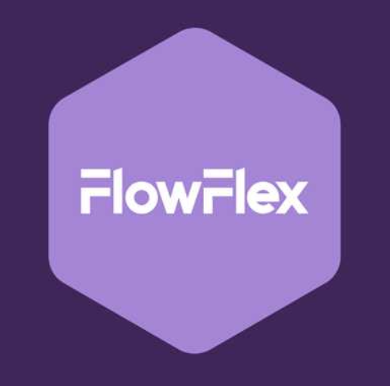

  

# About 
FlowFlex is an open-source, highly configurable workflow engine that empowers users to design, manage, and automate complex processes. With built-in support for questionnaires and checklists, every workflow node can be flexibly customized to fit diverse business needs. FlowFlex is ideal for teams seeking adaptable process automation, dynamic form handling, and collaborative task management—all in one extensible platform.
