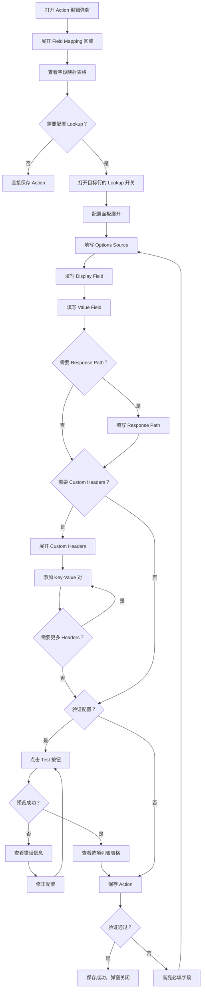
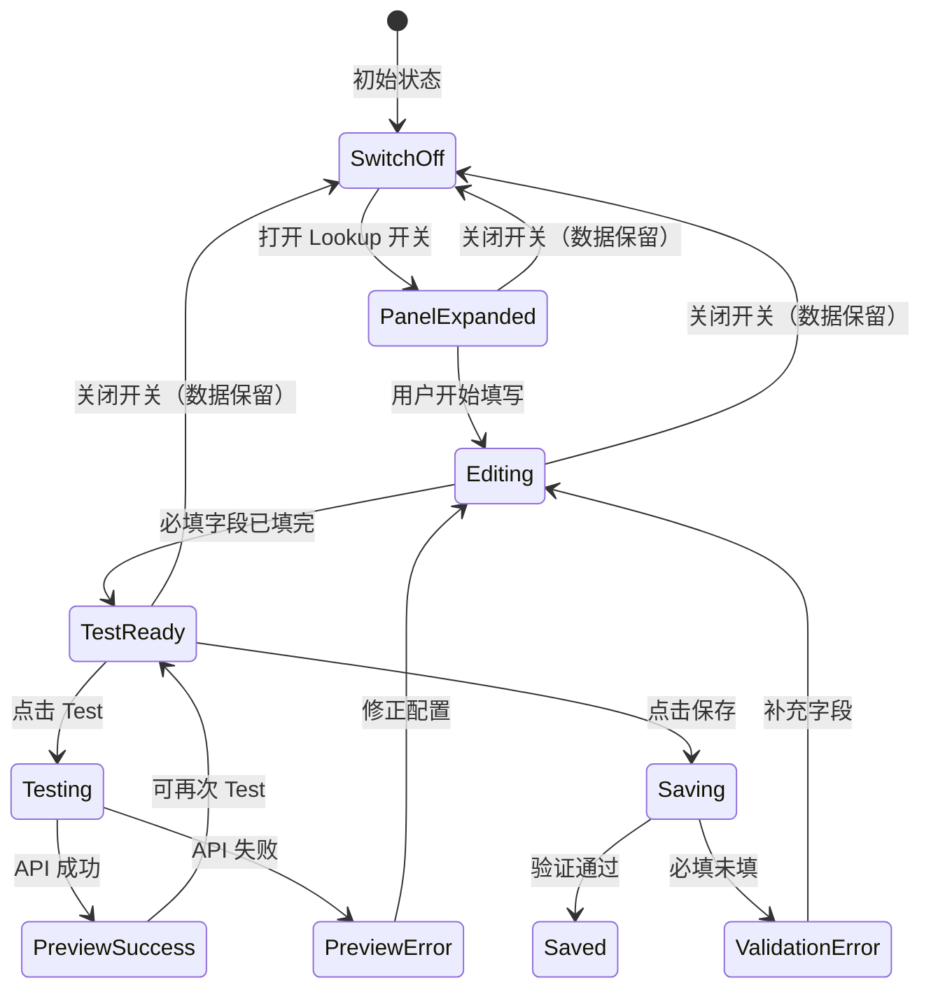

# Flowchart: Action Field Lookup — 用户操作流程图

## 1. Lookup 配置操作流程



## 2. 交互状态流转



## 3. Custom Headers 折叠交互

```mermaid
flowchart TD
    A[Lookup 面板展开] --> B[Custom Headers 区域默认收起]
    B --> C{用户点击 ▸ Custom Headers？}
    C -->|是| D[展开 Headers 编辑区域]
    D --> E[显示已有 Header 行]
    E --> F{操作？}
    F -->|添加| G[点击 + Add Header]
    G --> H[新增空行 Key | Value | ✕]
    H --> F
    F -->|删除| I[点击 ✕ 按钮]
    I --> J[移除该行]
    J --> F
    F -->|编辑| K[修改 Key 或 Value]
    K --> F
    F -->|收起| L[点击 ▾ Custom Headers]
    L --> B
    C -->|否| M[保持收起状态]
```
