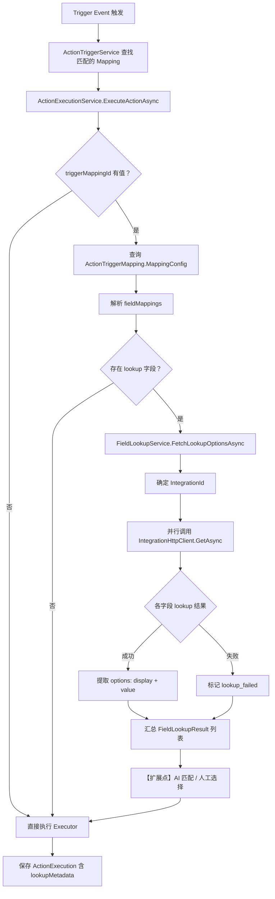
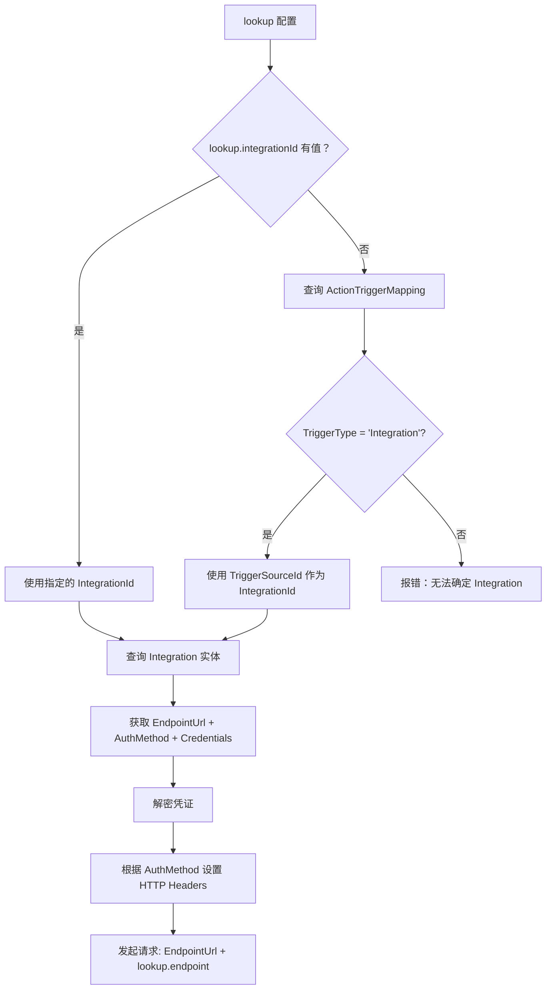
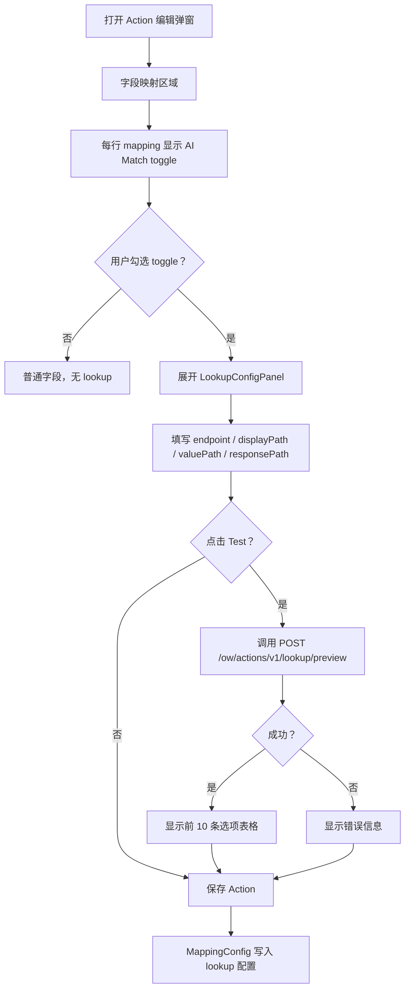
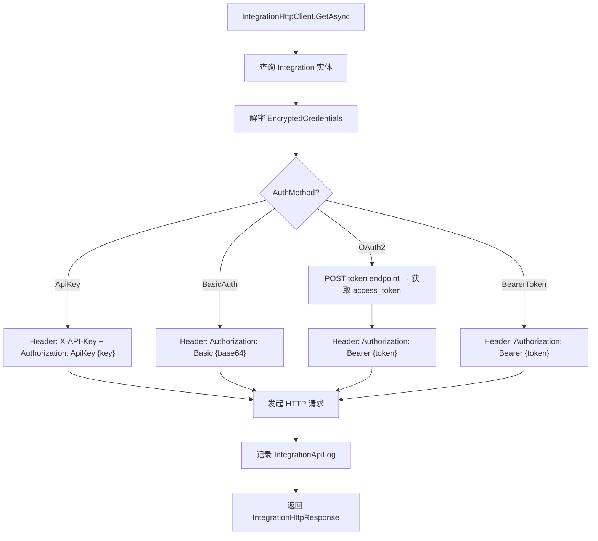

# Flowchart: Field Lookup 业务流程图

## 1. Action 执行时的 Lookup 流程

```mermaid
flowchart TD
    A[Trigger Event 触发] --> B[ActionTriggerService 查找匹配的 Mapping]
    B --> C[ActionExecutionService.ExecuteActionAsync]
    C --> D{triggerMappingId 有值？}
    D -->|否| E[直接执行 Executor]
    D -->|是| F[查询 ActionTriggerMapping.MappingConfig]
    F --> G[解析 fieldMappings]
    G --> H{存在 lookup 字段？}
    H -->|否| E
    H -->|是| I[FieldLookupService.FetchLookupOptionsAsync]
    I --> J[确定 IntegrationId]
    J --> K[并行调用 IntegrationHttpClient.GetAsync]
    K --> L{各字段 lookup 结果}
    L -->|成功| M[提取 options: display + value]
    L -->|失败| N[标记 lookup_failed]
    M --> O[汇总 FieldLookupResult 列表]
    N --> O
    O --> P[【扩展点】AI 匹配 / 人工选择]
    P --> E
    E --> Q[保存 ActionExecution 含 lookupMetadata]
```

## 2. IntegrationId 获取流程

```mermaid
flowchart TD
    A[lookup 配置] --> B{lookup.integrationId 有值？}
    B -->|是| C[使用指定的 IntegrationId]
    B -->|否| D[查询 ActionTriggerMapping]
    D --> E{TriggerType = 'Integration'?}
    E -->|是| F[使用 TriggerSourceId 作为 IntegrationId]
    E -->|否| G[报错：无法确定 Integration]
    C --> H[查询 Integration 实体]
    F --> H
    H --> I[获取 EndpointUrl + AuthMethod + Credentials]
    I --> J[解密凭证]
    J --> K[根据 AuthMethod 设置 HTTP Headers]
    K --> L[发起请求: EndpointUrl + lookup.endpoint]
```

## 3. 前端 Lookup 配置流程

```mermaid
flowchart TD
    A[打开 Action 编辑弹窗] --> B[字段映射区域]
    B --> C[每行 mapping 显示 AI Match toggle]
    C --> D{用户勾选 toggle？}
    D -->|否| E[普通字段，无 lookup]
    D -->|是| F[展开 LookupConfigPanel]
    F --> G[填写 endpoint / displayPath / valuePath / responsePath]
    G --> H{点击 Test？}
    H -->|是| I[调用 POST /ow/actions/v1/lookup/preview]
    I --> J{成功？}
    J -->|是| K[显示前 10 条选项表格]
    J -->|否| L[显示错误信息]
    H -->|否| M[保存 Action]
    K --> M
    L --> M
    M --> N[MappingConfig 写入 lookup 配置]
```

## 4. IntegrationHttpClient 认证处理

```mermaid
flowchart TD
    A[IntegrationHttpClient.GetAsync] --> B[查询 Integration 实体]
    B --> C[解密 EncryptedCredentials]
    C --> D{AuthMethod?}
    D -->|ApiKey| E["Header: X-API-Key + Authorization: ApiKey {key}"]
    D -->|BasicAuth| F["Header: Authorization: Basic {base64}"]
    D -->|OAuth2| G[POST token endpoint → 获取 access_token]
    G --> H["Header: Authorization: Bearer {token}"]
    D -->|BearerToken| I["Header: Authorization: Bearer {token}"]
    E --> J[发起 HTTP 请求]
    F --> J
    H --> J
    I --> J
    J --> K[记录 IntegrationApiLog]
    K --> L[返回 IntegrationHttpResponse]
```
