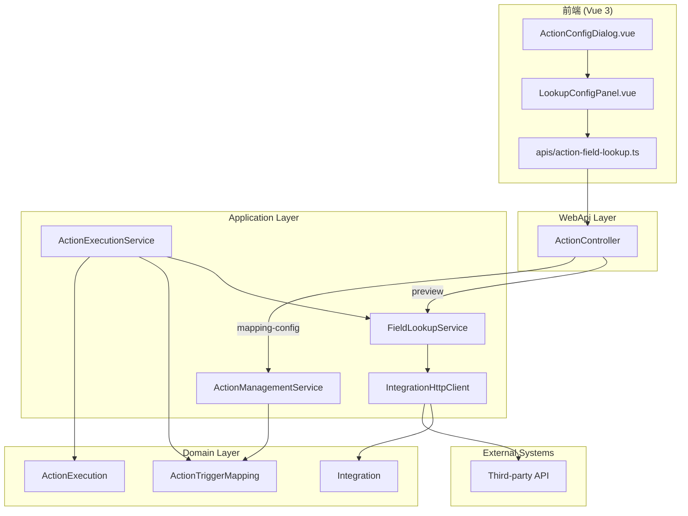
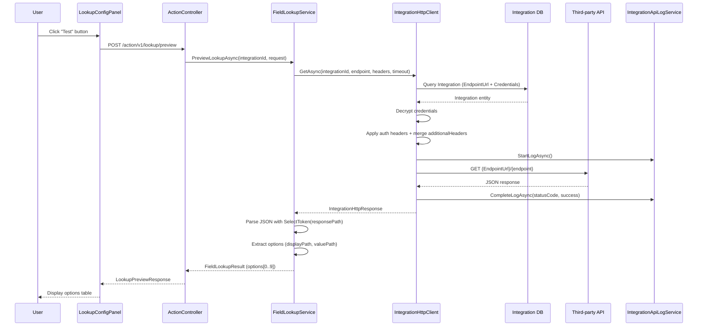
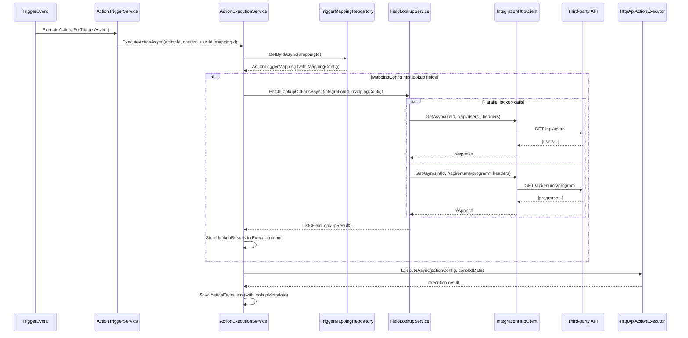
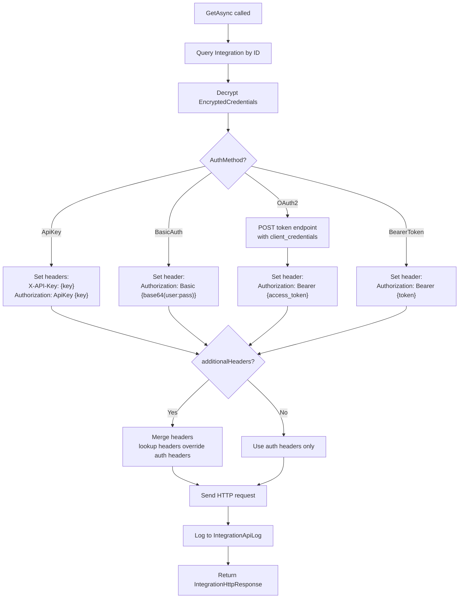

# Flowchart: Action Field Lookup — 架构图 + 时序图

## 1. 系统架构图

```mermaid
graph TB
    subgraph Frontend["前端 (Vue 3)"]
        ACD[ActionConfigDialog.vue]
        LCP[LookupConfigPanel.vue]
        API_FE[apis/action-field-lookup.ts]
    end

    subgraph WebAPI["WebApi Layer"]
        AC[ActionController]
    end

    subgraph Application["Application Layer"]
        AES[ActionExecutionService]
        FLS[FieldLookupService]
        IHC[IntegrationHttpClient]
        AMS[ActionManagementService]
    end

    subgraph Domain["Domain Layer"]
        ATM[ActionTriggerMapping]
        INT[Integration]
        AE[ActionExecution]
    end

    subgraph External["External Systems"]
        EXT_API[Third-party API]
    end

    ACD --> LCP
    LCP --> API_FE
    API_FE --> AC

    AC -->|preview| FLS
    AC -->|mapping-config| AMS
    AES --> FLS
    FLS --> IHC
    IHC --> INT
    IHC --> EXT_API
    AES --> ATM
    AES --> AE
    AMS --> ATM
```

## 2. Lookup Preview 时序图

```mermaid
sequenceDiagram
    participant User
    participant LCP as LookupConfigPanel
    participant API as ActionController
    participant FLS as FieldLookupService
    participant IHC as IntegrationHttpClient
    participant INT as Integration DB
    participant EXT as Third-party API
    participant LOG as IntegrationApiLogService

    User->>LCP: Click "Test" button
    LCP->>API: POST /action/v1/lookup/preview
    API->>FLS: PreviewLookupAsync(integrationId, request)
    FLS->>IHC: GetAsync(integrationId, endpoint, headers, timeout)
    IHC->>INT: Query Integration (EndpointUrl + Credentials)
    INT-->>IHC: Integration entity
    IHC->>IHC: Decrypt credentials
    IHC->>IHC: Apply auth headers + merge additionalHeaders
    IHC->>LOG: StartLogAsync()
    IHC->>EXT: GET {EndpointUrl}/{endpoint}
    EXT-->>IHC: JSON response
    IHC->>LOG: CompleteLogAsync(statusCode, success)
    IHC-->>FLS: IntegrationHttpResponse
    FLS->>FLS: Parse JSON with SelectToken(responsePath)
    FLS->>FLS: Extract options (displayPath, valuePath)
    FLS-->>API: FieldLookupResult (options[0..9])
    API-->>LCP: LookupPreviewResponse
    LCP-->>User: Display options table
```

## 3. Action 执行时 Lookup 时序图

```mermaid
sequenceDiagram
    participant Trigger as TriggerEvent
    participant ATS as ActionTriggerService
    participant AES as ActionExecutionService
    participant REPO as TriggerMappingRepository
    participant FLS as FieldLookupService
    participant IHC as IntegrationHttpClient
    participant EXT as Third-party API
    participant EXEC as HttpApiActionExecutor

    Trigger->>ATS: ExecuteActionsForTriggerAsync()
    ATS->>AES: ExecuteActionAsync(actionId, context, userId, mappingId)
    AES->>REPO: GetByIdAsync(mappingId)
    REPO-->>AES: ActionTriggerMapping (with MappingConfig)

    alt MappingConfig has lookup fields
        AES->>FLS: FetchLookupOptionsAsync(integrationId, mappingConfig)

        par Parallel lookup calls
            FLS->>IHC: GetAsync(intId, "/api/users", headers)
            IHC->>EXT: GET /api/users
            EXT-->>IHC: [users...]
            IHC-->>FLS: response
        and
            FLS->>IHC: GetAsync(intId, "/api/enums/program", headers)
            IHC->>EXT: GET /api/enums/program
            EXT-->>IHC: [programs...]
            IHC-->>FLS: response
        end

        FLS-->>AES: List<FieldLookupResult>
        AES->>AES: Store lookupResults in ExecutionInput
    end

    AES->>EXEC: ExecuteAsync(actionConfig, contextData)
    EXEC-->>AES: execution result
    AES->>AES: Save ActionExecution (with lookupMetadata)
```

## 4. IntegrationHttpClient 认证流程

```mermaid
flowchart TD
    A[GetAsync called] --> B[Query Integration by ID]
    B --> C[Decrypt EncryptedCredentials]
    C --> D{AuthMethod?}

    D -->|ApiKey| E["Set headers:\nX-API-Key: {key}\nAuthorization: ApiKey {key}"]
    D -->|BasicAuth| F["Set header:\nAuthorization: Basic {base64(user:pass)}"]
    D -->|OAuth2| G[POST token endpoint\nwith client_credentials]
    G --> H["Set header:\nAuthorization: Bearer {access_token}"]
    D -->|BearerToken| I["Set header:\nAuthorization: Bearer {token}"]

    E --> J{additionalHeaders?}
    F --> J
    H --> J
    I --> J

    J -->|Yes| K[Merge headers\nlookup headers override auth headers]
    J -->|No| L[Use auth headers only]

    K --> M[Send HTTP request]
    L --> M
    M --> N[Log to IntegrationApiLog]
    N --> O[Return IntegrationHttpResponse]
```
