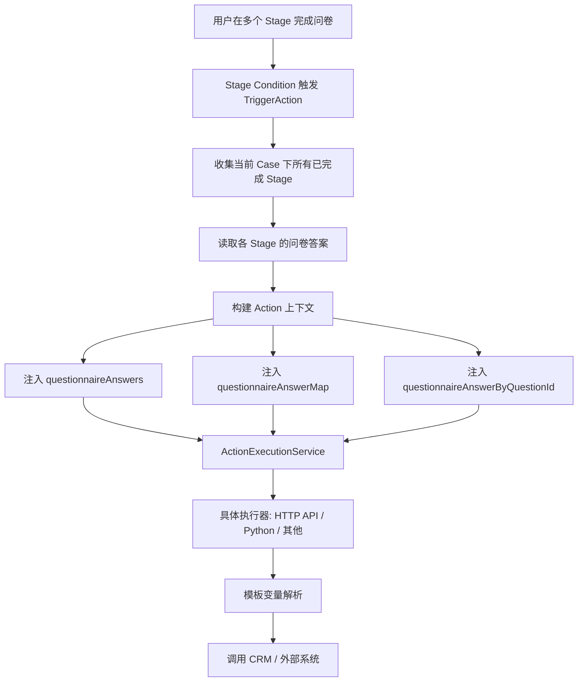
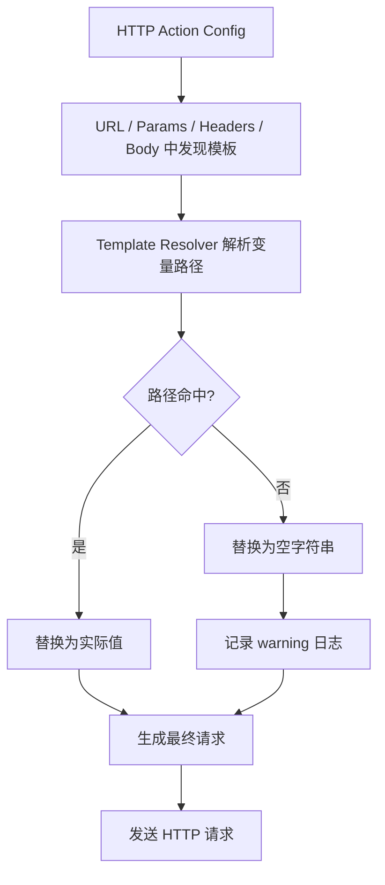
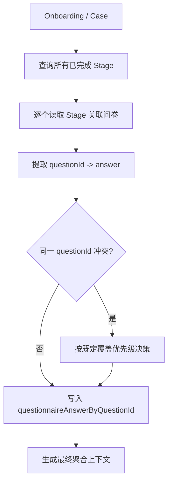

# Flowchart: Action Questionnaire Context 业务流程图

## 1. 问卷答案进入 Action 的总体流程

```mermaid
flowchart TD
    A[用户在多个 Stage 完成问卷] --> B[Stage Condition 触发 TriggerAction]
    B --> C[收集当前 Case 下所有已完成 Stage]
    C --> D[读取各 Stage 的问卷答案]
    D --> E[构建 Action 上下文]
    E --> F[注入 questionnaireAnswers]
    E --> G[注入 questionnaireAnswerMap]
    E --> H[注入 questionnaireAnswerByQuestionId]
    F --> I[ActionExecutionService]
    G --> I
    H --> I
    I --> J[具体执行器: HTTP API / Python / 其他]
    J --> K[模板变量解析]
    K --> L[调用 CRM / 外部系统]
```

## 2. HTTP Action 模板取值流程

```mermaid
flowchart TD
    A[HTTP Action Config] --> B[URL / Params / Headers / Body 中发现模板]
    B --> C[Template Resolver 解析变量路径]
    C --> D{路径命中?}
    D -->|是| E[替换为实际值]
    D -->|否| F[替换为空字符串]
    F --> G[记录 warning 日志]
    E --> H[生成最终请求]
    G --> H
    H --> I[发送 HTTP 请求]
```

## 3. 多 Stage 问卷来源聚合流程

```mermaid
flowchart TD
    A[Onboarding / Case] --> B[查询所有已完成 Stage]
    B --> C[逐个读取 Stage 关联问卷]
    C --> D[提取 questionId -> answer]
    D --> E{同一 questionId 冲突?}
    E -->|否| F[写入 questionnaireAnswerByQuestionId]
    E -->|是| G[按既定覆盖优先级决策]
    G --> F
    F --> H[生成最终聚合上下文]
```
