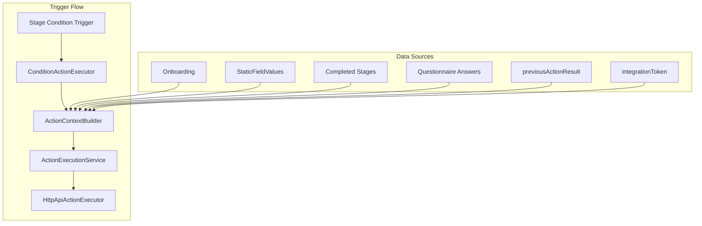
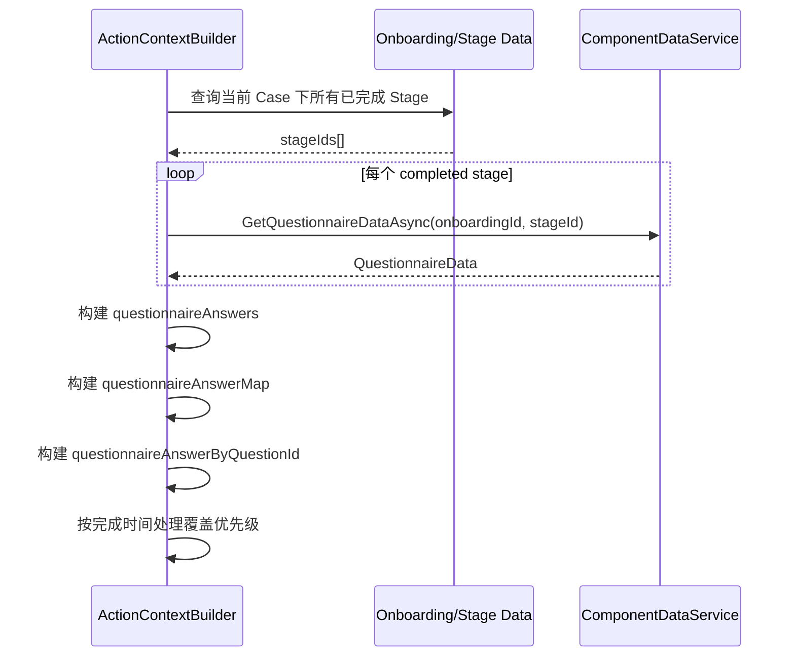
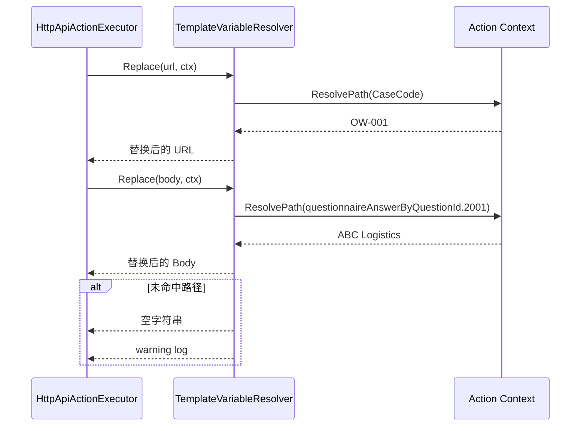

# Flowchart: Action Questionnaire Context — 技术架构图

## 1. 执行上下文构建架构图

```mermaid
graph TB
    subgraph Trigger Flow
        SC[Stage Condition Trigger]
        AE[ConditionActionExecutor]
        ACB[ActionContextBuilder]
        CES[ActionExecutionService]
        HAE[HttpApiActionExecutor]
    end

    subgraph Data Sources
        ONB[Onboarding]
        SF[StaticFieldValues]
        STAGES[Completed Stages]
        QA[Questionnaire Answers]
        PREV[previousActionResult]
        TOK[integrationToken]
    end

    SC --> AE
    AE --> ACB
    ONB --> ACB
    SF --> ACB
    STAGES --> ACB
    QA --> ACB
    PREV --> ACB
    TOK --> ACB
    ACB --> CES
    CES --> HAE
```

## 2. 多 Stage 问卷聚合时序图

```mermaid
sequenceDiagram
    participant EX as ActionContextBuilder
    participant DB as Onboarding/Stage Data
    participant CDS as ComponentDataService

    EX->>DB: 查询当前 Case 下所有已完成 Stage
    DB-->>EX: stageIds[]

    loop 每个 completed stage
        EX->>CDS: GetQuestionnaireDataAsync(onboardingId, stageId)
        CDS-->>EX: QuestionnaireData
    end

    EX->>EX: 构建 questionnaireAnswers
    EX->>EX: 构建 questionnaireAnswerMap
    EX->>EX: 构建 questionnaireAnswerByQuestionId
    EX->>EX: 按完成时间处理覆盖优先级
```

## 3. HTTP 模板解析时序图

```mermaid
sequenceDiagram
    participant EXEC as HttpApiActionExecutor
    participant RES as TemplateVariableResolver
    participant CTX as Action Context

    EXEC->>RES: Replace(url, ctx)
    RES->>CTX: ResolvePath(CaseCode)
    CTX-->>RES: OW-001
    RES-->>EXEC: 替换后的 URL

    EXEC->>RES: Replace(body, ctx)
    RES->>CTX: ResolvePath(questionnaireAnswerByQuestionId.2001)
    CTX-->>RES: ABC Logistics
    RES-->>EXEC: 替换后的 Body

    alt 未命中路径
        RES-->>EXEC: 空字符串
        RES-->>EXEC: warning log
    end
```
