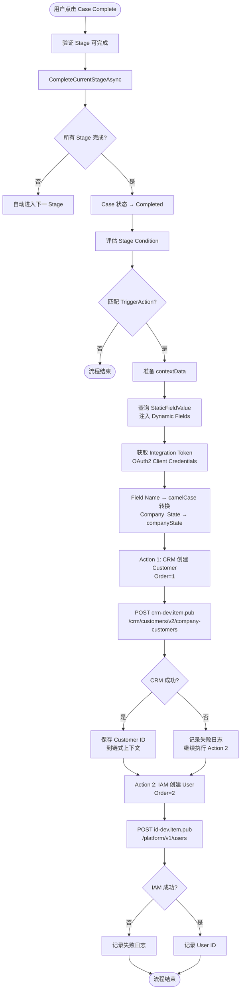
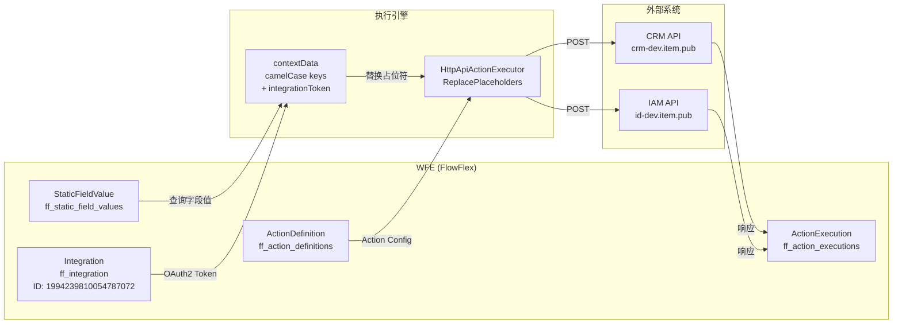

# Flowchart: LSO Parcel CRM & IAM Integration Actions

## 业务流程图

```mermaid
flowchart TB
    START([用户点击 Case Complete]) --> VALIDATE[验证 Stage 可完成]
    VALIDATE --> COMPLETE[CompleteCurrentStageAsync]
    COMPLETE --> ALL_DONE{所有 Stage 完成?}
    
    ALL_DONE -->|否| NEXT[自动进入下一 Stage]
    ALL_DONE -->|是| STATUS[Case 状态 → Completed]
    
    STATUS --> CONDITION[评估 Stage Condition]
    CONDITION --> TRIGGER{匹配 TriggerAction?}
    
    TRIGGER -->|否| END_NO([流程结束])
    TRIGGER -->|是| PREPARE[准备 contextData]
    
    PREPARE --> QUERY_FIELDS[查询 StaticFieldValue<br/>注入 Dynamic Fields]
    QUERY_FIELDS --> GET_TOKEN[获取 Integration Token<br/>OAuth2 Client Credentials]
    GET_TOKEN --> CAMEL[Field Name → camelCase 转换<br/>Company  State → companyState]
    
    CAMEL --> ACTION1[Action 1: CRM 创建 Customer<br/>Order=1]
    ACTION1 --> CRM_API[POST crm-dev.item.pub<br/>/crm/customers/v2/company-customers]
    CRM_API --> CRM_OK{CRM 成功?}
    
    CRM_OK -->|否| CRM_FAIL[记录失败日志<br/>继续执行 Action 2]
    CRM_OK -->|是| CRM_SAVE[保存 Customer ID<br/>到链式上下文]
    
    CRM_SAVE --> ACTION2[Action 2: IAM 创建 User<br/>Order=2]
    CRM_FAIL --> ACTION2
    
    ACTION2 --> IAM_API[POST id-dev.item.pub<br/>/platform/v1/users]
    IAM_API --> IAM_OK{IAM 成功?}
    
    IAM_OK -->|否| IAM_FAIL[记录失败日志]
    IAM_OK -->|是| IAM_SAVE[记录 User ID]
    
    IAM_FAIL --> END([流程结束])
    IAM_SAVE --> END
```

## 数据流图

```mermaid
flowchart LR
    subgraph WFE["WFE (FlowFlex)"]
        SF[StaticFieldValue<br/>ff_static_field_values]
        AD[ActionDefinition<br/>ff_action_definitions]
        AE[ActionExecution<br/>ff_action_executions]
        INT[Integration<br/>ff_integration<br/>ID: 1994239810054787072]
    end
    
    subgraph EXEC["执行引擎"]
        CTX[contextData<br/>camelCase keys<br/>+ integrationToken]
        HTTP[HttpApiActionExecutor<br/>ReplacePlaceholders]
    end
    
    subgraph EXT["外部系统"]
        CRM[CRM API<br/>crm-dev.item.pub]
        IAM[IAM API<br/>id-dev.item.pub]
    end
    
    SF -->|查询字段值| CTX
    INT -->|OAuth2 Token| CTX
    AD -->|Action Config| HTTP
    CTX -->|替换占位符| HTTP
    HTTP -->|POST| CRM
    HTTP -->|POST| IAM
    CRM -->|响应| AE
    IAM -->|响应| AE
```
