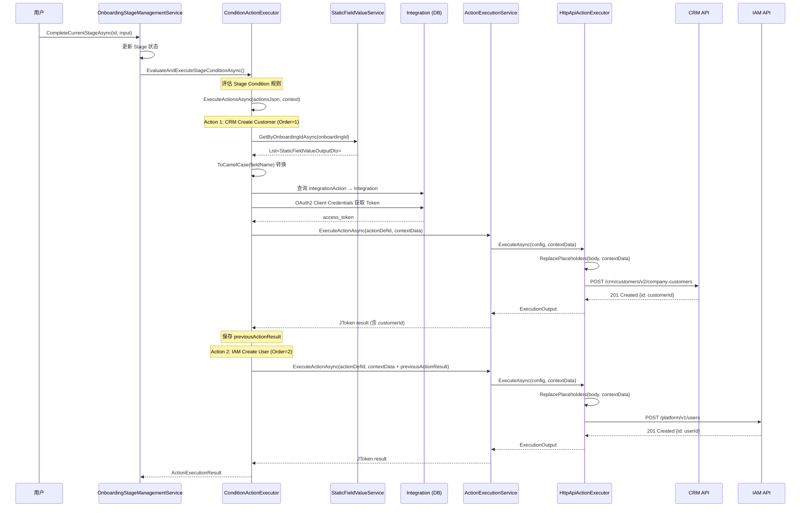
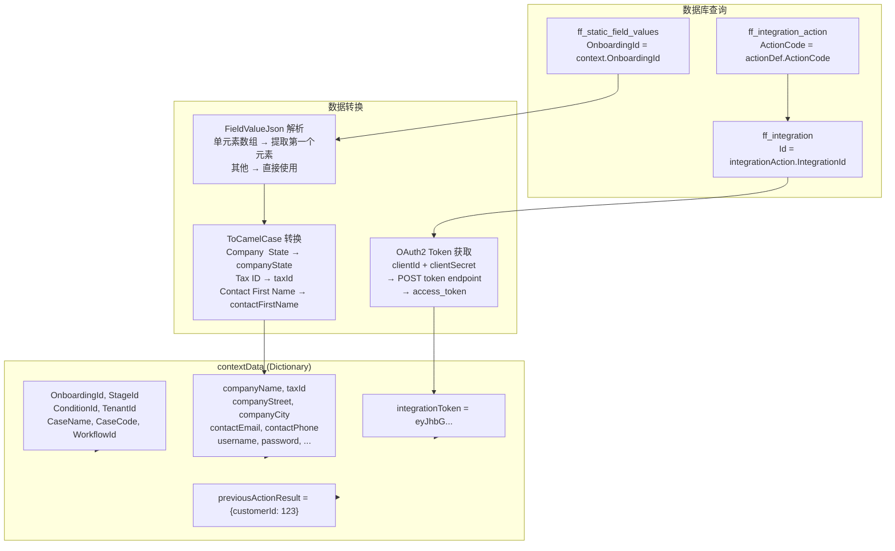

# Flowchart: LSO Parcel CRM & IAM Integration — Technical Design

## 代码执行时序图

```mermaid
sequenceDiagram
    participant User as 用户
    participant OSMS as OnboardingStageManagementService
    participant CAE as ConditionActionExecutor
    participant SFV as StaticFieldValueService
    participant INT as Integration (DB)
    participant AES as ActionExecutionService
    participant HTTP as HttpApiActionExecutor
    participant CRM as CRM API
    participant IAM as IAM API

    User->>OSMS: CompleteCurrentStageAsync(id, input)
    OSMS->>OSMS: 更新 Stage 状态
    OSMS->>CAE: EvaluateAndExecuteStageConditionAsync()
    
    Note over CAE: 评估 Stage Condition 规则
    CAE->>CAE: ExecuteActionsAsync(actionsJson, context)
    
    Note over CAE: Action 1: CRM Create Customer (Order=1)
    CAE->>SFV: GetByOnboardingIdAsync(onboardingId)
    SFV-->>CAE: List<StaticFieldValueOutputDto>
    CAE->>CAE: ToCamelCase(fieldName) 转换
    CAE->>INT: 查询 IntegrationAction → Integration
    CAE->>INT: OAuth2 Client Credentials 获取 Token
    INT-->>CAE: access_token
    
    CAE->>AES: ExecuteActionAsync(actionDefId, contextData)
    AES->>HTTP: ExecuteAsync(config, contextData)
    HTTP->>HTTP: ReplacePlaceholders(body, contextData)
    HTTP->>CRM: POST /crm/customers/v2/company-customers
    CRM-->>HTTP: 201 Created {id: customerId}
    HTTP-->>AES: ExecutionOutput
    AES-->>CAE: JToken result (含 customerId)
    
    Note over CAE: 保存 previousActionResult
    
    Note over CAE: Action 2: IAM Create User (Order=2)
    CAE->>AES: ExecuteActionAsync(actionDefId, contextData + previousActionResult)
    AES->>HTTP: ExecuteAsync(config, contextData)
    HTTP->>HTTP: ReplacePlaceholders(body, contextData)
    HTTP->>IAM: POST /platform/v1/users
    IAM-->>HTTP: 201 Created {id: userId}
    HTTP-->>AES: ExecutionOutput
    AES-->>CAE: JToken result
    
    CAE-->>OSMS: ActionExecutionResult
```

## 数据注入流程图

```mermaid
flowchart TB
    subgraph DB["数据库查询"]
        SFV["ff_static_field_values<br/>OnboardingId = context.OnboardingId"]
        IA["ff_integration_action<br/>ActionCode = actionDef.ActionCode"]
        INTG["ff_integration<br/>Id = integrationAction.IntegrationId"]
    end

    subgraph TRANSFORM["数据转换"]
        CAMEL["ToCamelCase 转换<br/>Company  State → companyState<br/>Tax ID → taxId<br/>Contact First Name → contactFirstName"]
        PARSE["FieldValueJson 解析<br/>单元素数组 → 提取第一个元素<br/>其他 → 直接使用"]
        TOKEN["OAuth2 Token 获取<br/>clientId + clientSecret<br/>→ POST token endpoint<br/>→ access_token"]
    end

    subgraph CTX["contextData (Dictionary)"]
        BASE["OnboardingId, StageId<br/>ConditionId, TenantId<br/>CaseName, CaseCode, WorkflowId"]
        FIELDS["companyName, taxId<br/>companyStreet, companyCity<br/>contactEmail, contactPhone<br/>username, password, ..."]
        TKN["integrationToken = eyJhbG..."]
        PREV["previousActionResult = {customerId: 123}"]
    end

    SFV --> PARSE --> CAMEL --> FIELDS
    IA --> INTG --> TOKEN --> TKN
    BASE --> CTX
    FIELDS --> CTX
    TKN --> CTX
    PREV --> CTX
```
