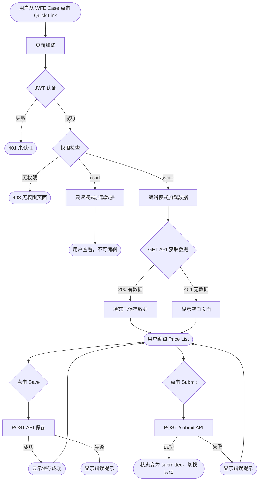
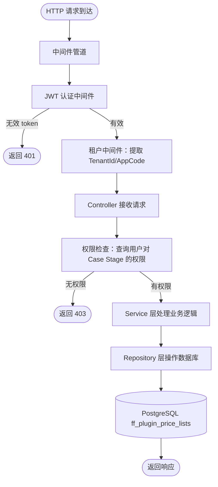

# Flowchart: Plugin Price List — 业务流程图

## 主流程：用户操作 Price List

```mermaid
flowchart TD
    START([用户从 WFE Case 点击 Quick Link]) --> LOAD[页面加载]
    LOAD --> AUTH{JWT 认证}
    AUTH -->|失败| ERR_401([401 未认证])
    AUTH -->|成功| PERM{权限检查}
    PERM -->|无权限| ERR_403([403 无权限页面])
    PERM -->|read| READONLY[只读模式加载数据]
    PERM -->|write| EDIT[编辑模式加载数据]

    READONLY --> VIEW([用户查看，不可编辑])

    EDIT --> GET{GET API 获取数据}
    GET -->|200 有数据| FILL[填充已保存数据]
    GET -->|404 无数据| EMPTY[显示空白页面]
    FILL --> EDITING([用户编辑 Price List])
    EMPTY --> EDITING

    EDITING --> SAVE{点击 Save}
    SAVE --> POST[POST API 保存]
    POST -->|成功| TOAST_OK([显示保存成功])
    POST -->|失败| TOAST_ERR([显示错误提示])
    TOAST_OK --> EDITING

    EDITING --> SUBMIT{点击 Submit}
    SUBMIT --> POST_SUBMIT[POST /submit API]
    POST_SUBMIT -->|成功| SUBMITTED([状态变为 submitted，切换只读])
    POST_SUBMIT -->|失败| TOAST_ERR2([显示错误提示])
    TOAST_ERR2 --> EDITING
```

## 后端处理流程

```mermaid
flowchart TD
    REQ([HTTP 请求到达]) --> MW[中间件管道]
    MW --> JWT[JWT 认证中间件]
    JWT -->|无效 token| R401([返回 401])
    JWT -->|有效| TENANT[租户中间件：提取 TenantId/AppCode]
    TENANT --> CTRL[Controller 接收请求]
    CTRL --> PERM_CHK[权限检查：查询用户对 Case Stage 的权限]
    PERM_CHK -->|无权限| R403([返回 403])
    PERM_CHK -->|有权限| SVC[Service 层处理业务逻辑]
    SVC --> REPO[Repository 层操作数据库]
    REPO --> DB[(PostgreSQL ff_plugin_price_lists)]
    DB --> RESP([返回响应])
```
