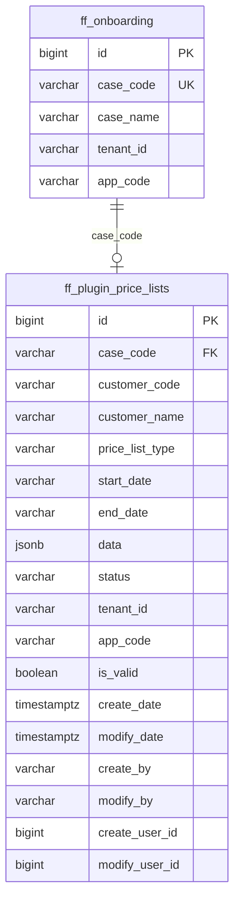
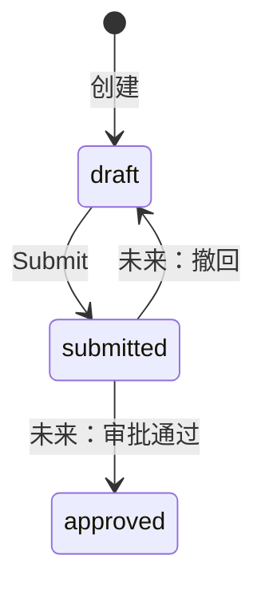

# Database Schema: Plugin Price List

## 表：ff_plugin_price_lists

```sql
CREATE TABLE ff_plugin_price_lists (
    id              BIGINT PRIMARY KEY,
    case_code       VARCHAR(50) NOT NULL,
    customer_code   VARCHAR(50),
    customer_name   VARCHAR(200),
    price_list_type VARCHAR(50) DEFAULT 'Customer Specific',
    start_date      VARCHAR(20),
    end_date        VARCHAR(20),
    data            JSONB NOT NULL DEFAULT '{"sections":[]}',
    status          VARCHAR(20) DEFAULT 'draft',
    tenant_id       VARCHAR(32) NOT NULL,
    app_code        VARCHAR(32) DEFAULT 'default',
    is_valid        BOOLEAN DEFAULT TRUE,
    create_date     TIMESTAMPTZ DEFAULT NOW(),
    modify_date     TIMESTAMPTZ DEFAULT NOW(),
    create_by       VARCHAR(50) DEFAULT 'SYSTEM',
    modify_by       VARCHAR(50) DEFAULT 'SYSTEM',
    create_user_id  BIGINT,
    modify_user_id  BIGINT
);

-- Unique constraint: one valid price list per case per tenant/app
CREATE UNIQUE INDEX idx_plugin_price_list_case_code 
    ON ff_plugin_price_lists(tenant_id, app_code, case_code) 
    WHERE is_valid = TRUE;
```

## ER 图



## JSONB `data` 字段结构

```json
{
  "sections": [
    {
      "locations": ["string"],
      "expanded": true,
      "items": [
        {
          "chargeCode": "string",
          "itemName": "string",
          "category": "string",
          "uom": "string",
          "rateType": "string",
          "price": "string",
          "isTiered": false,
          "tiers": [
            { "from": "string", "to": "string", "price": "string" }
          ],
          "availableDimensions": ["string"],
          "conditionValues": { "key": ["value"] },
          "customerDescription": "string"
        }
      ]
    }
  ]
}
```

## Status 状态流转



> 本期只实现 `draft → submitted`，其余状态流转预留。
