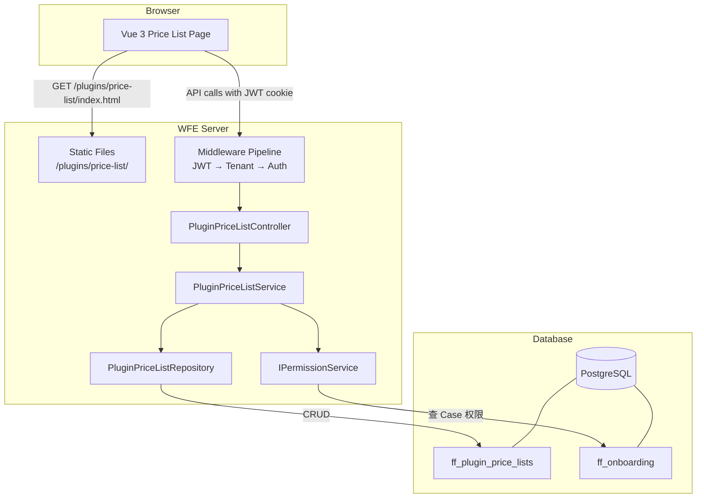
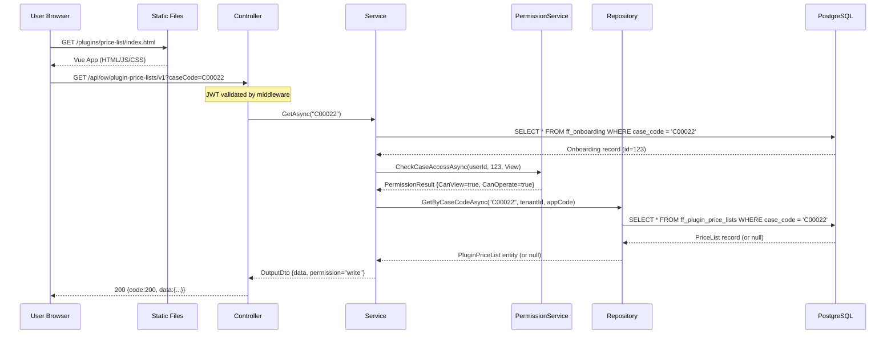
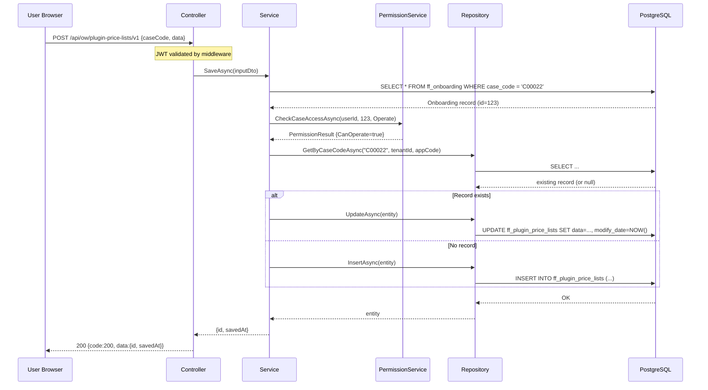

# Flowchart: Plugin Price List — 技术架构图

## 系统架构图

```mermaid
graph TB
    subgraph Browser
        VUE[Vue 3 Price List Page]
    end

    subgraph WFE Server
        STATIC[Static Files<br>/plugins/price-list/]
        MW[Middleware Pipeline<br>JWT → Tenant → Auth]
        CTRL[PluginPriceListController]
        SVC[PluginPriceListService]
        PERM[IPermissionService]
        REPO[PluginPriceListRepository]
    end

    subgraph Database
        PG[(PostgreSQL)]
        T1[ff_plugin_price_lists]
        T2[ff_onboarding]
    end

    VUE -->|GET /plugins/price-list/index.html| STATIC
    VUE -->|API calls with JWT cookie| MW
    MW --> CTRL
    CTRL --> SVC
    SVC --> PERM
    SVC --> REPO
    PERM -->|查 Case 权限| T2
    REPO -->|CRUD| T1
    PG --- T1
    PG --- T2
```

## 请求时序图 — GET Price List

```mermaid
sequenceDiagram
    participant U as User Browser
    participant S as Static Files
    participant C as Controller
    participant SVC as Service
    participant P as PermissionService
    participant R as Repository
    participant DB as PostgreSQL

    U->>S: GET /plugins/price-list/index.html
    S-->>U: Vue App (HTML/JS/CSS)
    
    U->>C: GET /api/ow/plugin-price-lists/v1?caseCode=C00022
    Note over C: JWT validated by middleware
    C->>SVC: GetAsync("C00022")
    SVC->>DB: SELECT * FROM ff_onboarding WHERE case_code = 'C00022'
    DB-->>SVC: Onboarding record (id=123)
    SVC->>P: CheckCaseAccessAsync(userId, 123, View)
    P-->>SVC: PermissionResult {CanView=true, CanOperate=true}
    SVC->>R: GetByCaseCodeAsync("C00022", tenantId, appCode)
    R->>DB: SELECT * FROM ff_plugin_price_lists WHERE case_code = 'C00022'
    DB-->>R: PriceList record (or null)
    R-->>SVC: PluginPriceList entity (or null)
    SVC-->>C: OutputDto {data, permission="write"}
    C-->>U: 200 {code:200, data:{...}}
```

## 请求时序图 — POST Save

```mermaid
sequenceDiagram
    participant U as User Browser
    participant C as Controller
    participant SVC as Service
    participant P as PermissionService
    participant R as Repository
    participant DB as PostgreSQL

    U->>C: POST /api/ow/plugin-price-lists/v1 {caseCode, data}
    Note over C: JWT validated by middleware
    C->>SVC: SaveAsync(inputDto)
    SVC->>DB: SELECT * FROM ff_onboarding WHERE case_code = 'C00022'
    DB-->>SVC: Onboarding record (id=123)
    SVC->>P: CheckCaseAccessAsync(userId, 123, Operate)
    P-->>SVC: PermissionResult {CanOperate=true}
    SVC->>R: GetByCaseCodeAsync("C00022", tenantId, appCode)
    R->>DB: SELECT ...
    DB-->>R: existing record (or null)
    
    alt Record exists
        SVC->>R: UpdateAsync(entity)
        R->>DB: UPDATE ff_plugin_price_lists SET data=..., modify_date=NOW()
    else No record
        SVC->>R: InsertAsync(entity)
        R->>DB: INSERT INTO ff_plugin_price_lists (...)
    end
    
    DB-->>R: OK
    R-->>SVC: entity
    SVC-->>C: {id, savedAt}
    C-->>U: 200 {code:200, data:{id, savedAt}}
```
