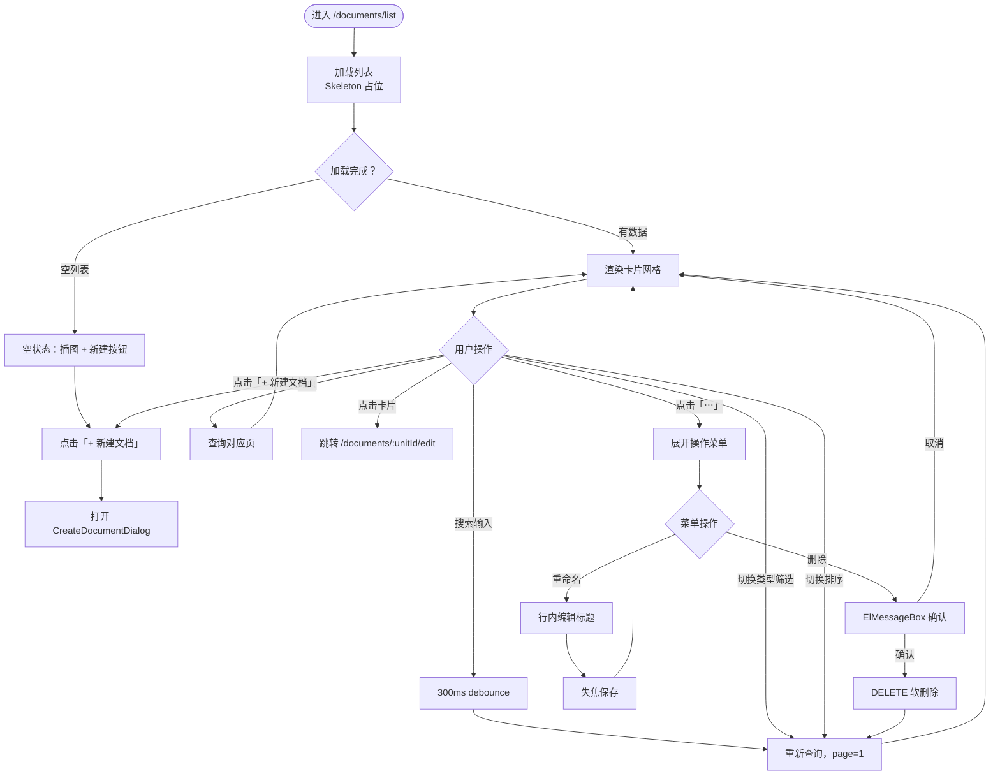
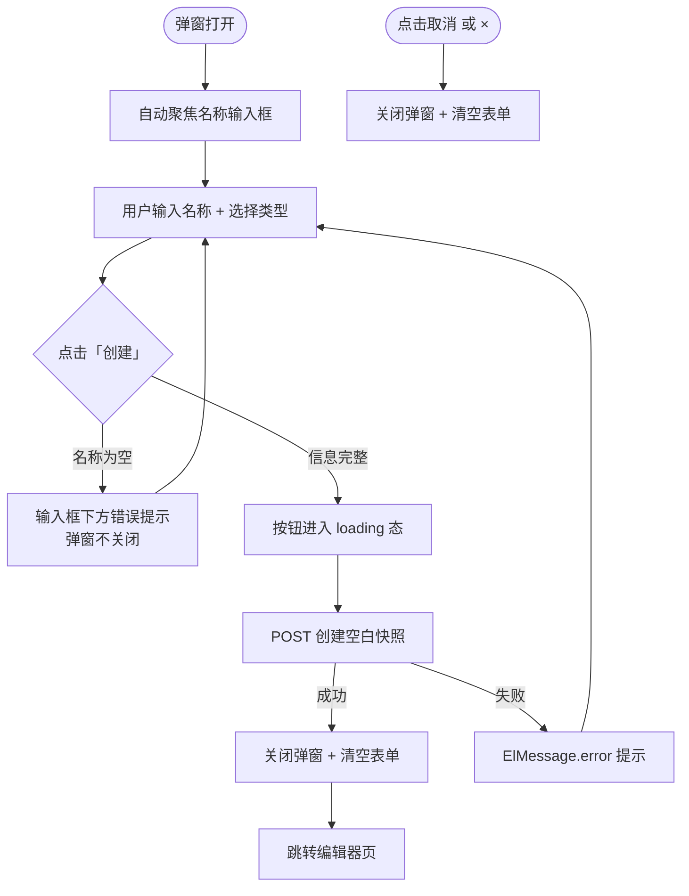
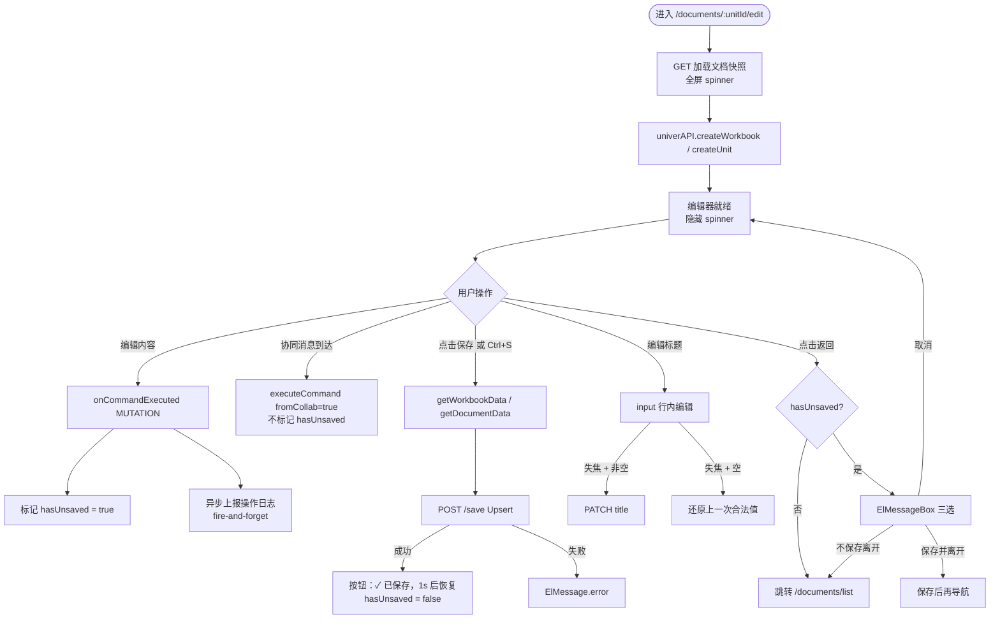
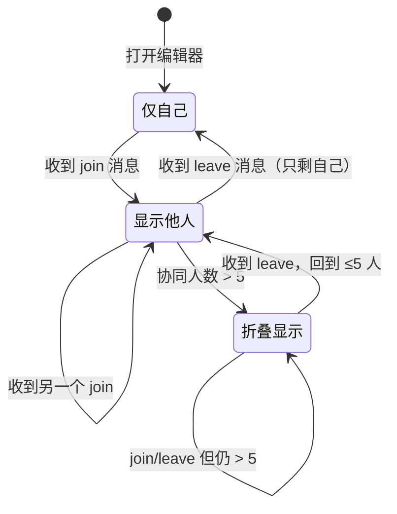

# 用户操作流程图 — 交互设计阶段

> 最后更新：2026-09-22

---

## 一、文档列表页操作流

```mermaid
flowchart TD
    Entry([进入 /documents/list]) --> Load[加载列表\nSkeleton 占位]
    Load --> Loaded{加载完成？}
    Loaded -->|空列表| Empty[空状态：插图 + 新建按钮]
    Loaded -->|有数据| Grid[渲染卡片网格]

    Grid --> UserAct{用户操作}
    Empty --> NewBtn[点击「+ 新建文档」]

    UserAct -->|搜索输入| Debounce[300ms debounce]
    Debounce --> Reload[重新查询，page=1]
    Reload --> Grid

    UserAct -->|切换类型筛选| Reload
    UserAct -->|切换排序| Reload
    UserAct -->|翻页| PageQuery[查询对应页]
    PageQuery --> Grid

    UserAct -->|点击卡片| NavEdit[跳转 /documents/:unitId/edit]
    UserAct -->|点击「⋯」| Menu[展开操作菜单]
    UserAct -->|点击「+ 新建文档」| NewBtn

    NewBtn --> Dialog[打开 CreateDocumentDialog]
    Menu --> MenuAct{菜单操作}
    MenuAct -->|重命名| InlineEdit[行内编辑标题]
    InlineEdit --> SaveTitle[失焦保存]
    SaveTitle --> Grid
    MenuAct -->|删除| Confirm[ElMessageBox 确认]
    Confirm -->|确认| Delete[DELETE 软删除]
    Delete --> Reload
    Confirm -->|取消| Grid
```

---

## 二、新建文档弹窗流

```mermaid
flowchart TD
    Open([弹窗打开]) --> Focus[自动聚焦名称输入框]
    Focus --> Input[用户输入名称 + 选择类型]
    Input --> Submit{点击「创建」}
    Submit -->|名称为空| Error[输入框下方错误提示\n弹窗不关闭]
    Error --> Input
    Submit -->|信息完整| Loading[按钮进入 loading 态]
    Loading --> API[POST 创建空白快照]
    API -->|成功| Close[关闭弹窗 + 清空表单]
    Close --> NavEdit[跳转编辑器页]
    API -->|失败| ErrMsg[ElMessage.error 提示]
    ErrMsg --> Input
    Open2([点击取消 或 ×]) --> CloseOnly[关闭弹窗 + 清空表单]
```

---

## 三、编辑器页交互流

```mermaid
flowchart TD
    Enter([进入 /documents/:unitId/edit]) --> LoadData[GET 加载文档快照\n全屏 spinner]
    LoadData --> Init[univerAPI.createWorkbook / createUnit]
    Init --> Ready[编辑器就绪\n隐藏 spinner]

    Ready --> EditAct{用户操作}

    EditAct -->|编辑内容| Mutation[onCommandExecuted MUTATION]
    Mutation --> MarkUnsaved[标记 hasUnsaved = true]
    Mutation --> LogAsync[异步上报操作日志\nfire-and-forget]

    EditAct -->|协同消息到达| ApplyCollab[executeCommand fromCollab=true\n不标记 hasUnsaved]

    EditAct -->|点击保存 或 Ctrl+S| SaveFlow[getWorkbookData / getDocumentData]
    SaveFlow --> PostSave[POST /save Upsert]
    PostSave -->|成功| BtnFeedback[按钮：✓ 已保存，1s 后恢复\nhasUnsaved = false]
    PostSave -->|失败| ErrMsg[ElMessage.error]

    EditAct -->|编辑标题| TitleEdit[input 行内编辑]
    TitleEdit -->|失焦 + 非空| PatchTitle[PATCH title]
    TitleEdit -->|失焦 + 空| Restore[还原上一次合法值]

    EditAct -->|点击返回| LeaveGuard{hasUnsaved?}
    LeaveGuard -->|否| NavBack[跳转 /documents/list]
    LeaveGuard -->|是| LeaveConfirm[ElMessageBox 三选]
    LeaveConfirm -->|保存并离开| SaveFlow2[保存后再导航]
    LeaveConfirm -->|不保存离开| NavBack
    LeaveConfirm -->|取消| Ready
```

---

## 四、协同头像状态流

```mermaid
stateDiagram-v2
    [*] --> 仅自己: 打开编辑器
    仅自己 --> 显示他人: 收到 join 消息
    显示他人 --> 显示他人: 收到另一个 join
    显示他人 --> 折叠显示: 协同人数 > 5
    显示他人 --> 仅自己: 收到 leave 消息（只剩自己）
    折叠显示 --> 显示他人: 收到 leave，回到 ≤5 人
    折叠显示 --> 折叠显示: join/leave 但仍 > 5
```
