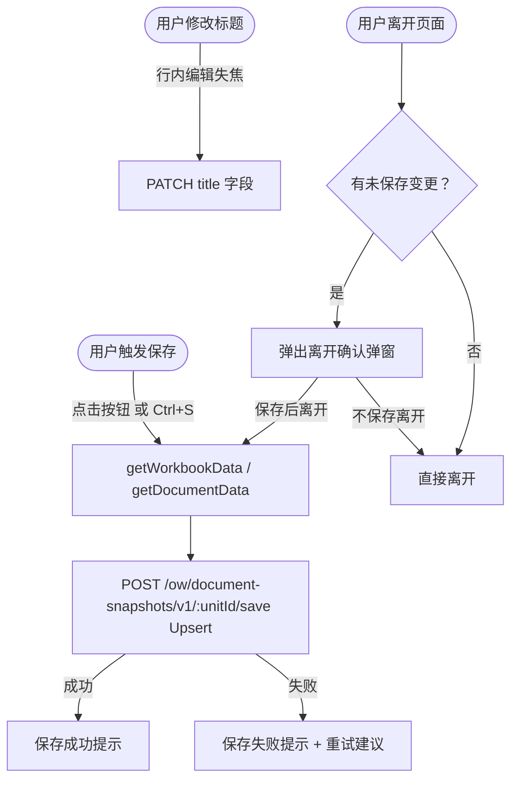
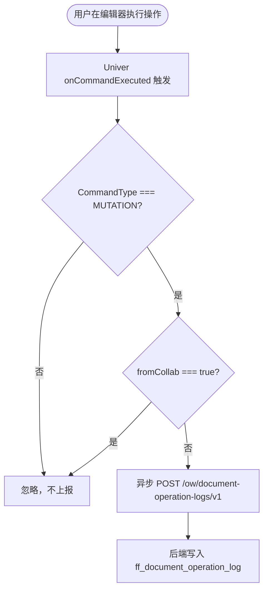
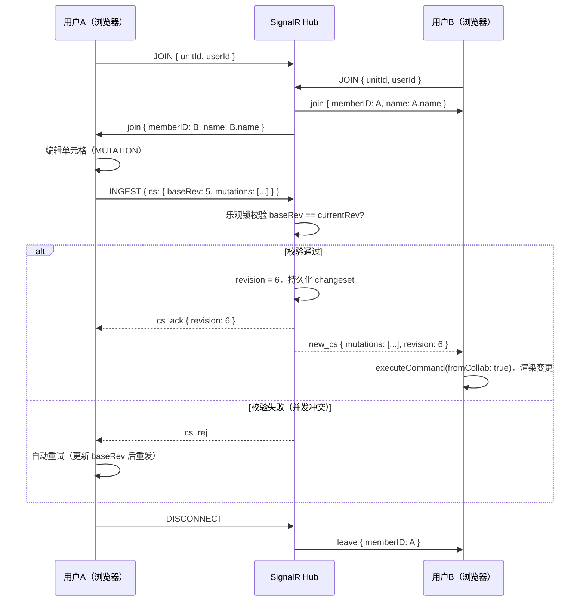
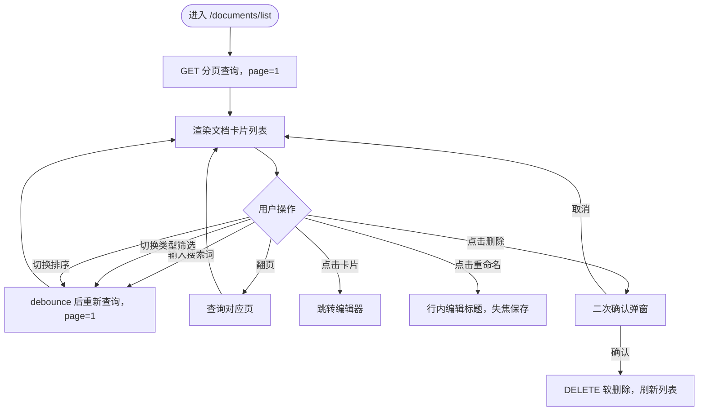

# 业务流程图 — Univer 集成

> 阶段：requirements-analysis  
> 最后更新：2026-09-22

---

## 一、文档创建与编辑主流程

```mermaid
flowchart TD
    A([用户进入文档管理]) --> B[/documents/list 列表页]
    B --> C{有目标文档？}
    C -->|是| D[点击文档卡片]
    C -->|否| E[点击「+ 新建文档」]
    E --> F[弹出 CreateDocumentDialog]
    F --> G[填写标题 + 选择类型]
    G --> H{提交}
    H -->|名称为空| I[提示错误，不关闭弹窗]
    I --> G
    H -->|信息完整| J[POST /ow/document-snapshots/v1 创建空白快照]
    J --> K[跳转 /documents/:unitId/edit]
    D --> K
    K --> L{根据 docType 渲染编辑器}
    L -->|Sheet| M[UniverSheet.vue]
    L -->|Doc| N[UniverDoc.vue]
    L -->|Slide| O[UniverSlide.vue]
    M & N & O --> P[GET /ow/document-snapshots/v1/:unitId 加载数据]
    P --> Q[编辑器就绪，用户开始编辑]
```

---

## 二、保存流程



---

## 三、操作日志记录流程



---

## 四、多人协同编辑流程



---

## 五、列表页操作流程


