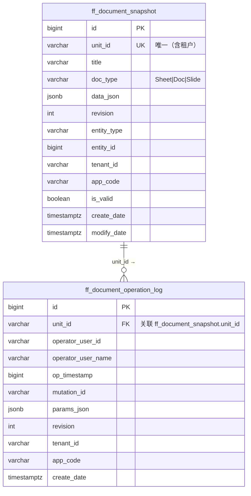

# 数据库表结构 — Univer 集成

> 最后更新：2026-09-22

---

## 一、ff_document_snapshot（文档快照表）

### DDL

```sql
CREATE TABLE ff_document_snapshot (
    id               BIGINT PRIMARY KEY,                  -- Snowflake ID
    unit_id          VARCHAR(100) NOT NULL,               -- Univer 文档唯一 ID（前端 UUID）
    title            VARCHAR(200),                        -- 文档标题
    doc_type         VARCHAR(20) NOT NULL DEFAULT 'Sheet',-- Sheet | Doc | Slide
    data_json        JSONB,                               -- IWorkbookData / IDocumentData JSON
    revision         INT NOT NULL DEFAULT 1,              -- 版本号（协同用）
    entity_type      VARCHAR(50),                         -- 关联业务实体类型（可选）
    entity_id        BIGINT,                              -- 关联业务实体 ID（可选）
    tenant_id        VARCHAR(100) NOT NULL DEFAULT '',
    app_code         VARCHAR(100) NOT NULL DEFAULT '',
    is_valid         BOOLEAN NOT NULL DEFAULT TRUE,       -- 软删除
    create_date      TIMESTAMPTZ NOT NULL DEFAULT NOW(),
    modify_date      TIMESTAMPTZ NOT NULL DEFAULT NOW(),
    create_by        VARCHAR(200),
    modify_by        VARCHAR(200),
    create_user_id   BIGINT NOT NULL DEFAULT 0,
    modify_user_id   BIGINT NOT NULL DEFAULT 0
);

-- 同租户内 unit_id 唯一（软删除记录除外）
CREATE UNIQUE INDEX idx_ff_doc_snapshot_unit_id
    ON ff_document_snapshot (unit_id, tenant_id, app_code)
    WHERE is_valid = TRUE;

-- 按 entity 查询索引
CREATE INDEX idx_ff_doc_snapshot_entity
    ON ff_document_snapshot (entity_type, entity_id, tenant_id, app_code)
    WHERE is_valid = TRUE;

-- 列表查询（按修改时间倒序）
CREATE INDEX idx_ff_doc_snapshot_list
    ON ff_document_snapshot (tenant_id, app_code, modify_date DESC)
    WHERE is_valid = TRUE;
```

### 字段说明

| 字段 | 类型 | 必填 | 说明 |
|------|------|------|------|
| id | BIGINT | ✅ | Snowflake，序列化为字符串传前端 |
| unit_id | VARCHAR(100) | ✅ | 前端生成 UUID，Univer 文档的唯一标识 |
| title | VARCHAR(200) | — | 文档标题，可单独 PATCH |
| doc_type | VARCHAR(20) | ✅ | 枚举：Sheet / Doc / Slide |
| data_json | JSONB | — | 完整文档 JSON，C# 侧用 string 存取不解析 |
| revision | INT | ✅ | 协同版本号，每次 Ingest 成功 +1，从 1 开始 |
| entity_type | VARCHAR(50) | — | 预留：如 "Onboarding"、"Stage" |
| entity_id | BIGINT | — | 预留：关联业务实体 ID |

### 关键业务规则

| 规则 | 说明 |
|------|------|
| Upsert 语义 | `SaveAsync` 先查 unit_id 是否存在，存在则 UPDATE，不存在则 INSERT |
| 软删除 | DELETE 操作只将 `is_valid = FALSE`，不物理删除 |
| 多租户过滤 | SqlSugar 全局过滤器自动加 `tenant_id + app_code` 条件 |

---

## 二、ff_document_operation_log（操作日志表）

### DDL

```sql
CREATE TABLE ff_document_operation_log (
    id                   BIGINT PRIMARY KEY,
    unit_id              VARCHAR(100) NOT NULL,           -- 关联文档
    operator_user_id     VARCHAR(100),                   -- 操作用户 ID
    operator_user_name   VARCHAR(100),                   -- 操作用户名
    op_timestamp         BIGINT NOT NULL DEFAULT 0,      -- 操作时间戳（毫秒）
    mutation_id          VARCHAR(200),                   -- Univer MutationId
    params_json          JSONB,                          -- 操作参数 JSON
    revision             INT NOT NULL DEFAULT 0,         -- 协同版本号
    tenant_id            VARCHAR(100) NOT NULL DEFAULT '',
    app_code             VARCHAR(100) NOT NULL DEFAULT '',
    is_valid             BOOLEAN NOT NULL DEFAULT TRUE,
    create_date          TIMESTAMPTZ NOT NULL DEFAULT NOW(),
    modify_date          TIMESTAMPTZ NOT NULL DEFAULT NOW(),
    create_by            VARCHAR(200),
    modify_by            VARCHAR(200),
    create_user_id       BIGINT NOT NULL DEFAULT 0,
    modify_user_id       BIGINT NOT NULL DEFAULT 0
);

-- 按文档查询日志（含时间范围过滤）
CREATE INDEX idx_ff_doc_op_log_unit_id
    ON ff_document_operation_log (unit_id, tenant_id, app_code, create_date DESC);
```

### 常见 MutationId 参考

| MutationId | 含义 | params 关键字段 |
|------------|------|----------------|
| `sheet.mutation.set-range-values` | 修改单元格值 | cellValue（新值）、range（位置） |
| `sheet.mutation.insert-row` | 插入行 | range（插入位置） |
| `sheet.mutation.remove-row` | 删除行 | range |
| `sheet.mutation.set-worksheet-name` | 修改 Sheet 名称 | name |
| `doc.mutation.retain-delete-apply` | 文档文本变更 | actions（CRDT 格式） |

---

## 三、ER 图


