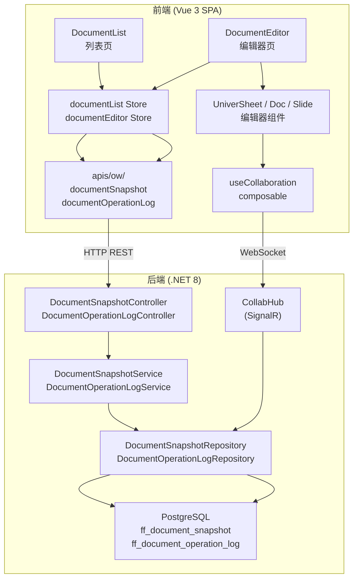
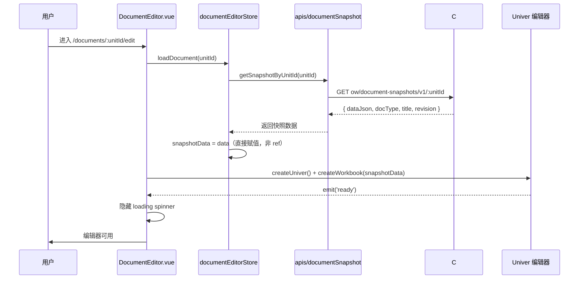
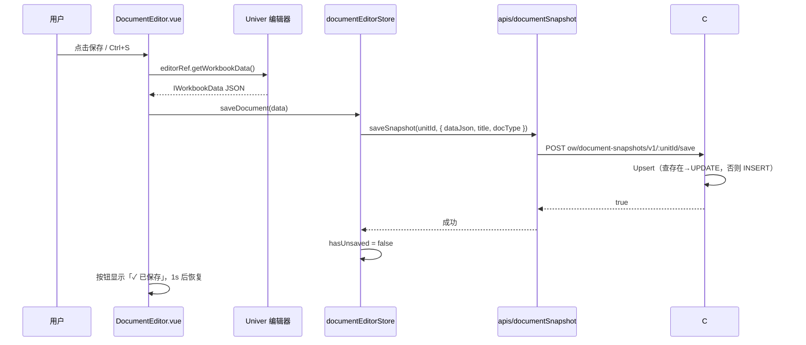
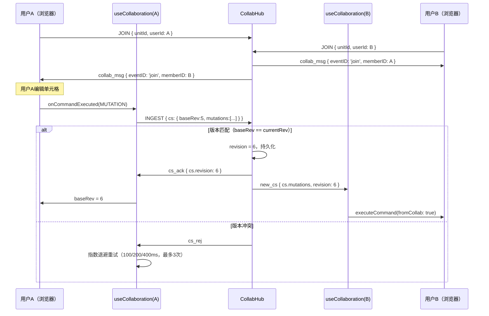
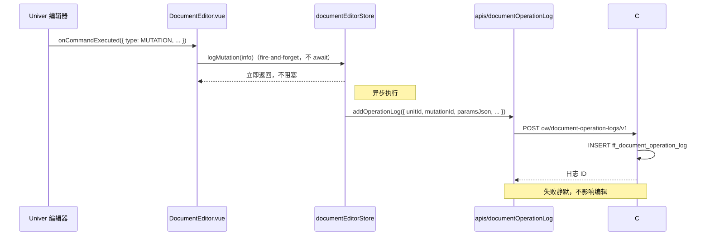

# 技术流程图 — 架构图 / 时序图 / ER 图

> 阶段：technical-design  
> 最后更新：2026-09-22

---

## 一、系统架构图

```mermaid
flowchart TB
    subgraph FE["前端 (Vue 3 SPA)"]
        direction TB
        LV["DocumentList\n列表页"]
        EV["DocumentEditor\n编辑器页"]
        US["UniverSheet / Doc / Slide\n编辑器组件"]
        UC["useCollaboration\ncomposable"]
        ST["documentList Store\ndocumentEditor Store"]
        API["apis/ow/\ndocumentSnapshot\ndocumentOperationLog"]
    end

    subgraph BE["后端 (.NET 8)"]
        direction TB
        CTRL["DocumentSnapshotController\nDocumentOperationLogController"]
        HUB["CollabHub\n(SignalR)"]
        SVC["DocumentSnapshotService\nDocumentOperationLogService"]
        REPO["DocumentSnapshotRepository\nDocumentOperationLogRepository"]
        DB["PostgreSQL\nff_document_snapshot\nff_document_operation_log"]
    end

    LV --> ST --> API
    EV --> US --> UC
    EV --> ST --> API
    API -->|HTTP REST| CTRL --> SVC --> REPO --> DB
    UC -->|WebSocket| HUB --> REPO --> DB
```

---

## 二、文档加载时序图

```mermaid
sequenceDiagram
    participant U as 用户
    participant V as DocumentEditor.vue
    participant S as documentEditorStore
    participant A as apis/documentSnapshot
    participant BE as C# Controller
    participant UE as Univer 编辑器

    U->>V: 进入 /documents/:unitId/edit
    V->>S: loadDocument(unitId)
    S->>A: getSnapshotByUnitId(unitId)
    A->>BE: GET ow/document-snapshots/v1/:unitId
    BE-->>A: { dataJson, docType, title, revision }
    A-->>S: 返回快照数据
    S->>S: snapshotData = data（直接赋值，非 ref）
    V->>UE: createUniver() + createWorkbook(snapshotData)
    UE-->>V: emit('ready')
    V->>V: 隐藏 loading spinner
    V->>U: 编辑器可用
```

---

## 三、保存时序图

```mermaid
sequenceDiagram
    participant U as 用户
    participant V as DocumentEditor.vue
    participant UE as Univer 编辑器
    participant S as documentEditorStore
    participant A as apis/documentSnapshot
    participant BE as C# Controller

    U->>V: 点击保存 / Ctrl+S
    V->>UE: editorRef.getWorkbookData()
    UE-->>V: IWorkbookData JSON
    V->>S: saveDocument(data)
    S->>A: saveSnapshot(unitId, { dataJson, title, docType })
    A->>BE: POST ow/document-snapshots/v1/:unitId/save
    BE->>BE: Upsert（查存在→UPDATE，否则 INSERT）
    BE-->>A: true
    A-->>S: 成功
    S->>S: hasUnsaved = false
    V->>V: 按钮显示「✓ 已保存」，1s 后恢复
```

---

## 四、协同编辑时序图

```mermaid
sequenceDiagram
    participant A as 用户A（浏览器）
    participant UC_A as useCollaboration(A)
    participant HUB as CollabHub
    participant UC_B as useCollaboration(B)
    participant B as 用户B（浏览器）

    A->>HUB: JOIN { unitId, userId: A }
    B->>HUB: JOIN { unitId, userId: B }
    HUB->>B: collab_msg { eventID: 'join', memberID: A }
    HUB->>A: collab_msg { eventID: 'join', memberID: B }

    Note over A: 用户A编辑单元格
    A->>UC_A: onCommandExecuted(MUTATION)
    UC_A->>HUB: INGEST { cs: { baseRev:5, mutations:[...] } }

    alt 版本匹配（baseRev == currentRev）
        HUB->>HUB: revision = 6，持久化
        HUB->>UC_A: cs_ack { cs.revision: 6 }
        HUB->>UC_B: new_cs { cs.mutations, revision: 6 }
        UC_A->>A: baseRev = 6
        UC_B->>B: executeCommand(fromCollab: true)
    else 版本冲突
        HUB->>UC_A: cs_rej
        UC_A->>UC_A: 指数退避重试（100/200/400ms，最多3次）
    end
```

---

## 五、操作日志写入时序图

```mermaid
sequenceDiagram
    participant UE as Univer 编辑器
    participant V as DocumentEditor.vue
    participant S as documentEditorStore
    participant A as apis/documentOperationLog
    participant BE as C# Controller

    UE->>V: onCommandExecuted({ type: MUTATION, ... })
    V->>S: logMutation(info)（fire-and-forget，不 await）
    S-->>V: 立即返回，不阻塞
    Note right of S: 异步执行
    S->>A: addOperationLog({ unitId, mutationId, paramsJson, ... })
    A->>BE: POST ow/document-operation-logs/v1
    BE->>BE: INSERT ff_document_operation_log
    BE-->>A: 日志 ID
    Note over A,BE: 失败静默，不影响编辑
```
