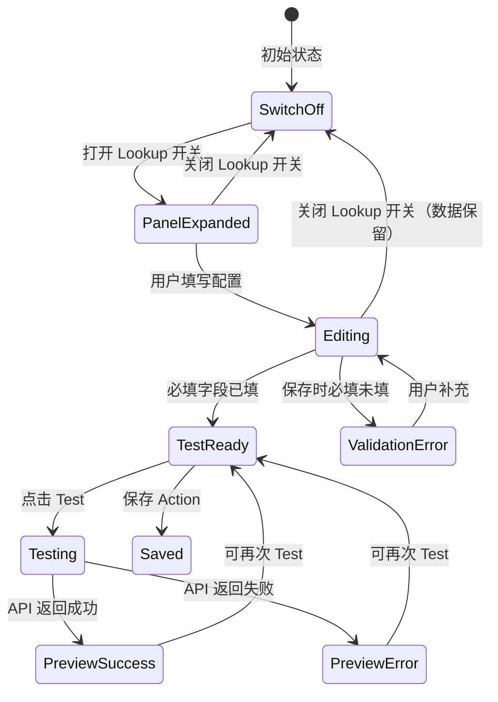

# Design: Field Lookup — 交互设计与视觉规范

## 1. 线框图

### 1.1 Field Mapping 表格（Lookup 关闭状态）

```
┌─────────────────────────────────────────────────────────────────────────────┐
│  ▼ Field Mapping                                    [+ Add Field]           │
├─────────────────────────────────────────────────────────────────────────────┤
│                                                                             │
│  ┌──────────────┬──────────────┬────────┬───────────┬────────┬──────────┐  │
│  │ External     │ WFE Field    │ Type   │ Direction │ Lookup │ Actions  │  │
│  │ Field        │              │        │           │        │          │  │
│  ├──────────────┼──────────────┼────────┼───────────┼────────┼──────────┤  │
│  │ [company_na] │ [Company ▼]  │ text   │ [View ▼]  │ ○ Off  │  🗑️     │  │
│  ├──────────────┼──────────────┼────────┼───────────┼────────┼──────────┤  │
│  │ [sales_rep ] │ [Sales R ▼]  │ text   │ [View ▼]  │ ○ Off  │  🗑️     │  │
│  ├──────────────┼──────────────┼────────┼───────────┼────────┼──────────┤  │
│  │ [location  ] │ [Locatio ▼]  │ text   │ [Edit ▼]  │ ○ Off  │  🗑️     │  │
│  └──────────────┴──────────────┴────────┴───────────┴────────┴──────────┘  │
│                                                                             │
└─────────────────────────────────────────────────────────────────────────────┘
```

### 1.2 Field Mapping 表格（Lookup 打开状态 + 预览结果）

```
┌─────────────────────────────────────────────────────────────────────────────┐
│  ▼ Field Mapping                                    [+ Add Field]           │
├─────────────────────────────────────────────────────────────────────────────┤
│                                                                             │
│  ┌──────────────┬──────────────┬────────┬───────────┬────────┬──────────┐  │
│  │ External     │ WFE Field    │ Type   │ Direction │ Lookup │ Actions  │  │
│  ├──────────────┼──────────────┼────────┼───────────┼────────┼──────────┤  │
│  │ [company_na] │ [Company ▼]  │ text   │ [View ▼]  │ ○ Off  │  🗑️     │  │
│  ├──────────────┼──────────────┼────────┼───────────┼────────┼──────────┤  │
│  │ [sales_rep ] │ [Sales R ▼]  │ text   │ [View ▼]  │ ● On   │  🗑️     │  │
│  ├──────────────┴──────────────┴────────┴───────────┴────────┴──────────┤  │
│  │ ┌─ Lookup Configuration ──────────────────────────────────────────┐  │  │
│  │ │ ▎                                                                │  │  │
│  │ │ ▎  ┌─────────────────────────┐  ┌─────────────────────────┐    │  │  │
│  │ │ ▎  │ * Options Source         │  │ * Display Field          │    │  │  │
│  │ │ ▎  │ [/api/users?active=true ]│  │ [$.full_name           ] │    │  │  │
│  │ │ ▎  └─────────────────────────┘  └─────────────────────────┘    │  │  │
│  │ │ ▎                                                                │  │  │
│  │ │ ▎  ┌─────────────────────────┐  ┌─────────────────────────┐    │  │  │
│  │ │ ▎  │ * Value Field            │  │   Response Path          │    │  │  │
│  │ │ ▎  │ [$.user_id             ] │  │ [$.data                ] │    │  │  │
│  │ │ ▎  └─────────────────────────┘  └─────────────────────────┘    │  │  │
│  │ │ ▎                                                                │  │  │
│  │ │ ▎  ▸ Custom Headers (optional)                                  │  │  │
│  │ │ ▎    ┌──────────────┬──────────────┬───┐                        │  │  │
│  │ │ ▎    │ Key          │ Value        │ ✕ │                        │  │  │
│  │ │ ▎    │ [X-Custom  ] │ [some-value] │ ✕ │                        │  │  │
│  │ │ ▎    └──────────────┴──────────────┴───┘                        │  │  │
│  │ │ ▎    [+ Add Header]                                             │  │  │
│  │ │ ▎                                                                │  │  │
│  │ │ ▎                                              [Test]            │  │  │
│  │ │ ▎                                                                │  │  │
│  │ │ ▎  Showing 10 of 45 options                                     │  │  │
│  │ │ ▎  ┌────────────────────────┬──────────────────┐                │  │  │
│  │ │ ▎  │ Display                │ Value            │                │  │  │
│  │ │ ▎  ├────────────────────────┼──────────────────┤                │  │  │
│  │ │ ▎  │ Zhang San              │ USER_001         │                │  │  │
│  │ │ ▎  │ Li Si                  │ USER_002         │                │  │  │
│  │ │ ▎  │ Wang Wu                │ USER_003         │                │  │  │
│  │ │ ▎  │ ...                    │ ...              │                │  │  │
│  │ │ ▎  └────────────────────────┴──────────────────┘                │  │  │
│  │ └─────────────────────────────────────────────────────────────────┘  │  │
│  ├──────────────┬──────────────┬────────┬───────────┬────────┬──────────┤  │
│  │ [location  ] │ [Locatio ▼]  │ text   │ [Edit ▼]  │ ○ Off  │  🗑️     │  │
│  └──────────────┴──────────────┴────────┴───────────┴────────┴──────────┘  │
│                                                                             │
└─────────────────────────────────────────────────────────────────────────────┘
```

### 1.3 Test 失败状态

```
│  │ ▎                                              [Test]            │  │
│  │ ▎                                                                │  │
│  │ ▎  ┌─ ⚠️ Error ─────────────────────────────────────────────┐   │  │
│  │ ▎  │ Failed to fetch options: Connection timeout (10s)       │   │  │
│  │ ▎  └────────────────────────────────────────────────────────┘   │  │
```

---

## 2. 组件架构

```
ActionConfigDialog.vue
└── Field Mapping Section (现有)
    └── el-table
        ├── 现有列: External Field | WFE Field | Type | Direction | Actions
        ├── 新增列: Lookup (el-switch)
        └── 行展开区域 (el-collapse-transition)
            └── LookupConfigPanel.vue (新组件)
                ├── 配置表单 (endpoint / displayPath / valuePath / responsePath)
                ├── Test 按钮
                └── 预览结果 (el-table 或 el-alert)
```

---

## 3. 视觉规范

### 3.1 Lookup 开关

| 属性           | 值                             |
| -------------- | ------------------------------ |
| 组件           | `el-switch`                    |
| size           | `small`                        |
| active-color   | `var(--el-color-primary)`      |
| inactive-color | `var(--el-color-info-light-7)` |

### 3.2 Lookup 配置面板

| 属性       | 值                            |
| ---------- | ----------------------------- |
| 背景色     | `bg-gray-50 dark:bg-gray-800` |
| 圆角       | `rounded-lg`                  |
| 内边距     | `p-4`                         |
| 左侧指示线 | `border-l-4 border-primary`   |
| 外边距     | `mx-2 my-2`                   |
| 过渡动画   | `el-collapse-transition`      |

### 3.3 预览结果表格

| 属性       | 值                              |
| ---------- | ------------------------------- |
| 组件       | `el-table`                      |
| size       | `small`                         |
| border     | `true`                          |
| max-height | `200px`（超出滚动）             |
| 空状态     | "Click Test to preview options" |

### 3.4 Test 按钮

| 属性     | 值             |
| -------- | -------------- |
| 组件     | `el-button`    |
| type     | `primary`      |
| plain    | `true`         |
| size     | `small`        |
| loading  | 请求中显示     |
| disabled | 必填字段未填时 |

### 3.5 错误提示

| 属性      | 值         |
| --------- | ---------- |
| 组件      | `el-alert` |
| type      | `error`    |
| show-icon | `true`     |
| closable  | `true`     |

---

## 4. 交互状态流转



---

## 5. 数据回显逻辑

当编辑已有 Action 时，需要从 MappingConfig 中恢复 Lookup 状态：

```
加载 Action 详情
  → 获取关联的 ActionTriggerMapping
  → 解析 MappingConfig.fieldMappings
  → 对每行 fieldMapping：
      如果有 lookup 属性 → 开关设为 On，填充配置字段
      如果无 lookup 属性 → 开关设为 Off
```

---

## 6. 与现有 UI 的集成方式

### 6.1 表格改造方案

当前 Field Mapping 使用 `el-table`。由于 `el-table` 原生不支持行内展开自定义面板（expand 功能样式受限），采用以下方案：

**方案：使用 `el-table` 的 expand 行类型**

- 利用 `el-table` 的 `type="expand"` 列实现行展开
- 展开内容为 `LookupConfigPanel` 组件
- 通过 `expand-row-keys` 控制哪些行展开
- Lookup 开关切换时，自动展开/收起对应行

### 6.2 不影响现有功能

- 所有现有列（External Field / WFE Field / Type / Direction / Actions）保持不变
- 新增的 Lookup 列和展开面板是纯增量改动
- 无 Lookup 配置的行，行为与当前完全一致
